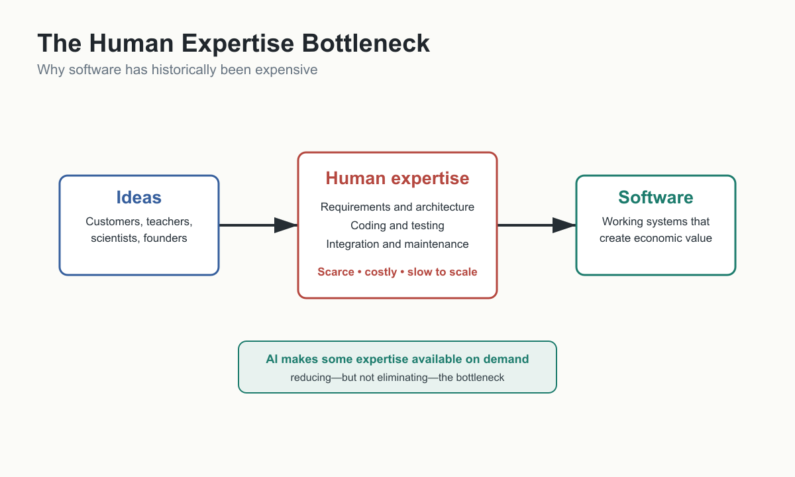

# The Economics of Software Development



Software has become one of the basic materials of modern civilisation.

That may sound exaggerated until we look at ordinary life. A bank is no longer simply a building with tellers and vaults. It is a network of databases, payment systems, fraud-detection rules, mobile applications, identity checks, compliance procedures, and transaction engines. An airline is no longer only aircraft, pilots, and airports. It is reservation software, maintenance software, route-planning systems, crew scheduling, pricing algorithms, loyalty programmes, safety systems, and airport integration. Hospitals, factories, governments, retailers, logistics companies, schools, power stations, and telecommunications networks all depend on software so deeply that the organisation and the software can no longer be cleanly separated.

Software is not merely another industry. It has become infrastructure.

That is why the economics of software matter. Before we can understand why artificial intelligence may transform software development, we first need to understand what is being transformed. The story should not begin with AI. It should begin with software itself: what it is, why it matters, why it has become so expensive to create and maintain, and why even a modest change in the cost of producing software could have consequences far beyond the technology industry.

This book argues that AI is important not simply because it can write code, answer questions, or imitate conversation. AI is important because it may change the cost structure of creating software. If that is true, the consequences will be economic before they are cultural. They will affect which ideas become products, who can build software, how organisations allocate labour, what skills become valuable, and what kinds of systems become economically possible.

The scale of the industry makes this more than a technical curiosity. Gartner's February 2026 forecast estimated worldwide IT spending at about $6.15 trillion in 2026, including about $1.43 trillion in software spending alone. SlashData estimated 48.4 million developers worldwide in Q3 2025. In the United States, the Bureau of Labor Statistics reported about 1.7 million software developer jobs in 2024, with a median annual wage of $133,080 in May 2024. These figures are not interchangeable, and each has its own methodology, but together they make the same point: software is a vast economic system built on specialised human expertise. See Software Industry Economics.

## Software Is Not Just Code

The word "software" often makes people think of code: lines of Python, Swift, JavaScript, C++, or some other programming language. Code matters, but code is only the visible expression of something deeper.

Software expresses procedures. It tells a machine what should happen under particular conditions. If the user presses this button, save the file. If the payment is approved, update the order. If the temperature exceeds a threshold, send an alert. If the customer has missed a deadline, apply a penalty. If two records conflict, choose the authoritative source. A program is not merely text. It is organised behaviour.

Software also expresses rules. Some rules are technical, such as how data should be stored, sorted, encrypted, transmitted, or displayed. Others are business rules: who may approve a loan, how insurance premiums are calculated, when a hospital should escalate a patient record, how tax should be applied, how inventory should be replenished, or how a factory should respond to a faulty sensor.

Software expresses relationships. A customer has orders. An order has items. An item belongs to a catalogue. A payment belongs to an invoice. A medical scan belongs to a patient. A flight booking belongs to a passenger, an aircraft, a route, a schedule, and a regulatory environment. In real systems, these relationships become dense, layered, and difficult to change without consequences elsewhere.

Most importantly, software expresses accumulated knowledge. A mature system often contains years or decades of decisions: product decisions, legal decisions, regulatory decisions, operational decisions, engineering decisions, and compromises made under pressure. The code may look like technical machinery, but inside it is a history of human judgement.

This is why the note [[15-legacy-problem|Legacy Systems]] makes such an important point: software is not just code. It is accumulated business knowledge. A bank's old COBOL system is not valuable because COBOL is fashionable. It is valuable because it may embody decades of lending policies, risk calculations, accounting rules, fraud-detection practices, regulatory responses, exception handling, and operational experience.

When we understand software this way, its cost becomes less mysterious. Software is expensive because knowledge is expensive.

## The Scarce Resource

For most of computing history, one resource has constrained software creation more than any other: human programming expertise.

To create useful software, organisations needed people who could translate human goals into machine-executable systems. That translation required many layers of knowledge. A software developer might need to understand programming languages, algorithms, data structures, operating systems, databases, networks, security, user interfaces, testing, debugging, deployment, cloud infrastructure, version control, architectural patterns, APIs, performance trade-offs, and the specific business domain in which the software operates.

Even this list understates the problem. Writing code is only one part of software development. Before code can be written, someone must understand the problem. What is the user trying to accomplish? What should happen in the normal case? What should happen when something goes wrong? What data is required? Who is allowed to see it? Which systems must be updated? Which laws or policies apply? Which trade-offs are acceptable? Which mistakes are catastrophic?

After the code is written, the work is still not finished. The software must be tested, debugged, deployed, monitored, documented, maintained, secured, integrated, upgraded, and adapted as the business changes. A useful system is not a one-time act of creation. It is a continuing obligation.

That is the economic bottleneck. Many ideas do not become software because the value of the idea is lower than the cost of implementation. A teacher may have a good idea for tracking student attendance patterns. A small business may want a custom workflow for managing suppliers. A family may want a simple private application for coordinating care for an elderly parent. A scientist may want software tailored to a narrow research process. In each case, the idea may be useful, but not useful enough to justify hiring developers, managing a project, and maintaining the result.

The limitation is not imagination. It is implementation cost.

## Why Software Is Expensive

Software is not expensive because typing is slow. Most programmers can type far faster than they can design.

Software is not expensive because computers are slow. Computers execute instructions at extraordinary speed.

Software is expensive because turning a human intention into reliable machine behaviour is difficult.

The first cost is understanding. Software projects often begin with vague goals: "We need a better booking system", "We want to automate approvals", "We need an app for our customers", "We should use AI to handle support requests." These statements are not yet requirements. They are wishes. Someone must turn them into precise descriptions of behaviour. What exactly should the system do? For whom? Under what conditions? With which exceptions? Against which constraints? This is the world of [[12-requirements-engineering|Requirements Engineering]], and it is often where failure begins.

The second cost is design. Once the problem is understood, the system must be shaped. Should it be a mobile app, a web application, an internal tool, an API, a database workflow, or a set of services? How should data be represented? Which parts should be separate? Which parts must be fast? Which parts must be secure? Which parts will change often? Poor design may not be obvious on the first day, but it becomes expensive when the system grows.

The third cost is implementation. Code must be written in a form a machine can execute. This requires knowledge of programming languages, libraries, frameworks, platform rules, and the existing codebase. Implementation also requires thousands of small decisions that are rarely visible to users but determine whether software feels reliable or fragile.

The fourth cost is debugging. A program can be syntactically correct and still behave incorrectly. A calculation may be wrong. A button may update the wrong record. A screen may work on one device but not another. A data import may fail on unusual characters. A permission check may be missing. Debugging is expensive because the visible symptom is often far from the hidden cause.

The fifth cost is testing and verification. In ordinary conversation, "it seems to work" may be enough. In software, it is not. A payment system, medical system, payroll system, or aircraft system must be correct enough under many conditions. [[13-precision-and-probabilistic-ai|Software Verification]] exists because software must be checked against requirements, edge cases, and failure modes. AI may make generation cheaper, but it does not remove the need to know whether the result is correct.

The sixth cost is communication. Software is built by people who must understand one another: users, managers, designers, developers, testers, security specialists, compliance teams, operations teams, and executives. Miscommunication becomes code. A missing requirement becomes a bug. An ambiguous instruction becomes unexpected behaviour. This is why the later discussion of The Most Important AI Skill Is Communication matters so much. Communication has always been part of software economics. AI merely makes the link more visible.

The seventh cost is maintenance. Software changes because the world changes. Customers ask for new features. Laws change. Competitors move. Platforms evolve. Security vulnerabilities appear. Dependencies are updated. Databases grow. Old assumptions break. A system that was correct five years ago may be wrong today because the business around it has changed.

This long tail of cost is not theoretical. The Consortium for Information & Software Quality estimated the cost of poor software quality in the United States at at least $2.41 trillion in 2022, with accumulated technical debt of about $1.52 trillion. McKinsey has described technical debt as a significant drag on technology estates, with CIO estimates placing it at 20% to 40% of pre-depreciation technology-estate value. A 2022 empirical study of 39 proprietary production codebases found that low-quality code contained 15 times more defects than high-quality code and that resolving issues in low-quality code took 124% more time on average. These figures should be treated carefully, but they reinforce the larger point: the cost of software lies not only in initial creation, but in quality, change, maintenance, and repair. See Software Maintenance and Quality Costs.

The eighth cost is integration. Most software does not live alone. It must communicate with databases, payment systems, identity providers, legacy systems, analytics platforms, customer records, enterprise applications, mobile devices, cloud services, and sometimes physical machines. [[15-legacy-problem|System Integration]] is where software meets reality. It is also where many simple demos become expensive production systems.

These costs explain why software development has historically required specialised labour. The programmer was never merely a typist of code. The programmer was a translator, designer, detective, systems thinker, tester, maintainer, and often an accidental business analyst.

## What One Software Employee Costs

To make the bottleneck concrete, imagine a mid-career software developer in the IT department of a large enterprise: a bank, manufacturer, logistics company, hospital group, or industrial firm. In the United States, the Bureau of Labor Statistics says software developers, quality assurance analysts, and testers typically need a bachelor's degree in computer and information technology or a related field, while some employers prefer a master's degree. BLS reported a median annual wage of $133,080 for software developers in May 2024, and $102,610 for software quality assurance analysts and testers.

That salary is only the visible part of the cost. The employer also pays for benefits, payroll taxes, recruiting, training, laptops, development tools, cloud environments, security systems, office or remote-work support, and management overhead. A developer with a $130,000 salary can easily represent a substantially higher annual cost to the organisation. If that person works roughly 220 to 230 effective workdays after weekends, holidays, leave, training, meetings, support work, and administration, every week spent on a project is expensive.

At the high end, the number becomes startling. Levels.fyi, a crowd-sourced compensation site, reported in July 2026 that a Google software engineer in the United States ranged from about $210,000 in total annual compensation at L3 to about $293,000 at L4 and about $415,000 at L5. These are not ordinary enterprise averages, and stock-heavy compensation should not be confused with salary. But they illustrate the same economic point: advanced software expertise is expensive because it packages years of education, accumulated experience, scarce judgement, and familiarity with complex systems.

A large industrial company gives a more ordinary comparison. Crowd-sourced salary sites are not official company records, but Glassdoor listed an OTIS software engineer total-pay range in the United States of about $110,000 to $149,000 a year, with a median total pay estimate of $127,000. The exact number matters less than the shape of the example. Even outside Big Tech, professional software labour is not cheap.

Now imagine a modest internal project requiring five people for six months: two developers, one tester, one product or business analyst, and one manager or architect. Even before cloud costs, software licences, security review, procurement, legal review, and long-term maintenance, the human cost can reach hundreds of thousands of dollars. That is why many useful ideas never become software. The organisation may want the tool, but not enough to justify consuming that much scarce expertise.

AI matters economically if it changes this arithmetic. If one expert with AI can produce, test, and maintain work that previously required a larger team, or if AI can reduce weeks of implementation and debugging to days, more ideas cross the boundary from uneconomic to worth building. The question is not whether human expertise has no value. It is whether AI can multiply that expertise enough to change which software becomes affordable.

## The Cost Equation

Historically, the path from idea to software looked like this:

```text
Idea
↓
Human expertise
↓
Software
```

The human expertise in the middle was scarce. That scarcity shaped the entire software economy. It determined which projects were worth building, which ideas remained unrealised, how large software teams needed to be, how long development took, and how much risk organisations had to accept.

Artificial intelligence changes the equation because it places a new form of machine intelligence between idea and implementation:

```text
Idea
↓
AI-assisted translation
↓
Software
```

This does not mean expertise disappears. It means some portion of expertise becomes available on demand through conversation, examples, context, and iteration. A person can ask an AI system to explain an error, design a data model, generate a function, compare architectures, write tests, refactor code, or translate a rough idea into a more precise specification. The AI does not eliminate the need for judgement, but it changes who can access technical knowledge and how quickly that knowledge can be applied.

The economic question is not whether AI is perfect. No important technology is perfect at first, and many remain imperfect while still becoming economically indispensable. The question is whether AI reduces enough cost, time, labour, training, or risk to make new software economically viable.

If the answer is yes, the consequences are large.

## Cost Reduction Creates Demand

When the cost of producing something valuable falls, people do not merely buy the same amount for less money. They often use far more of it. They also discover uses that previously made no economic sense.

Digital photography is a simple example. When every photograph required film, processing, and printing, people rationed photographs. They took pictures of special events, not every meal, receipt, whiteboard, product label, parking space, or passing curiosity. When the marginal cost of another photograph fell towards zero, photography changed. People did not simply replace film cameras with digital cameras. They began taking photographs for entirely new reasons.

Software may follow a similar pattern. If software becomes significantly cheaper to create, organisations and individuals will not merely build the same systems at lower cost. They will build software that would previously have been too small, too temporary, too specialised, or too personal to justify.

We may see more niche software: tools for a single profession, hobby, classroom, clinic, workshop, or research process.

We may see more temporary software: applications built for an event, a project, a migration, a holiday, a legal case, a construction site, or a short-term business process.

We may see more personal software: tools designed around one person's preferences, disabilities, workflow, memory, habits, or learning style.

We may see more internal software: small applications that solve irritating problems inside companies but never previously justified a formal software project.

This is one of the reasons AI-assisted software development matters economically. The biggest change may not be that existing programmers become faster, although that matters. The bigger change may be that many more ideas cross the threshold from "not worth building" to "worth building".

That threshold is where economics lives.

## Who Benefits?

If AI lowers the cost of creating software, the benefits will not belong to one group only.

Professional programmers may benefit because AI can remove some routine work, explain unfamiliar code, generate boilerplate, write tests, suggest refactorings, and act as a reasoning partner. A good developer with AI may be able to explore more alternatives, move faster, and spend more time on architecture, judgement, and verification.

Companies may benefit because internal software becomes cheaper to build and maintain. Processes that once required manual spreadsheets, email chains, and informal workarounds may become custom tools. Smaller teams may create systems that previously required larger budgets.

Governments may benefit if they can modernise old systems, improve services, and reduce the cost of maintaining outdated infrastructure. This is not automatic, and public-sector software has its own procurement and governance problems, but the economic possibility is significant.

Scientists, doctors, teachers, engineers, lawyers, accountants, consultants, and other professionals may benefit because they often understand problems that software developers do not. If AI helps them turn domain knowledge into working tools, the boundary between user and software creator shifts.

Small businesses may benefit because they have many software needs but cannot always afford custom development. A restaurant, clinic, tuition centre, workshop, or family business may need software that is too specialised for commercial products and too small for traditional development budgets.

Individuals may benefit because personal software becomes more plausible. A retiree managing medication, a parent coordinating family logistics, a student building a study tool, or a person with a disability adapting technology to their own needs may be able to create software that would never have existed as a commercial product.

This does not mean everyone becomes equally capable of building complex software. The Limits of AI Democratization correctly warns that tools are not the only limiting factor. Product clarity, persistence, domain obsession, debugging instinct, and judgement still matter. But lowering the barrier changes the distribution of who can participate.

## What Becomes Scarce?

If code becomes cheaper, code becomes less scarce.

That does not mean code becomes worthless. It means the bottleneck moves. In every economic system, when one constraint loosens, another becomes more visible.

If AI can generate code quickly, the scarce resources become:

- Good ideas.
- Domain knowledge.
- Clear requirements.
- Architecture.
- Judgement.
- Communication.
- Trust.
- Verification.
- Taste.

Good ideas matter because AI cannot decide what is worth building on behalf of humanity. It can suggest, combine, and extrapolate, but the real source of many valuable software ideas is lived experience with a problem.

Domain knowledge matters because software is useful only when it fits the world it serves. A generic application may be easy to generate, but a system that handles medical workflows, insurance claims, manufacturing exceptions, classroom behaviour, or Chinese character learning requires knowledge of the domain.

Clear requirements matter because AI can implement confusion quickly. Cheap generation makes vague intent more dangerous, not less. If a system can be built in days instead of months, bad assumptions can become working software before anyone has examined them properly.

Architecture matters because software must grow, integrate, and survive change. A quick prototype can be useful, but production systems need structure. They need boundaries, data models, permissions, error handling, observability, and paths for future evolution.

Judgement matters because AI produces proposals, not truth. It can generate plausible code, plausible explanations, plausible designs, and plausible mistakes. Someone must decide what is good enough, what is risky, what is elegant but unnecessary, and what is clever but wrong.

Communication matters because human intent becomes the new interface. If natural language becomes a higher-level programming medium, then clarity of thought becomes an engineering skill. [[11-communication-becomes-the-interface|Natural Language Programming]] is not casual chatting. It is the disciplined expression of behaviour, constraints, examples, and expected outcomes.

Trust matters because software increasingly mediates important decisions. Users, companies, regulators, and customers must trust systems enough to rely on them. That trust cannot be produced by generation alone.

Verification matters because cheap output is not the same as correct output. In fact, when output becomes cheap, verification may become more important. The question shifts from "Can we produce software?" to "Can we know that this software behaves correctly enough?"

Taste matters because abundance creates selection problems. When many things can be built, the harder question becomes what should be built, how it should feel, what should be left out, and what kind of experience is worth preserving.

This shift is central to the book. AI does not remove scarcity from software development. It changes where scarcity lives.

## AI as an Economic Force

It is tempting to describe AI in terms of intelligence, creativity, or magic. Those words capture the feeling of using AI, but they do not explain its long-term importance.

The durable explanation is economic.

AI matters because it may reduce the amount of human expertise required to turn intent into working software. It makes pieces of accumulated software-engineering knowledge available through conversation. It can explain unfamiliar code, generate drafts, suggest architectures, propose tests, translate between languages, and help people reason about systems they do not fully understand.

This does not make AI a replacement for software engineering. It makes AI a new production technology for software engineering.

The distinction matters. A production technology changes what can be produced, by whom, at what cost, and at what scale. The printing press changed the economics of books. Industrial machinery changed the economics of manufacturing. Cloud computing changed the economics of infrastructure. AI may change the economics of expertise.

That is why adoption will not depend only on excitement. If AI-assisted development permanently lowers cost while maintaining acceptable quality, organisations will adopt it because economic pressure rewards lower cost, faster iteration, and broader capability. If it fails to produce reliable value, enthusiasm will not be enough.

The right question is therefore not "Is AI impressive?" It is:

> What scarce resource does AI reduce, what new cost does it introduce, and do the benefits exceed the costs?

This question will return throughout the book.

## The New Costs

AI does not make software free. It changes the pattern of cost.

It introduces compute costs. Every AI interaction uses computing resources. Later chapters will distinguish [[09-economics-of-models|Training]], the expensive process of creating or improving a model, from [[09-economics-of-models|Inference]], the ongoing cost of using that model to produce outputs.

It introduces verification costs. AI-generated work must be checked. Sometimes the checking is simple: does the code compile, do the tests pass, does the user interface behave as expected? Sometimes it is more difficult: does the AI-generated answer follow policy, respect privacy, cite sources, avoid unsafe actions, and handle unusual cases correctly?

It introduces integration costs. A prototype generated by AI may look impressive, but real value often appears only when the software connects to existing systems, data, permissions, workflows, and users. This is why [[15-legacy-problem|System Integration]] and [[15-legacy-problem|Legacy Systems]] will become central later in the book.

It introduces governance costs. Organisations must decide which models may be used, what data may be shared, how outputs are reviewed, how prompts are versioned, how model changes are tested, and who is responsible when AI-assisted systems fail.

It introduces skill-transition costs. People must learn how to work with AI: how to specify intent, break problems into pieces, provide context, evaluate output, manage uncertainty, and decide when to trust or reject a result.

These costs do not negate the economic argument. They make it more serious. A technology transforms an industry not because it has no costs, but because its benefits exceed its costs in enough valuable situations.

## Why This Comes Before AI

This chapter has said very little about how AI works. That is deliberate.

If we begin with neural networks, models, tokens, vectors, context windows, or GPUs, we risk making AI seem like the subject of the book. It is not. The subject is the transformation of software creation.

AI is the mechanism. Software is the industry being transformed. Economics is the lens that explains why the transformation matters.

Once we understand software as an economic system constrained by scarce expertise, the importance of AI becomes clearer. The mystery is not merely that AI can write code. The deeper question is how any technology could reduce the cost of turning human intent into reliable machine behaviour.

Computing has been moving in this direction for seventy years. Every major improvement in programming has tried, in one way or another, to let humans work at a higher level and think less like machines.

That history has a name.

It is called abstraction.

If software has become progressively easier and cheaper to create over the past seventy years, why?

That is the question for the next chapter.

## What We Know

Software is more than code. It represents procedures, rules, relationships, and accumulated business knowledge.

Software development has historically been expensive because it requires scarce human expertise across requirements, design, implementation, testing, debugging, maintenance, communication, architecture, and integration.

Software and IT are economically large enough that changes in software creation cost may have broad consequences. Gartner forecast worldwide software spending above $1.4 trillion in 2026, within more than $6 trillion in total IT spending. SlashData estimated 48.4 million developers worldwide in Q3 2025. These are dated estimates and should be rechecked before publication.

Software quality, maintenance, and technical debt impose substantial economic costs after initial development. Available estimates vary, but they support the principle that software cost continues throughout a system's life.

Lowering the cost of producing a valuable good tends to increase demand and make previously uneconomic uses viable.

AI-assisted software development is economically important if it reduces the cost, time, labour, or expertise required to translate human intent into working software while maintaining acceptable quality.

## What We Infer

If AI substantially lowers software creation costs, the effect will extend beyond programmer productivity. It will change which ideas become worth implementing, who can participate in software creation, and where human value moves.

As code generation becomes cheaper, the bottleneck is likely to shift towards ideas, domain knowledge, requirements, architecture, judgement, communication, trust, verification, and taste.

The most durable explanation of AI's impact on software is economic rather than magical: AI changes the production function for software.

## What We Do Not Yet Know

We do not yet know how large the productivity gains will be across different kinds of software work.

We do not yet know how much AI-assisted development will reduce total software cost after verification, integration, governance, training, and maintenance are included.

We do not yet know which parts of software development will remain stubbornly expensive because they depend on organisational knowledge, regulation, safety, trust, or human judgement.

We need current evidence for software industry size, employment, market capitalisation, maintenance costs, project failure rates, and AI-assisted productivity effects.
