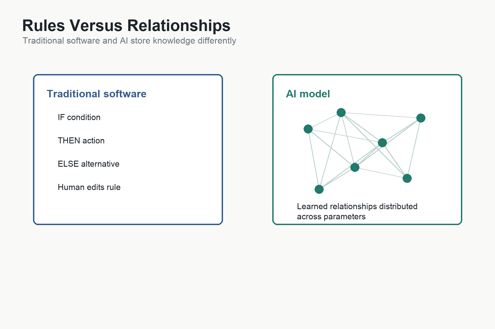

# How Neural Networks Learn Relationships



The previous chapter described an AI model as a learned mathematical representation of patterns found in data.

That raises the next question:

How is such a model built?

The answer is not that programmers write millions or billions of rules. That older idea is exactly what modern AI moved beyond. Programmers do not write a rule saying that every possible sentence should be translated this way, every possible image should be recognised that way, and every possible programming request should be solved with this exact code.

Instead, engineers build learning systems.

The most important of these systems are [[Neural Networks]].

## The Problem With Hand-Written Rules

Suppose we want a computer to recognise cats in photographs.

An old rule-based approach might begin like this:

```text
If it has whiskers, maybe it is a cat.
If it has pointed ears, maybe it is a cat.
If it has fur, maybe it is a cat.
If it has a tail, maybe it is a cat.
```

Immediately the problems appear. Some cats are photographed from angles where whiskers are not visible. Some dogs have pointed ears. Some cats are hidden under blankets. Some drawings are cats but not photographs. Some statues depict cats. Some images contain two cats and a dog. Some images contain a cat-shaped toy. Some photographs are blurry.

The world is too varied for simple rules.

Language has the same problem. How many rules would we need to understand every way a person might ask for the same software feature? How many rules would cover sarcasm, ambiguity, missing context, technical jargon, unusual grammar, mixed languages, screenshots, code fragments, and half-formed ideas?

Traditional rule-based software works well when the rules are stable and explicit. It struggles when knowledge is fuzzy, contextual, and difficult to write down completely.

Neural networks became powerful because they learn patterns from examples rather than requiring humans to specify every rule.

Radix's camera workflow offers a familiar example. A user can photograph Chinese text and ask the phone to recognise the characters. I did not write a catalogue of rules describing every permissible stroke thickness, camera angle, shadow, font, background, or printing defect. An OCR system has to recognise stable patterns despite all those variations.

The result is not magical and it is not guaranteed. OCR can confuse similar characters or misread a poor image. Radix therefore preserves the captured text for inspection and places later checks around the workflow. But its ability to recognise unfamiliar images at all comes from learned relationships rather than an exhaustive handwritten description of every photograph it might encounter.

## Tiny Decision Makers

A neural network is often explained through biology, but we do not need to begin there.

For this book, it is more useful to imagine many tiny adjustable decision makers.

Each one receives signals, gives those signals different importance, and passes along a result. One signal may matter a lot. Another may matter a little. Another may be ignored. During training, the system adjusts how much each signal matters.

One tiny decision maker is not intelligent.

Ten are not intelligent.

But enormous numbers of them, organised into layers and trained on vast amounts of data, can learn complicated patterns.

The intelligence does not live in one tiny unit. It emerges from the relationships among many units and the values learned during training.

## Are We Building A Huge Human Brain?

The phrase "neural network" almost invites misunderstanding.

It sounds as if engineers are building an artificial brain.

That is not quite right.

Artificial neural networks were inspired by the brain, but they are not giant human brains. The useful borrowed idea is that many simple units, connected together, can produce complex behaviour.

The comparison looks like this:

```text
Human brain:
neurons + synapses + activity patterns

Artificial neural network:
nodes + parameters + numerical transformations
```

The similarity is real but limited. In both cases, knowledge is distributed across a network rather than stored as one obvious rulebook.

But the differences are enormous. A human brain is biological, embodied, alive, adaptive, emotional, social, and connected to a body. It develops through childhood, movement, sensation, memory, culture, and lived experience.

An AI model is an engineered mathematical artefact. It has no body, no metabolism, no pain, no childhood, no survival instinct, and no subjective experience that we can responsibly assume. Its "neurons" are not living cells. Its "synapses" are not biological synapses. Its parameters are numbers adjusted during training.

A useful analogy is flight.

Airplanes were inspired by birds, but they are not giant birds.

Artificial neural networks were inspired by brains, but they are not giant brains.

They may achieve some intelligent behaviour through mechanisms that are only loosely related to biology. See [[Brain vs Neural Network Side Story]].

## Tokens: How Information Enters The Network

Before a neural network can learn from language, code, images, or sound, the information has to be turned into a form the network can process.

This is where the idea of a token becomes important.

A token is a piece of input used by the model. It is not always a word. In text, a token might be a whole word, part of a word, a punctuation mark, a space pattern, a number, or a fragment that appears often in the training data.

For example, the sentence:

```text
The cat sat on the mat.
```

might be broken into pieces roughly like:

```text
The | cat | sat | on | the | mat | .
```

But a longer or less common word might be split into smaller parts. A programming identifier such as:

```text
calculateMonthlyInterest
```

might be split into pieces resembling:

```text
calculate | Monthly | Interest
```

The exact split depends on the tokenizer, but the principle is simple: the model does not receive meaning directly. It receives pieces of representation.

Each token is then converted into numbers. Those numbers enter the neural network.

This is already a major abstraction. Human beings see words, sentences, variables, and punctuation. The model sees numerical representations of tokens and learns relationships among them.

## Tokens Are Not Just For English

Tokens matter because they explain how the same kind of model can process different symbolic systems.

English can be tokenised.

Chinese can be tokenised.

Swift can be tokenised.

Python can be tokenised.

SQL can be tokenised.

A programming language is a formal symbolic system. It has keywords, names, brackets, indentation, operators, strings, comments, and patterns. To a model, these become tokens and relationships among tokens.

For example:

```swift
if missedDays > 3 {
    notifyCounselor()
}
```

contains symbols with structure:

```text
if | missed | Days | > | 3 | { | notify | Counselor | ( | ) | }
```

Again, this is simplified. But it shows the essential idea. The model does not need to "think in Swift" as a human programmer does. It learns relationships among token patterns that appear in Swift code, English descriptions, documentation, error messages, and examples.

That is why symbolic languages matter to AI. English, Chinese, mathematics, and source code are different symbolic systems, but they can all be broken into pieces, represented numerically, and related through training.

## What About Images?

Images seem different because they are not made of words.

But the same broad idea still applies: the image must be broken into processable pieces and represented numerically.

An older image-recognition system might begin with pixels: tiny colour values arranged in a grid.

A modern vision model may divide an image into patches. Each patch is a small square region of the image. Those patches can then be converted into numerical representations, somewhat like visual tokens.

For a photograph of a cat, the model does not begin with the human concept "cat". It begins with numerical information about colours, brightness, edges, textures, shapes, and spatial relationships.

The simplified progression might be:

```text
Image
↓
Pixels or patches
↓
Numerical representations
↓
Visual patterns
↓
Higher-level concepts
↓
Cat
```

This is why multimodal AI is possible. Text, code, images, audio, and video begin in different forms, but each can be transformed into numerical representations that neural networks can process.

The representations are not identical. Text tokens are not image patches. Audio segments are not source-code tokens. But once they enter a model as numerical structures, the model can learn relationships among them.

That is how a multimodal model can look at a screenshot, read the visible text, infer what the interface is doing, and suggest code changes. It is not treating the screenshot, the English explanation, and the code as separate worlds. It is learning relationships across different kinds of representation.

## Tokens And Cost

Tokens also matter economically.

Models do work over tokens. A longer document has more tokens. A larger codebase has more tokens. A long conversation has more tokens. An image, audio clip, or video may require its own form of token-like representation.

More tokens usually mean more computation, more memory, more latency, and more cost.

This is why context windows matter. A model with a larger context window can consider more tokens at once, but that extra capacity is not free.

For the reader, the important point is:

> Tokens are the units through which information enters the model. They are the bridge between human symbols and machine mathematics.

## A Mental Model: Pieces, Dials, And Layers

At this point, it helps to separate three ideas.

```text
Tokens
= the pieces of information entering the model

Parameters
= the learned dials inside the model

Layers
= the stages that transform simple signals into richer representations
```

Tokens are the input pieces.

Parameters are the adjustable numbers learned during training. These are the tiny dials that decide how strongly one signal should influence another. A model with billions of parameters has billions of learned settings. No single parameter says "cat", "bank", "Swift", or "database". The knowledge is distributed across vast numbers of parameters.

Layers are the organised stages through which information passes. Each layer transforms the representation it receives and passes a new representation onward.

The mental picture is:

```text
Input pieces
↓
numerical representations
↓
layer
↓
layer
↓
layer
↓
useful internal representation
↓
output
```

The important point is that neural networks do not work by looking up a fixed meaning for each token. They transform representations step by step.

For text, the early representation may begin with token patterns. Later layers may capture grammar, sentence structure, reference, topic, intent, and eventually the likely continuation.

For code, early patterns may include keywords, brackets, indentation, identifiers, operators, and syntax. Later layers may capture functions, data flow, API usage, design patterns, and procedural intent.

For images, early patterns may begin with colour, brightness, edges, textures, and local shapes. Later layers may capture parts, objects, spatial relationships, scenes, and visual meaning.

The raw material differs, but the general process is similar:

```text
Break input into pieces
↓
turn pieces into numbers
↓
pass numbers through learned layers
↓
produce a richer internal representation
```

This is why the same broad neural-network idea can work across text, code, and images even though those inputs feel completely different to humans.

## Symbolic Text Versus Images

Text and code are symbolic.

The symbols are already discrete. A sentence is made of words, punctuation, and structure. A program is made of keywords, names, operators, brackets, indentation, and syntax. Humans invented these symbolic systems so that meaning or procedure could be represented explicitly.

Images are different.

An image does not arrive as a neat list of symbols. It arrives as a field of visual data: pixels, colours, brightness, edges, textures, and spatial relationships. A cat in an image is not labelled "cat" inside the pixels. The model has to learn visual patterns that often correspond to cats.

The simple distinction is:

```text
Text starts with symbols.
Images start with measurements.
```

In text, the units already carry human-designed symbolic meaning. The word "cat" is a symbol. A comma is a symbol. In code, `if`, `>`, `{`, and `}` are symbols with formal roles.

Pixels are not symbols in that sense. A pixel does not mean "cat", "eye", "tail", or "fur". It is only a tiny colour or brightness measurement. Meaning emerges only when many pixels are combined into edges, textures, shapes, parts, and objects.

So the early processing differs:

```text
Text/code:
symbols → tokens → numerical representations

Images:
pixels/patches → visual representations → numerical representations
```

But once both become numerical representations, the model can begin learning relationships.

For symbolic text, the model learns relationships such as:

- which words tend to appear together
- how grammar changes meaning
- how a variable name relates to nearby code
- how an error message relates to a likely bug
- how an English request maps to a programming pattern

For images, the model learns relationships such as:

- which edges combine into shapes
- which textures belong to surfaces
- which shapes combine into objects
- how objects relate spatially
- how a screenshot corresponds to an interface state

That difference matters for multimodal AI.

A model reading source code is moving through a formal symbolic structure. A model looking at a screenshot is interpreting visual structure. A model listening to speech is processing sound over time. These are not identical tasks. But they can be connected because each modality can be converted into numerical representations and aligned during training.

This is the bridge:

```text
English
Chinese
Swift
Screenshot
Voice
Diagram
↓
different input forms
↓
numerical representations
↓
learned relationships
↓
shared task understanding
```

That is why a multimodal model can hear a spoken request, look at a screenshot, inspect code, and propose a software change. It is not because speech, image, and code are the same. It is because the model has learned relationships among their representations.

## Layers

Layers are crucial because simple patterns can combine into more complex patterns.

In image recognition, early layers may respond to simple visual features such as edges, curves, colours, or textures. Later layers may combine these into shapes. Still later layers may combine shapes into objects.

The progression might look like this:

```text
Pixels
↓
Edges
↓
Shapes
↓
Parts
↓
Objects
↓
Cat
```

Language can be understood similarly, though the details differ:

```text
Characters
↓
Words
↓
Phrases
↓
Sentences
↓
Meaning
↓
Reasoning
```

Software also has layered structure:

```text
Tokens
↓
Syntax
↓
Expressions
↓
Functions
↓
Patterns
↓
Architecture
↓
Procedure
```

These diagrams are simplified, but they convey the intuition. Neural networks can learn lower-level features and combine them into higher-level representations.

That is how meaning begins to become mathematical. Not because someone writes a formula for "cat", "democracy", "database", or "Swift function", but because training adjusts many relationships until similar and related patterns occupy useful positions in the model's learned structure.

## Training Adjusts the Relationships

Training is the process that adjusts the network.

At the beginning, the network is not useful. Its internal settings do not yet encode the patterns we want. During training, it is exposed to examples. It produces predictions. Those predictions are compared with desired outcomes or training signals. The system then adjusts its internal parameters slightly so that future predictions become better.

This happens again and again at enormous scale.

The adjustable-dials analogy helps. Imagine a machine with vast numbers of dials. Each training example turns many dials a tiny amount. No single turn creates intelligence. But after enormous numbers of examples, the collective dial settings capture patterns.

Those settings are not a readable rulebook. They are distributed mathematical relationships.

This is why [[Training]] is expensive. It requires data, computation, specialised hardware, engineering judgement, experimentation, and evaluation. It is not simply "installing knowledge" into a computer. It is an industrial process for producing a useful learned representation.

## Vectors and Neighbourhoods

Eventually, concepts and patterns are represented numerically.

One common intuition is to think of them as points or directions in a high-dimensional space. Similar ideas are near one another. Related concepts form neighbourhoods. Differences become directions.

Dog, cat, wolf, and fox may occupy related regions. Election, voting, constitution, and democracy may occupy another. Function, variable, class, compiler, and API may occupy a software-related neighbourhood.

The model does not store a dictionary definition in the human sense. It stores relationships that allow it to predict, transform, and generate.

This explains why AI can move between English and code. If the model has learned relationships between natural-language descriptions and programming structures, it can generate a likely code representation for a described procedure.

It also explains why AI can make plausible mistakes. Nearby does not always mean correct. Prediction does not guarantee truth. Statistical relationship is not the same as verified fact.

## Why This Is Different From Traditional Programming

Traditional software:

```text
Programmer
↓
writes rules
↓
computer follows rules
```

Modern AI:

```text
Engineers build a learning system
↓
training adjusts relationships
↓
model applies learned patterns during inference
```

This is a different way of building software.

In traditional software, the knowledge is explicit. A human can inspect the code and see the rule. In AI models, the knowledge is distributed. A human can test the behaviour but cannot easily read the internal representation as a list of rules.

That difference explains why AI feels powerful and unsettling.

It is powerful because it can handle patterns too complex for hand-written rules.

It is unsettling because its internal logic is harder to inspect and its outputs are probabilistic.

## Why Neural Networks Matter for Software Development

Software development contains many pattern-recognition tasks.

A developer reads an error message and recognises a likely cause. They see a requirement and recognise a familiar design pattern. They inspect a function and infer its purpose. They compare two APIs. They notice that a bug resembles one they saw before. They read old code and reconstruct the business rule hidden inside it.

AI models can assist with these tasks because neural networks have learned relationships across code, language, documentation, examples, and problem descriptions.

This does not make AI a senior engineer. It lacks direct accountability, lived project context, and reliable judgement. But it can perform many useful transformations:

- Explain code.
- Generate code.
- Translate between languages.
- Suggest tests.
- Identify likely bugs.
- Summarise documentation.
- Propose refactorings.
- Convert requirements into implementation sketches.

These capabilities emerge from learned relationships, not from hand-written rules for every programming situation.

## The Economic Meaning of Neural Networks

Neural networks matter economically because they change how capability is produced.

Traditional software capability is produced by programmers writing rules. AI capability is produced by training systems that learn from examples. This shifts some cost from human labour into data, compute, hardware, research, and infrastructure.

The cost does not disappear. It changes form.

Training a large model may require enormous capital investment. But once trained, the model can be used repeatedly across many tasks. This is why AI companies treat models as strategic assets. A capable model can distribute learned capability to millions of users through inference.

This is the economics of intelligence: the production, storage, distribution, and use of machine-learned capability.

For software development, the implications are enormous. If a model can package useful portions of software-engineering knowledge, then users can access that knowledge without acquiring all of it personally. That does not eliminate expertise, but it changes how expertise is distributed.

## Limits

Neural networks are not magic.

They depend on training data. They can inherit bias, gaps, errors, and outdated patterns. They can produce fluent but false answers. They can struggle with tasks requiring exact calculation unless connected to tools. They may fail when the context is incomplete. They may not understand a company's private business rules unless those rules are provided.

They are also expensive. Training requires capital. Inference requires ongoing computation. Larger contexts, better reasoning, and multimodal capability introduce further cost.

The right response is not to dismiss neural networks because they are imperfect. Nor is it to trust them blindly because they are impressive. The right response is engineering: understand what they are good at, where they fail, and how to build systems around their strengths and weaknesses.

## Bridge to Software Generation

We can now connect the pieces.

Software is information.

Programming languages represent procedures.

AI models store learned relationships among patterns in data.

Neural networks are the machinery that learns those relationships.

Inference uses the trained model to generate outputs.

Now the original mystery becomes answerable:

> How can a machine convert English into software?

It can do so because English descriptions, software procedures, source code, documentation, examples, and error messages can all be represented within a learned mathematical structure. The model has learned relationships among them. When prompted, it can generate a plausible transformation from one representation to another.

The next chapter develops that answer directly.
