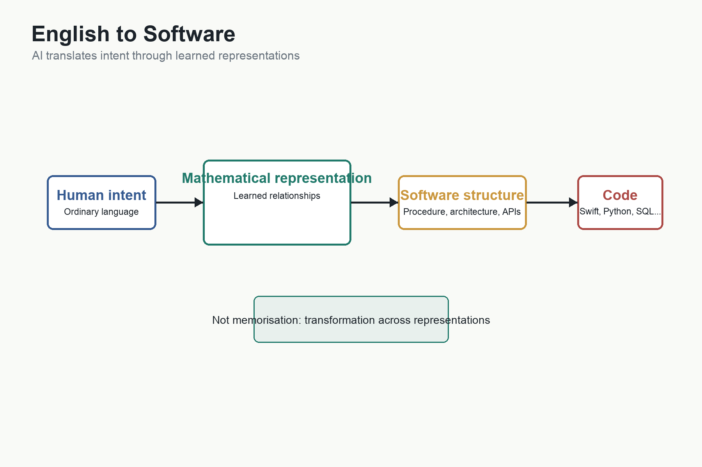

# How AI Converts English Into Software



We can now return to the question that motivated this book.

How can an idea expressed in ordinary English become working software?

At first, the experience feels almost magical. A person describes a feature. The AI asks a question, proposes a design, writes code, explains errors, and revises the implementation. A conversation becomes an application. For someone who remembers when programming required strict syntax from the first line, the shift is astonishing.

But the point of this book is not to admire the magic. It is to understand how the trick works.

The answer is not that AI has memorised every possible program. It has not.

The answer is not that AI thinks in Swift, Python, JavaScript, or SQL. It does not.

The answer is that software is a representation of procedure, and AI models can learn relationships among different representations of procedure: English, examples, pseudocode, documentation, source code, tests, errors, and explanations.

## Software Is Procedure

Software tells a machine what to do.

More precisely, software represents procedures precisely enough for a machine to execute them. It defines data, operations, conditions, sequences, permissions, errors, and outputs.

Consider a simple request:

> Build a feature that lets users save favourite Chinese characters and review them later.

This sentence is not code, but it contains software structure. It implies a user. It implies a collection of characters. It implies a save action. It implies persistent storage. It implies a review screen. It may imply ordering, deletion, search, sync, backup, and user-interface states.

A human developer hears the request and begins translating. What data model is needed? Where should favourites be stored? What happens if the same character is saved twice? How does the user remove one? Should favourites sync across devices? What if the database is unavailable?

AI performs a similar kind of translation, though not in the same way a human does. It uses learned relationships to infer likely structures and generate a representation in code.

## Procedure Can Exist in Many Forms

The same feature can be represented in ordinary English:

```text
Let the user save favourite Chinese characters and review them later.
```

It can be represented as requirements:

```text
- The user can mark a character as a favourite.
- The app stores favourites persistently.
- The user can open a favourites screen.
- The user can remove a character from favourites.
- Duplicate favourites are not created.
```

It can be represented as pseudocode:

```text
if user_taps_favourite(character):
    if character not in favourites:
        favourites.add(character)
        save(favourites)
```

It can be represented as a data model, a screen design, a database table, a test case, or a Swift function.

All of these are different forms of the same underlying procedure.

AI-generated software depends on moving between these forms.

## The Intermediate Layer Is Not English

When readers see AI convert English into code, they may imagine a direct path:

```text
English
↓
Swift
```

That is too simple.

A better intuition is:

```text
English
↓
learned mathematical representation
↓
Swift
```

The model receives text, represents it internally through numerical structures, and generates output based on learned relationships. Swift is not what the model fundamentally understands. English is not what it fundamentally understands. Both are external symbolic forms.

This helps answer the question from Programming:

> How can a machine that does not think in Swift still produce useful Swift code?

Because Swift is one way of expressing a procedure. If the model has learned relationships among intent, procedural structure, and Swift syntax, it can generate a plausible Swift representation of the requested behaviour.

This also explains why AI can translate English to Python, English to SQL, code to explanation, error message to fix, or screenshot to interface suggestion. The model is moving through learned relationships among representations.

## Not Memorisation

AI sometimes memorises fragments from training data, but memorisation is not the main explanation for its usefulness.

If AI-generated programming were only memorisation, it would fail whenever a user asked for a slightly new combination of requirements. But AI can often combine patterns: a mobile interface with a database, an import feature with duplicate handling, a quiz generator with formatting constraints, or a settings screen with cloud sync.

That ability comes from generalisation. The model has learned that certain kinds of requests imply certain structures. It has seen many examples of code, explanations, libraries, documentation, errors, and design patterns. When prompted, it predicts a useful continuation that fits the current context.

This is why precise context matters. If the user gives vague instructions, the model fills gaps with likely assumptions. Sometimes those assumptions are helpful. Sometimes they are wrong. If the user gives clear requirements, examples, constraints, and existing code, the model's transformation becomes better grounded.

AI does not remove the need to think clearly. It rewards clear thinking.

## The Role of Context

AI does not generate software from the prompt alone. It uses the prompt plus whatever context is available.

Context may include:

- The user's instruction.
- Existing code.
- Error messages.
- Documentation.
- File names.
- Examples.
- Screenshots.
- Prior conversation.
- Constraints.
- Test output.
- Project conventions.

The context window is the model's working memory during inference. A larger context window can allow the model to consider more of a codebase, a longer specification, or more examples. But context is not infinite, and larger context can introduce cost and attention problems.

This is why AI-assisted software development often works best as an iterative process. The human supplies context, examines output, adds correction, narrows the task, tests the result, and asks for revision. The model generates proposals. The human and surrounding tools evaluate them.

The process is not:

```text
Say idea once
↓
Receive perfect software
```

It is closer to:

```text
Express intent
↓
Generate proposal
↓
Test behaviour
↓
Clarify requirement
↓
Revise
↓
Integrate
↓
Verify
```

This is still programming, but at a higher level of abstraction.

## Why Code Still Needs Verification

AI can generate code that looks convincing.

That is useful and dangerous.

A generated function may compile but mishandle edge cases. A database query may work for small data but fail at scale. A user-interface change may solve one problem while breaking another. A security check may be missing. A library call may be outdated. An algorithm may be inefficient. A test may pass because it tests the wrong thing.

The model's output is a proposal, not a guarantee.

This is why Software Verification becomes more important, not less. If generation becomes cheap, the bottleneck shifts to knowing whether the generated system behaves correctly enough. Tests, type checking, code review, static analysis, runtime monitoring, user feedback, and human judgement all remain essential.

AI can help with verification too. It can write tests, explain failures, identify suspicious code, and suggest edge cases. But AI-generated tests must themselves be reviewed. The system cannot be trusted merely because the same technology generated both the code and the test.

Reliable software requires independent checks.

## Natural Language Programming

In some AI-driven features, the prompt is not just a request for code. It becomes part of the running system.

For example, a language-learning application might contain an AI quiz feature. Instead of writing every quiz rule in Swift or Python, the developer may write a detailed prompt describing how the AI should behave: what kinds of questions to ask, how difficult they should be, which language to use, when to reveal answers, what format to follow, and which mistakes to avoid.

That prompt is not casual conversation. It is a behavioural specification.

This is Natural Language Programming. The prompt functions like a high-level programming layer. The model acts like a probabilistic interpreter of that specification. The process still requires precision, testing, iteration, and review.

This does not mean all software becomes prompts. Conventional code remains essential for user interfaces, databases, security, networking, payments, permissions, performance, and deterministic execution. But for tasks involving language, reasoning, classification, generation, or explanation, natural-language specifications can become part of the software's behaviour.

The boundary between programming and communication begins to move.

## Why This Is Economically Important

The economic significance of AI-generated software is not that machines can produce text that looks like code. The significance is that AI reduces the cost of translation between intent and implementation.

Historically, that translation required scarce experts. A user had to explain a problem to a developer. The developer had to understand it, design a solution, implement it, test it, and revise it. Each handoff introduced cost and delay.

AI can compress some of those steps. A domain expert can describe a workflow and receive a prototype. A developer can describe a refactoring and receive a draft. A founder can explore product ideas before hiring a full team. A student can build a tool while learning the concepts. A professional programmer can use AI to move faster through routine implementation and spend more attention on architecture and verification.

The cost reduction is uneven. Simple prototypes may become dramatically cheaper. Safety-critical systems may remain expensive because verification dominates. Enterprise systems may still be costly because integration and governance dominate. But even uneven cost reduction matters if it shifts enough projects across the threshold of economic viability.

## What AI Is Actually Doing

When AI converts English into software, it is performing several transformations at once.

It interprets intent. It identifies what the user appears to want.

It infers structure. It recognises entities, actions, relationships, data, sequence, and constraints.

It maps the structure to software patterns. It may recognise that the problem requires a database, a state variable, a loop, an API call, a view model, a validation function, or a test.

It generates a symbolic representation. That representation may be code, configuration, pseudocode, a test case, or an explanation.

It uses context to fit the output to the project. Existing code, naming conventions, frameworks, errors, and prior discussion all shape the result.

None of this requires the model to think in Swift. It requires learned relationships among intent, procedure, and representation.

That is the essential mechanism.

## The Limits of the Mechanism

Because AI relies on learned relationships, it is strongest where the problem resembles patterns it has learned and where the user provides enough context.

It is weaker when requirements are ambiguous, the domain is highly specialised, the codebase is large and poorly documented, the task depends on hidden business rules, or correctness requires exact reasoning that the model cannot verify alone.

It may also struggle when the best solution is unusual. Models tend to generate plausible solutions based on patterns. Sometimes the right answer requires rejecting the familiar pattern.

This is why human judgement remains central. AI can generate candidate solutions. It can accelerate exploration. It can make expertise more accessible. But someone must still decide whether the result is appropriate.

## Bridge to Model Economics

We now understand the basic mechanism behind AI-generated software.

Software is procedure.

Procedures can be represented in many forms.

AI models learn mathematical relationships among those representations.

Inference uses the model and context to generate a likely useful output.

But this mechanism has costs. Larger models cost more. Longer contexts cost more. Better reasoning may cost more. Multimodal capability costs more. Training is different from inference. Model versions change. Different models behave differently.

The next chapter turns from the mechanism to the economics of models.

## What We Know

AI can generate software because software is a representation of procedure and models learn relationships among natural language, code, documentation, examples, and software patterns.

The model does not need to think in Swift or Python to generate Swift or Python. Those languages are external representations of procedures.

Context strongly affects output.

AI-generated code and AI-driven behaviour require verification.

Natural-language prompts can become software specifications in AI-driven features.

## What We Infer

The main economic value of AI-assisted development comes from reducing translation cost between human intent and machine-executable behaviour.

The human role shifts toward specifying intent, supplying context, evaluating output, and integrating reliable systems.

Programming languages will remain important as deterministic execution layers even if humans interact with them less directly.

## What We Do Not Yet Know

We do not yet know how far AI can scale from small features and prototypes to large, long-lived, safety-critical systems.

We do not yet know which forms of natural-language programming will become stable engineering practice.

We do not yet know how much verification cost will offset generation cost savings in different software domains.
