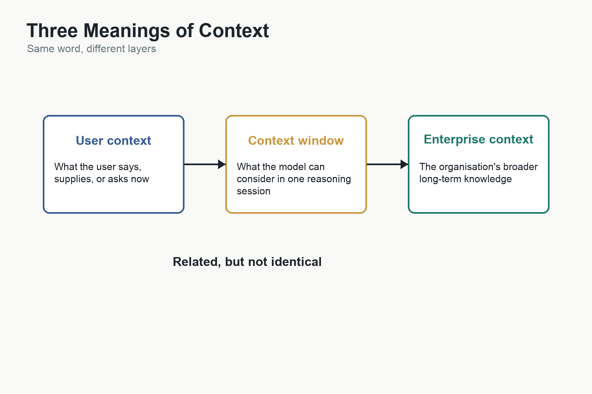
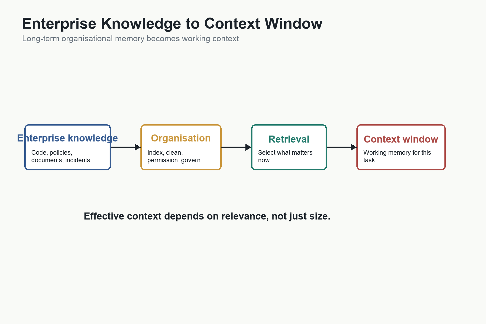

# Context: What the Model Knows Right Now



## Purpose

This chapter explains context from first principles.

The previous chapters explained what an AI model is, how neural networks learn relationships, how AI can convert English into software, and why model capability has economic cost. But one crucial idea still needs its own foundation:

> An AI model's behaviour depends not only on what it learned during training, but on what information it is given at the moment it is used.

That surrounding information is context.

Without this idea, many later arguments in the book remain incomplete. Context explains why prompts matter, why requirements matter, why long context windows matter, why AI agents need memory, why senior engineers still have advantages, why enterprise knowledge may become a strategic asset, and why AI can be brilliant in general while still making poor decisions inside a specific project.

## Central Question

What does an AI need to know right now in order to act intelligently in a particular situation?

## Core Ideas

- Context is the surrounding information that gives an instruction meaning.
- A model's training gives it general capability; context gives it situation-specific relevance.
- The same instruction can require different actions in different contexts.
- A context window is the model's working memory during inference.
- Memory and retrieval systems exist because the right context often lives outside the model.
- Project-specific context explains much of the difference between general programming knowledge and experienced engineering judgement.
- Enterprise context may become a strategic asset because organisational knowledge becomes more valuable when AI can use it.

## Reader Takeaways

By the end of this chapter, the reader should understand:

- The difference between model knowledge, prompt, context, memory, and enterprise context.
- Why AI sometimes fails because it lacks information, not because it lacks intelligence.
- Why longer context windows are economically important but not sufficient by themselves.
- Why future software organisations may compete partly on the quality of the context they can provide to AI systems.

## Bridge to Next Chapter

Once context is understood, the next question becomes clearer:

> If context gives AI its situation-specific intelligence, how should humans communicate intent, requirements, constraints, and examples clearly enough for AI to act on them?

That leads naturally to [[11-communication-becomes-the-interface|09 Communication Becomes the Interface]].

## The Simplest Definition

Context is the information surrounding a request that makes the request meaningful.

If I say:

> Put it over there.

the sentence is almost meaningless by itself.

What is "it"? Where is "there"? Am I speaking in a kitchen, a warehouse, a hospital, a classroom, or a software project? Am I asking someone to move a cup, a file, a database record, a chair, or a line of code?

The words are simple. The meaning depends on context.

This is true in ordinary life. It is also true in software.

If a product manager says:

> Add a search feature.

that instruction is not enough. Search what? Chinese characters? Customer records? Hotel bookings? Medical images? Source code? Should the search handle spelling mistakes? Should it be fast across millions of records? Should it rank results by relevance, date, popularity, or exact match? Should it respect permissions? Should it work offline?

The instruction points toward an intention, but the implementation depends on surrounding information.

That surrounding information is context.

## Three Meanings of Context

The word context is confusing because people use it in several different ways.

For this book, it helps to separate three meanings.

This distinction is important enough to become a vocabulary rule for the whole book. When the book says "context" in a general sense, it means surrounding information that gives a request meaning. But when precision matters, the book should use more specific terms:

```text
Training knowledge
= what the model learned during training

Context window
= temporary working memory during inference

Retrieved context
= external information brought into the context window

Project context
= situation-specific knowledge about a product, codebase, or business problem

Enterprise context
= organisation-wide knowledge available to AI systems

Raw context
= maximum token capacity

Effective context
= useful information actually available for solving the task
```

Without this distinction, readers may confuse what the model knows permanently, what it can see temporarily, what the application retrieves, and what an organisation knows collectively.

### Context 1: Training Knowledge

The first meaning is the model's training knowledge.

This is everything the AI learned during training. Think of it as the model's education.

It has learned patterns involving programming languages, history, physics, law, medicine, economics, literature, databases, software architecture, and countless other subjects.

This knowledge is stored in the model's parameters: billions or trillions of learned numbers.

It is not stored as ordinary documents. It is compressed into mathematical relationships.

This knowledge persists across conversations. When a new conversation begins, the model still has general knowledge of Python, Swift, SQL, grammar, databases, design patterns, and many other subjects.

### Context 2: The Context Window

The second meaning is the [[10-context-what-the-model-knows-right-now|context window]].

This is the information available to the model during the current inference session.

The context window is not the AI's map of the world.

The model is the map.

The context window is the viewport: the part of the world the model is currently looking at.

Imagine Google Maps. The map contains a representation of the world, but the phone screen shows only Singapore CBD, a neighbourhood, or a particular route. The model's learned knowledge is analogous to the larger map. The context window is analogous to the visible portion on the screen.

If a user says:

```text
The hotel has 100 rooms.
VIP members receive special pricing.
The system must support Singapore GST.
Online payments are required.
```

that information becomes part of the current context window.

The model reads that information while generating its answer.

This is working memory, not permanent knowledge.

### Context 3: Retrieved Context

The third meaning is retrieved context.

Sometimes the application fetches information from outside the conversation:

```text
Hotel Policy.pdf
Database Schema
API documentation
Source code
Requirements
```

These documents are inserted into the context window so the model can reason about them.

They may come from search, a vector database, a code index, a document store, an enterprise knowledge base, or a tool.

The combined picture is:

```text
Training knowledge
+
Current context window
+
Retrieved information
=
Model output
```

Training provides general capability.

The context window provides the immediate task.

Retrieved context supplies external information the model may not otherwise know or remember.

This distinction matters because many people imagine the AI searches its training data like Google. It does not. If a user asks what Python is, the model does not search a database of Python documents. Its parameters already contain a learned mathematical representation of Python, and that representation influences the probabilities of the next words it generates.

But if a user asks the model to summarise a 500-page report, the report is not inside the model. It must be placed into the context window or retrieved in pieces. The model reads that supplied information while producing the summary. After the session ends, the model has not necessarily learned the report. Unless the application deliberately stores, summarises, or indexes it, the report disappears from working memory.

This is the core distinction:

```text
Training is education.
The model is long-term learned capability.
The context window is temporary working memory.
Retrieved context is information brought into working memory from outside.
```

## Context Is Not the Same as Knowledge

This distinction is fundamental.

An AI model contains general knowledge learned during training. It may have seen examples of programming languages, design patterns, database schemas, user interfaces, security advice, API documentation, business writing, mathematics, history, and many other domains.

That knowledge gives the model broad capability.

But broad capability is not the same as knowing the specific situation.

A model may know how authentication systems usually work. It may not know how your application handles authentication. It may know common database patterns. It may not know your schema. It may know how payment systems are generally designed. It may not know the business rules inside a particular bank's legacy system.

Training gives the model general patterns.

Context gives the model the particular case.

The difference looks like this:

```text
Model knowledge
= what the AI learned generally during training

Context
= what the AI is given right now for this task
```

This is why an AI can answer a general programming question well but make a bad change in a real codebase. The model may understand the language, the framework, and the design pattern. What it lacks is the local context: the files, tests, conventions, business rules, previous decisions, edge cases, and hidden constraints that make this system different from every other system.

In software engineering, those details matter enormously.

## Same Instruction, Different Context

Consider the instruction:

> Make it faster.

To a web developer, this might mean reducing page-load time.

To a database engineer, it might mean adding an index.

To a machine-learning engineer, it might mean reducing inference latency.

To a product manager, it might mean shortening the user workflow.

To a finance department, it might mean speeding up month-end reporting.

The instruction is identical. The correct action changes because the context changes.

Software development is full of instructions like this:

- Make the screen cleaner.
- Fix the search.
- Improve onboarding.
- Reduce errors.
- Support enterprise customers.
- Make it secure.
- Modernise the system.

None of these instructions is self-contained. They require interpretation. Interpretation requires context.

This is one reason AI-assisted software development is not merely "telling AI what to code." The human must supply enough context for the model to understand what the instruction means in this particular situation.

That is why communication becomes engineering.

## The Context Window

When an AI model is used, it does not automatically have access to everything it has ever been told by a user, every file in a codebase, every document inside a company, or every event in the world.

It has access to the information placed into its current working area.

That working area is usually called the [[10-context-what-the-model-knows-right-now|context window]].

The context window contains the information the model can consider during inference. It may include:

- The user's current prompt.
- Earlier messages in the conversation.
- System instructions.
- Files attached to the request.
- Code snippets.
- Retrieved documents.
- Tool outputs.
- Application state.
- Examples.
- Constraints.
- Relevant memory.

The context window is not the same as the model's training data. It is not the same as long-term memory. It is closer to working memory: the information available for the current task.

A useful analogy is a desk.

The model's training is like everything a person has learned over a lifetime.

The context window is like the papers currently spread out on the desk.

A person may be very intelligent and well educated, but if the relevant contract, design note, bug report, or database schema is not on the desk, they may make the wrong decision. The problem is not intelligence. The problem is missing context.

The same is true for AI.

## Why Larger Context Windows Matter

Larger context windows matter because real software systems are not isolated fragments.

A small code change may depend on:

- A database schema.
- A type definition.
- A UI convention.
- A business rule.
- A test fixture.
- A configuration file.
- A security requirement.
- A migration script.
- An old architectural decision.
- A production incident from last year.

If the model sees only the function being edited, it may produce a locally plausible change that breaks the larger system.

Longer context can help because it allows more of the system to be visible at once. A model can inspect more files, read more requirements, consider more examples, and maintain more of the conversation.

But larger context is not magic.

More context can also mean more noise. The right information may be buried among irrelevant information. The model may pay attention to the wrong details. It may treat stale documentation as current. It may miss a small but important constraint.

The economic value of long context therefore depends on quality, not only quantity.

The real question is not:

> How many tokens can the model accept?

The better question is:

> Is the right information available at the right moment in a form the model can use?

That is a much deeper engineering problem.

## Memory and Retrieval

Because the context window is limited, AI systems often need ways to bring relevant information into context when needed.

This is where AI Memory and retrieval systems enter.

Memory does not necessarily mean that the model permanently changes every time it learns something. In many practical AI systems, memory means that information is stored outside the model and retrieved later.

For example, an AI coding assistant may retrieve:

- Relevant source files.
- Recent commits.
- Design documents.
- API documentation.
- Issue descriptions.
- Error logs.
- Test failures.
- Prior conversations.

The retrieved material is then inserted into the context window so the model can use it.

This distinction matters:

```text
Training
creates general model capability.

Inference
uses the model for a specific task.

Context
is the information available during that task.

Retrieval
finds relevant information outside the model.

Memory
preserves useful information so it can be retrieved later.
```

An AI system that appears to "remember" a project may actually be searching project files, retrieving notes, loading summaries, or consulting an external knowledge base. That does not make the memory fake. It simply means the memory is part of the surrounding system, not necessarily inside the model itself.

This is important for software engineering because most project knowledge should not be baked permanently into a general model. It changes too often. Requirements change. APIs change. Tests change. Customers change. Regulations change.

Project context must be current.

That makes retrieval, memory, indexing, and governance part of the engineering problem.

## Project-Specific Context

This explains one of the most important differences between a general AI model and an experienced engineer.

An experienced engineer does not merely know programming.

They know the project.

They know why a module is written in an awkward way. They know which customer depends on an old behaviour. They remember the failed migration from three years ago. They know which test is flaky. They know which database table is too dangerous to change casually. They know that the documentation is out of date. They know which stakeholder will object if a workflow changes.

Much of this knowledge may never appear in code.

It may live in meetings, habits, incident reports, customer complaints, Slack threads, half-forgotten design decisions, and people's heads.

This is why Context as the Missing Ingredient matters.

Programming expertise has at least two layers:

```text
General software engineering knowledge
```

and

```text
Project-specific context
```

AI is increasingly strong at the first layer because it has been trained on enormous amounts of general programming material.

The second layer is harder because it belongs to a specific organisation, product, codebase, customer base, and history.

When AI fails at a software task, the failure is often described as a lack of intelligence. Sometimes that is true. But often the failure is more precise:

> The AI did not have the information it needed.

It did not know the business rule. It did not see the test. It did not understand the migration history. It did not know the product constraint. It did not have the architecture decision record. It did not know that the old behaviour was intentional.

That is not merely a model problem.

It is a context problem.

## Context as an Economic Bottleneck

Earlier chapters argued that software has been expensive because expertise is scarce.

AI changes that by making general software knowledge more available. A person can ask for help with Python, Swift, SQL, architecture, testing, debugging, or refactoring and receive useful assistance immediately.

But as general expertise becomes cheaper, another bottleneck becomes more visible:

> Does the AI understand this specific situation?

That is where context becomes economic.

If a company cannot make its internal knowledge accessible to AI, then the AI remains generic. It may write plausible code, but it cannot reliably make decisions that depend on the company's systems, customers, policies, risks, and history.

If a company can make that knowledge accessible, the value of AI increases dramatically.

This is why context windows, code indexing, document retrieval, vector databases, knowledge graphs, tool use, production telemetry, and enterprise search are not merely technical features. They are attempts to reduce the cost of supplying situation-specific knowledge to machine intelligence.

The economic pattern is clear:

```text
General model capability
without context
= broad but generic intelligence

General model capability
with high-quality context
= useful intelligence inside a specific situation
```

The value is not only in the model.

The value is in the combination of model and context.

## Raw Context and Effective Context

This creates another economic distinction.

Raw context is the maximum number of tokens a model can read.

Effective context is the amount of relevant information the system can actually use to solve the problem.

Raw context is what model providers advertise.

Effective context is what users experience.

The difference matters because bigger context has diminishing returns.

If the task is to write a small script, a million-token context window may add little value. If the task is to understand a large codebase, legacy system, contract archive, or enterprise process, more context may be extremely valuable.

The value of context depends on the size and structure of the problem.

Context also has cost. More tokens usually mean more computation, more memory, more latency, and more expense. If doubling context only improves a task slightly, the economics may not justify the cost.

That is why the future race may shift from largest context to smartest context.

```text
Largest context
↓
Best retrieval
↓
Best reasoning
↓
Best tool use
↓
Best verification
```

This is the core argument in The Economics of Context.

The goal is not to stuff everything into the model's working memory. The goal is to supply the right information at the right time, at acceptable cost.

## Enterprise Context

The idea becomes even more powerful at organisational scale.

A company is not just a collection of employees and software systems. It is also a collection of accumulated knowledge:

- Source code.
- Design documents.
- API specifications.
- Architecture decisions.
- Meeting notes.
- Customer complaints.
- Support tickets.
- Production incidents.
- Regulatory obligations.
- Business policies.
- Operational workflows.
- Historical compromises.
- Undocumented rules.

Much of this knowledge is fragmented. Some lives in databases. Some lives in documents. Some lives in code. Some lives in email. Some lives in ticketing systems. Some lives only in people's memories.

Enterprise Context asks what happens when more of this knowledge becomes machine-readable, searchable, governed, and available to AI systems.

The company's competitive advantage may begin to depend not only on how many software engineers it employs, but on how complete, current, trustworthy, and accessible its organisational context is.

This does not mean every company must train its own frontier model. Many companies may rent models from specialised AI providers. Their distinctive advantage may come from the context they can supply:

```text
Frontier model
+ proprietary enterprise context
= organisation-specific capability
```

That is a different economic story from simply "AI writes code."

It suggests that the next scarce resource may be high-quality organisational knowledge arranged so that AI can use it.

## Context Window Versus Enterprise Knowledge



This distinction should be made carefully.

A model's context window and an enterprise's knowledge base are closely related, but they are not identical.

The context window is the information the AI can consider during one reasoning session. It is working memory.

Enterprise knowledge is the much larger universe of information held by the organisation. It is closer to long-term memory.

The relationship looks like this:

```text
Enterprise Knowledge
        |
        v
Knowledge Organisation
        |
        v
Retrieval System
        |
        v
Relevant Documents
        |
        v
Context Window
        |
        v
AI Model
        |
        v
Answer or Action
```

A company may possess enormous amounts of knowledge, but the AI does not load all of it at once. It retrieves the relevant pieces and places them into the context window.

This means the most important race may not be simply larger context windows. It may be larger effective context.

An organisation with a huge context window but poor retrieval may perform worse than an organisation with a smaller context window and excellent retrieval. The first can hold more information. The second supplies better information.

The deeper enterprise question is therefore:

> How should an organisation structure its knowledge so that AI systems receive the most relevant context at the right moment?

That is the question behind Enterprise Knowledge Architecture.

The context window is only the final layer. The real competitive advantage may lie in the earlier layers: knowledge quality, organisation, indexing, retrieval, governance, permissions, provenance, and freshness.

This suggests a further architectural layer: Enterprise Intelligence Layer.

Most enterprises probably do not need to build their own frontier model. They can rent general intelligence from foundation-model providers, much as companies rent cloud infrastructure or buy standard software platforms.

What they need to own is their specialised intelligence: the representation of their own business reality.

```text
Foundation model
= general intelligence

Enterprise intelligence layer
= specialised enterprise intelligence
```

The foundation model may understand Python, physics, language, accounting principles, and general software engineering. The enterprise layer understands the bank, the hospital, the airline, the manufacturer, or the retailer.

That leads to an economic thesis:

> In the AI era, foundation models may become commodities. Enterprise knowledge becomes the competitive advantage.

## Bad Context Creates Bad Software

If context is powerful, bad context is dangerous.

AI systems can fail because context is:

- Missing.
- Incomplete.
- Out of date.
- Contradictory.
- Irrelevant.
- Too broad.
- Too narrow.
- Untrusted.
- Unauthorised.
- Misleading.

For example, an AI system may read old documentation that no longer matches the code. It may retrieve a deprecated API. It may see a workaround but not the reason for it. It may combine requirements from two different product versions. It may expose information to a user who should not see it. It may give excessive weight to one example and ignore a stronger rule elsewhere.

This is why context management becomes part of software engineering.

The goal is not merely to give AI more information. The goal is to give AI the right information, with the right permissions, at the right time, with enough structure to support reliable action.

In traditional software, data quality already mattered. In AI systems, context quality matters just as much because context directly shapes behaviour.

## The First-Principles Stack

The concept can now be summarised as a stack:

```text
Information
= the underlying meaning or content

Representation
= the form information takes: English, Chinese, code, image, sound

Model
= learned mathematical representation of patterns in data

Training
= the process that creates general model capability

Inference
= using the model for a specific task

Context
= the information available to the model during that task

Memory and retrieval
= systems that bring relevant context back when needed

Enterprise context
= organisational knowledge made usable by AI
```

This stack links the whole book.

Part II explains abstraction: computing repeatedly hides complexity behind simpler interfaces.

Part III explains information and models: AI can transform information because it has learned relationships among representations.

This chapter explains context: the model's general capability becomes useful only when combined with the right situation-specific information.

Part IV then explains engineering: communication, requirements, precision, verification, agents, and integration are all ways of managing what AI is asked to do, what information it receives, and how its outputs are checked.

## The Chapter Thesis

Context is not a minor technical detail.

It is the bridge between general intelligence and useful action.

A model trained on the world may know a great deal in general, but software engineering always happens in a particular place: a particular codebase, company, product, user group, architecture, budget, regulation, and history.

The better an AI system understands that particular situation, the more useful it becomes.

That is why context windows are growing, memory systems are being built, retrieval is becoming infrastructure, agents need state, and enterprises may increasingly compete on the quality of the knowledge they can make available to AI.

The future of AI-assisted software development will not be determined by model intelligence alone.

It will be determined by the combination of:

```text
model capability
+
high-quality context
+
engineering judgement
```

That is the foundation for the next part of the book.

If context determines what the model can understand in a specific situation, then the human task becomes clearer: supply intent, requirements, constraints, examples, and judgement in a form the AI can use.

In the age of AI, communication is no longer a preliminary step before software development.

Communication becomes part of software development itself.

## Related Notes

- [[10-context-what-the-model-knows-right-now|Context Windows]]
- AI Memory
- Three Meanings of Context
- The Economics of Context
- Context as the Missing Ingredient
- Enterprise Context
- Enterprise Knowledge Architecture
- Enterprise Intelligence Layer
- [[06-what-is-an-ai-model|AI Models]]
- [[09-economics-of-models|Inference]]
- [[09-economics-of-models|Training]]
- [[11-communication-becomes-the-interface|Prompt Engineering]]
- [[12-requirements-engineering|Requirements Engineering]]
- AI Agents
- [[15-legacy-problem|System Integration]]
- [[13-precision-and-probabilistic-ai|Software Verification]]
- [[11-communication-becomes-the-interface|09 Communication Becomes the Interface]]
- [[12-requirements-engineering|09A Requirements Engineering]]
- [[16-agents-tools-and-integrated-systems|12 Agents Tools and Integrated Systems]]

## Future Work

- Add a diagram showing model knowledge, prompt, context window, retrieval, memory, tools, and enterprise data sources.
- Research current context-window cost, latency, and retrieval trade-offs before publication.
- Add a concrete Radix example showing how missing context changes an AI-generated result.
- Add a production example where stale documentation or missing project context leads to a software error.
- Decide whether this chapter remains `08A` or becomes Chapter 9 in Version 0.2, with later Part IV chapters renumbered.
