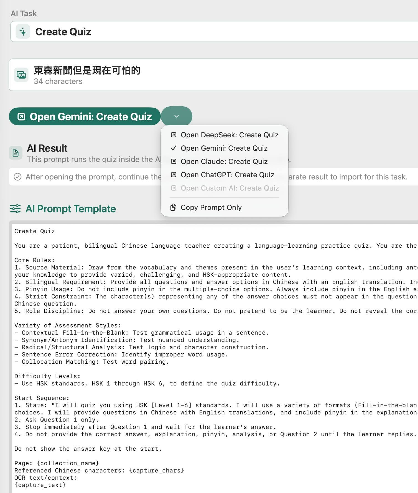

# Communication Becomes the Interface

The previous chapters explained how AI can convert human intent into software, why model capability has economic cost, and why context determines what the model knows right now. That ability changes the technical process of software development, but it also changes the human process.

If AI can translate ordinary language into code, then language itself becomes part of the development environment.

This does not mean grammar becomes more important. In many ways, AI is forgiving. It can often understand broken sentences, spelling mistakes, incomplete phrasing, and awkward wording. What it cannot reliably overcome is unclear intent.

AI has lowered the standard for polished prose while raising the standard for clear thinking.

That is why communication becomes one of the central engineering skills of the AI era.

## Prompt Engineering Is Often Communication

The phrase "prompt engineering" can make the work sound new and exotic. Sometimes it is. Prompt design for production AI systems can involve templates, variables, retrieval, structured output, evaluation sets, model-specific tuning, safety constraints, and version control.

But for many users, prompt engineering is an old discipline under a new name.

Much of it is disciplined communication: defining the objective, providing context, explaining constraints, giving examples, specifying format, identifying edge cases, stating what should not happen, and evaluating whether the result satisfies the need.

This is not a soft skill sitting outside technology. In AI-assisted software development, communication becomes the interface through which human expertise reaches machine intelligence.

A vague prompt produces vague software. A confused objective produces confused output. A missing requirement becomes a bug. An unstated assumption becomes unexpected behaviour.

This was always true in software development. AI makes it immediate.

One way to understand the shift is to think about an office before computers became easy to use.

When I worked at IBM in the 1980s, offices still had secretaries who handled much of the paperwork around professional life. They typed documents, prepared letters, routed messages, organised schedules, and managed the administrative machinery of the office.

That was not because managers lacked ideas. It was because the systems of the time were not easy for every professional to use directly.

Over time, computers, email, word processors, spreadsheets, calendars, and enterprise systems changed the interface. Professionals began doing many of those tasks themselves. The secretary did not disappear overnight, but the role steadily shrank because the translation layer became less necessary.

The boss might know exactly what needed to be said, but the secretary knew how to operate the machinery of communication: typing, formatting, filing, routing, scheduling, and retrieving information. The secretary was not valuable because the boss lacked ideas. The secretary was valuable because the office systems required translation.

AI changes software in a similar way. The business user, teacher, doctor, lawyer, engineer, or executive may know what outcome they want, but historically they had to explain that intent to analysts, IT staff, or programmers before the machine could act on it. If AI allows the user to speak more directly to the system, part of that translation layer becomes less necessary.

This does not mean the IT function disappears. It means the valuable work moves upward into architecture, security, integration, governance, verification, and accountability. The old bottleneck was operating the machinery. The new bottleneck is deciding what the machinery should be allowed to do.

## Requirements Become More Important

When software was expensive to build, vague requirements were still dangerous, but the slowness of development sometimes exposed ambiguity before implementation went too far. Meetings, specifications, estimates, and design reviews created friction. Friction is costly, but it can also force thought.

AI reduces friction. That is one of its great strengths.

It also means bad ideas can become working prototypes very quickly.

This makes Requirements Engineering more important, not less. If AI can produce software from a description, the quality of the description matters enormously. The user must define what the system should do, for whom, under which conditions, with which exceptions, using which data, and with which constraints.

The question changes from:

> Can we write the code?

to:

> Have we described the right behaviour clearly enough?

That is a higher-level programming problem.

## From Prompt to Specification

In casual use, a prompt is simply an instruction to an AI system.

In software development, a prompt can become something more serious. It can become a specification.

Consider an AI-powered quiz feature inside a language-learning app. A casual prompt might say:

> Create a quiz for these Chinese characters.

That may produce something useful once. It is not enough for a reliable feature.

A production prompt may need to specify:

- The role the AI should play.
- The source material it may use.
- The question format.
- The difficulty level.
- Whether answers should include English.
- Whether pinyin should be shown.
- How many questions should appear.
- When the correct answer should be revealed.
- What mistakes the AI must avoid.
- What output format the app expects.

At that point, the prompt is no longer a casual request. It is a behavioural contract.

This is the core idea of **natural-language programming**: some software behaviour can now be expressed through carefully engineered natural-language specifications interpreted by a model.

The language is English, but the discipline resembles programming.

## The Radix Example



The Radix quiz prompt is a useful example because it shows natural language becoming operational.

The prompt does not merely ask the AI to be helpful. It defines a task: create a language-learning quiz. It defines constraints: use the captured material, include Chinese and English appropriately, avoid revealing the answer too early, control pinyin usage, ask one question at a time, and follow a sequence.

That is software behaviour expressed in ordinary language.

The screenshot matters because the reader can see the difference between a magic phrase and a specification. The task is surrounded by rules, sequence, exclusions, source material, and expected interaction. That is the hidden labour behind a feature that may feel effortless to the user.

This example also shows why the term "programming" is changing. The author was not implementing the quiz entirely in Swift or Python. He was defining behaviour through a prompt that the AI model would interpret during use. The result still depended on conventional software around it: user interface, storage, captured text, model selection, and result handling. But part of the behaviour moved upward into natural language.

That is abstraction in practice.

Codex adds another layer to this example.

The Radix quiz prompt shows natural language controlling behaviour inside the app. Codex shows natural language controlling the development of the app itself. I could say what was wrong, show a screenshot, ask for a change, or describe the behaviour I wanted. Codex could then inspect the project, find the relevant files, edit code, run checks, and report what happened.

That is why communication becomes more than prompting. It becomes supervision.

```text
human intent
↓
Codex gathers context
↓
Codex changes the system
↓
tests, builds, or user checks provide feedback
↓
human decides whether the result is acceptable
```

The interface is still language, but the result is no longer only an answer. It is a change in a working system.

## Communication Is Not Enough

Clear communication is necessary, but it is not sufficient.

A well-written prompt can still produce a wrong answer. A precise requirement can still overlook an edge case. A model can still misunderstand context. A generated implementation can still contain bugs.

Communication must therefore be connected to verification.

In traditional software, requirements lead to design, implementation, tests, and review. AI does not remove that chain. It accelerates parts of it and changes the form of some links. A prompt may be versioned. A model response may be evaluated. A generated function may be tested. A natural-language instruction may be treated as part of the system.

The more important the software, the more the communication must become inspectable, repeatable, and testable.

## The Human Role Changes

AI changes the user's role from passive requester to active specifier.

The user must increasingly:

- Define the goal.
- Supply context.
- Explain constraints.
- Identify examples.
- Evaluate output.
- Correct misunderstandings.
- Decide what is acceptable.
- Know when to escalate to a human expert.

This is why domain knowledge becomes more valuable. A doctor, teacher, lawyer, engineer, accountant, scientist, or business owner may not know programming syntax, but they may know the problem deeply. AI gives them a new way to express that knowledge. The quality of the result depends on whether they can communicate the knowledge clearly enough for the model and surrounding software to use it.

Professional software developers do not disappear in this process. Their role moves upward too. They may spend less time writing routine code and more time shaping requirements, designing systems, reviewing AI output, creating evaluation suites, managing integrations, and ensuring reliability.

## The Economics of Communication

Miscommunication has always been expensive in software.

AI changes its cost profile. It can reduce the cost of producing a first draft, but it can increase the cost of unclear intent because the system may confidently implement the wrong thing. Cheap generation can multiply ambiguity.

Clear communication reduces waste. It lowers iteration cost. It improves model output. It reduces rework. It makes verification easier because the expected behaviour is clearer. It allows domain experts to participate directly in software creation.

In an AI-assisted workflow, communication is no longer merely a management skill. It becomes part of the production process.

The economic question is:

> How clearly can human intent be expressed, transformed, tested, and maintained?

That question leads directly to precision.
