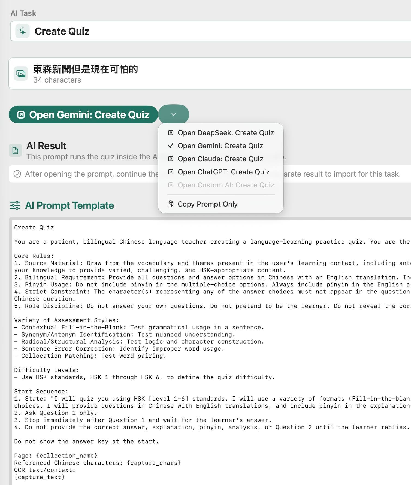

Part III explained how AI can convert human intent into software, why capability has economic cost, and how context shapes model behaviour. That ability changes both the technical and human processes of software development.

If AI can translate ordinary language into code, then language itself becomes part of the development environment.

This does not mean grammar becomes more important. In many ways, AI is forgiving. It can often understand broken sentences, spelling mistakes, incomplete phrasing, and awkward wording. What it cannot reliably overcome is unclear intent.

AI has lowered the standard for polished prose while raising the standard for clear thinking.

That is why communication becomes one of the central engineering skills of the AI era.

## Clear Instructions Come Before Prompt Engineering

Most people improve an AI result in familiar ways: say what outcome they want, provide the relevant background, explain limits, give an example, describe the desired form, identify unusual cases, state what must not happen, and check the result.

The industry often calls this **prompt engineering**. For many users, it is disciplined communication under a new name. In production systems the practice can become more technical: teams may reuse instruction templates, insert changing information, retrieve documents, require fixed output fields, maintain test cases, adapt instructions to a particular model, add safety rules, and track versions.

This is not a soft skill sitting outside technology. In AI-assisted software development, communication becomes the interface through which human expertise reaches machine intelligence.

A vague prompt produces vague software. A confused objective produces confused output. A missing requirement becomes a bug. An unstated assumption becomes unexpected behaviour.

This was always true in software development. AI makes it immediate.

One way to understand the shift is to think about an office before computers became easy to use.

When I worked at IBM in the 1980s, offices still had secretaries who handled much of the paperwork around professional life. They typed documents, prepared letters, routed messages, organised schedules, and managed the administrative machinery of the office.

That was not because managers lacked ideas. It was because the systems of the time were not easy for every professional to use directly.

Over time, computers, email, word processors, spreadsheets, calendars, and enterprise systems—large shared systems used to run an organisation—changed the interface. Professionals began doing many of those tasks themselves. The secretary did not disappear overnight, but the role steadily shrank because the translation layer became less necessary.

The boss might know exactly what needed to be said, but the secretary knew how to operate the machinery of communication: typing, formatting, filing, routing, scheduling, and retrieving information. The secretary was not valuable because the boss lacked ideas. The secretary was valuable because the office systems required translation.

AI changes software in a similar way. The business user, teacher, doctor, lawyer, engineer, or executive may know the desired outcome but historically needed analysts, IT staff, or programmers to translate it before the machine could act. AI can shorten that path. The remaining work is deciding what the system should be allowed to do and building the architecture, security, integration, verification, and accountability around it.

## Requirements Become More Important

When software was expensive to build, vague requirements were still dangerous, but the slowness of development sometimes exposed ambiguity before implementation went too far. Meetings, specifications, estimates, and design reviews created friction. Friction is costly, but it can also force thought.

AI reduces friction. That is one of its great strengths.

It also means bad ideas can become working prototypes very quickly.

This makes Requirements Engineering more important, not less. If AI can produce software from a description, the quality of the description matters enormously. The user must define what the system should do, for whom, under which conditions, with which exceptions, using which data, and with which constraints.

The question changes from:

> Can we write the code?

to:

> Have we described the right behaviour clearly enough?

That is a higher-level programming problem.

## Side Story: How Radix Was Built Through Rapid Iteration

The magical feeling of AI-assisted coding is not usually that one sentence creates a perfect product. It is that the distance between an idea and a useful test becomes much shorter.

In the older way of working, a person with an idea often had to plan everything in advance, find someone with the required technical skills, wait for a version to be built, and only then discover whether the idea made sense on a real screen. That made early mistakes expensive. It also meant that many small ideas were never tried.

Radix is the book's practical example. It is an app created to help a learner work with Chinese text: capture material, find useful phrases and characters, and return to them for study. It began with a product idea, not with a complete technical plan. What should a learner see first? How should captured text become useful study material? Which choices should be easy on a small phone screen and which need more room on an iPad? Those questions became clearer by building and using small versions of the app.

With an AI coding agent, the loop can be much faster:

```text
idea → small prototype → use it → notice what is wrong → revise it → test again
```

Radix was built through that loop from the beginning. One early goal was a short quiz that tested whether a learner could recognise one Chinese character. The first version sounded reasonable in theory, but failed as soon as I used it: the answer was already visible in the question. I could show Codex the screen and describe the experience I wanted instead: a sentence with a blank, four similar-looking character choices, and a focus on useful verbs.

That was not the end of the specification. On the next use, the questions appeared in the same order each time and a supposed “quick” quiz contained one hundred questions. The requirement became clearer only through experience: randomise the questions and choices, ask twenty at a time, and let the learner choose Simplified or Traditional Chinese. Codex could inspect the project, change the quiz rules, and run checks; I could use the result and decide whether it was actually better.

The same pattern applied to the app's structure. As Radix gained more Study areas, separate screens and controls began to duplicate each other and made navigation harder to understand. Codex helped refactor them into related sections controlled by one shared choice, while keeping the important controls visible. *Refactoring* means improving the internal structure of software without changing its intended purpose. Here it made the app easier to extend without asking the user to learn a more complicated route through it.

When a row of controls later overflowed the left and right edges of an iPad screen, I did not need to know the name of the layout rule that had failed. I could show Codex the screenshot, explain what a learner should be able to see, and ask it to investigate. It could find the relevant code, propose a correction, and run checks. I could then decide whether the changed screen actually worked.

The next version was not merely a reply in a chat. It was an app that could be seen and used. That matters because an imagined feature can sound sensible while a real feature can reveal a confusing flow, an awkward label, a missing exception, or a screen that simply does not fit. Reality joined the conversation sooner.

This is **rapid iteration**: improving something through short, repeated cycles of trying, observing, and revising. It changes several parts of software work at once.

- **Rapid prototyping:** A half-formed idea can become a small working example while it is still fresh.
- **Planning through development:** Planning does not disappear. Instead of pretending that every detail is known at the start, the plan becomes clearer as people see and use each version.
- **Rapid refactoring:** AI can make such cleanup cheaper, so a temporary early solution need not remain permanent.
- **Learning while doing:** A user can ask why a database choice, security setting, or layout pattern matters at the moment it becomes relevant, rather than studying every tool before beginning.
- **Results before terminology:** Someone can describe the outcome they need—“make this screen work on an iPad” or “save this record safely”—before they know the formal technical name for the solution.

Radix therefore does not prove that anyone can produce dependable software without knowledge or care. It shows something more useful: a person with a real problem can stay involved from the first idea through each revision. The human supplies the learning goal, examples, priorities, taste, testing on real devices, and the final decision. Codex supplies speed, technical options, and help with the many small steps between intention and a working change.

This is a useful extension of **just-in-time learning**, a familiar workplace idea: learn the knowledge needed for the task when it is needed, rather than build up a large inventory of skills that may never be used. AI can go further. It can provide **just-in-time capability**: not only an explanation, but a proposed implementation, relevant examples, and a way to test the result.

The agent is therefore not the whole consultant. The growing consultant is a system: the model, the project files it can inspect, reusable software building blocks called frameworks, documentation, compilers, tests, security scanners, performance tools, and the records of previous decisions. Frameworks often provide sensible defaults for common jobs. A compiler can reject invalid code, a test can reveal a broken feature, and a performance tool can reveal a slow part of an app. The model can help connect this evidence and propose the next change.

```text
human: state the outcome and limits
↓
AI agent: proposes and changes the software
↓
frameworks and tools: check security, performance, compatibility, and tests
↓
human: reviews the evidence and accepts, revises, or rejects the change
```

Some routine technical judgement can therefore be offloaded: using established patterns, checking common security mistakes, following platform conventions, or investigating why a screen is slow. That does not transfer ultimate responsibility. People must still decide what information should be stored, who may access it, what risk is acceptable, when a result is good enough, and when a change needs an expert review. The higher the consequence—payments, health, safety, law, or large public systems—the more important those human decisions become.

The promise is not that AI removes judgement. It is that a growing body of technical knowledge can arrive at the point where it is needed. AI does not merely provide just-in-time learning; it can provide just-in-time technical judgement, supported by models, tools, frameworks, tests, and best practices.

The next step is to turn these evolving instructions into specifications that can be inspected and tested.

## From Prompt to Specification

In casual use, a prompt is simply an instruction to an AI system.

In software development, a prompt can become something more serious. It can become a specification: a detailed description of required behaviour that people can inspect and test.

Consider an AI-powered customer-support feature. A casual prompt might say:

> Help this customer understand whether an item can be returned.

That may produce something useful once. It is not enough for a reliable system.

A production prompt may need to specify:

- The role the AI should play.
- The policy and order information it may use.
- Which cases it may draft a reply for and which must be escalated.
- What it must never promise, approve, or disclose.
- How uncertainty should be expressed.
- What fields the surrounding system expects.

At that point, the prompt is no longer a casual request. It is a behavioural contract. The quiz example below shows the same idea in a more personal form.

This is the core idea of **natural-language programming**: some software behaviour can now be expressed through carefully engineered natural-language specifications interpreted by a model.

The language is English, but the discipline resembles programming.

## A Quiz Example



The quiz instructions are useful because they show natural language becoming operational.

The prompt does not merely ask the AI to be helpful. It defines a task: create a quiz. It defines constraints: use the captured material, include Chinese and English appropriately, avoid revealing the answer too early, control pinyin usage, ask one question at a time, and follow a sequence.

That is software behaviour expressed in ordinary language.

The screenshot matters because the reader can see the difference between a magic phrase and a specification. The task is surrounded by rules, sequence, exclusions, source material, and expected interaction. That is the hidden labour behind a feature that may feel effortless to the user.

This example also shows why the term "programming" is changing. The author was not implementing the quiz entirely in Swift or Python. He was defining behaviour through a prompt that the AI model would interpret during use. The result still depended on conventional software around it: user interface, storage, captured text, model selection, and result handling. But part of the behaviour moved upward into natural language.

That is abstraction in practice.

Codex adds another layer to this example.

The quiz instructions show natural language controlling behaviour inside the application. Codex shows natural language controlling the development of the application itself. I could say what was wrong, show a screenshot, ask for a change, or describe the behaviour I wanted. Codex could then inspect the project, find the relevant files, edit code, run checks, and report what happened.

That is why communication becomes more than prompting. It becomes supervision.

```text
human intent
↓
Codex gathers context
↓
Codex changes the system
↓
tests, builds, or user checks provide feedback
↓
human decides whether the result is acceptable
```

The interface is still language, but the result is no longer only an answer. It is a change in a working system.

## Communication Is Not Enough

Clear communication is necessary, but it is not sufficient.

A well-written prompt can still produce a wrong answer. A precise requirement can still overlook an edge case. A model can still misunderstand context. A generated implementation can still contain bugs.

Communication must therefore be connected to verification.

In traditional software, requirements lead to design, implementation, tests, and review. AI does not remove that chain. It accelerates parts of it and changes the form of some links. A prompt may be versioned. A model response may be evaluated. A generated function may be tested. A natural-language instruction may be treated as part of the system.

The more important the software, the more the communication must become inspectable, repeatable, and testable.

## The Human Role Changes

AI changes the user's role from passive requester to active specifier.

The user must increasingly:

- Define the goal.
- Supply context.
- Explain constraints.
- Identify examples.
- Evaluate output.
- Correct misunderstandings.
- Decide what is acceptable.
- Know when to escalate to a human expert.

This is why domain knowledge becomes more valuable. A doctor, teacher, lawyer, engineer, accountant, scientist, or business owner may not know programming syntax, but they may know the problem deeply. AI gives them a new way to express that knowledge. The quality of the result depends on whether they can communicate the knowledge clearly enough for the model and surrounding software to use it.

Professional software developers do not disappear in this process. Their role moves upward too. They may spend less time writing routine code and more time shaping requirements, designing systems, reviewing AI output, creating evaluation suites—collections of test cases used to measure AI behaviour—managing integrations, and ensuring reliability.

## The Economics of Communication

Miscommunication has always been expensive in software.

AI changes its cost profile. It can reduce the cost of producing a first draft, but it can increase the cost of unclear intent because the system may confidently implement the wrong thing. Cheap generation can multiply ambiguity.

Clear communication reduces waste. It lowers iteration cost. It improves model output. It reduces rework. It makes verification easier because the expected behaviour is clearer. It allows domain experts to participate directly in software creation.

In an AI-assisted workflow, communication is no longer merely a management skill. It becomes part of the production process.

The economic question is:

> How clearly can human intent be expressed, transformed, tested, and maintained?

That question leads first to requirements: turning human intention into behaviour clear enough to build and test.
