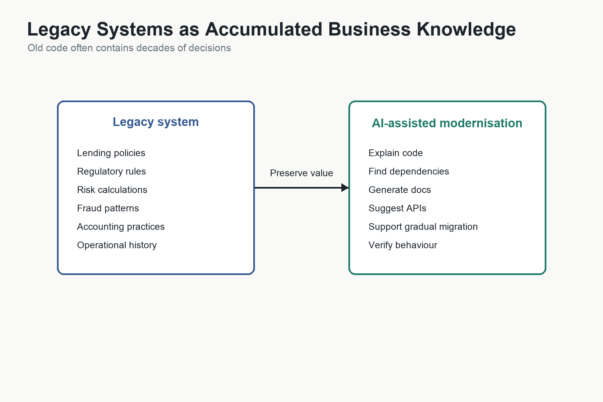

# The Legacy Problem



Imagine the chief executive of a major bank announcing that every computer system will be replaced over the weekend.

It is impossible.

Not because the technology does not exist. Not because programmers cannot write new software. It is impossible because the business would stop.

Modern organisations resemble cities. A city cannot be demolished and rebuilt in a weekend. Roads, bridges, buildings, utilities, transport systems, and communications networks must be repaired and replaced gradually while people continue living there.

Software evolves the same way.

Organisations cannot simply throw away the systems that run payments, insurance claims, hospital records, airline reservations, factory production, government benefits, telecommunications networks, and supply chains. Those systems may be old, awkward, poorly documented, and difficult to change. They may also be essential.

This is the legacy problem.

## Old Does Not Mean Bad

Many people assume that old software is bad software.

Sometimes it is. Old systems can be fragile, insecure, poorly understood, expensive to maintain, and difficult to integrate.

But age alone is not the problem.

Some old systems are stable. They process enormous transaction volumes. They embody decades of operational experience. They have survived real-world edge cases newer systems have never encountered. They may be ugly but reliable.

The real problem is that legacy systems were built for a different technological world.

They may use obsolete languages, old databases, outdated operating systems, fragile interfaces, and assumptions that no longer fit modern business needs. The original developers may have retired. Documentation may be incomplete. Source code may be missing. Dependencies may be unknown. Business rules may be hard-coded in places no one remembers.

The system still works, but the organisation no longer fully understands it.

This is not only a technical inconvenience. It is an economic drag. Research on software quality and technical debt suggests that poor-quality and hard-to-change code can impose large downstream costs. The Consortium for Information & Software Quality estimated U.S. accumulated software technical debt at about $1.52 trillion in 2022, while McKinsey has reported CIO estimates that technical debt can amount to 20% to 40% of the value of a technology estate before depreciation. Those figures are broad estimates, not legacy-system measures specifically, but they help explain why old software can become expensive even when it still works. See [[Software Maintenance and Quality Costs]].

Public-sector audits make the problem more concrete. GAO identified 10 critical U.S. federal legacy systems in 2019 that ranged from 8 to 51 years old; GAO later reported that those systems collectively cost about $337 million annually to operate and maintain. Several used older languages such as COBOL, and agency modernisation plans were often incomplete. The UK government has also created a formal Legacy IT Risk Assessment Framework, while the National Audit Office reported that, in March 2024, departments did not have fully funded plans to remediate around half of government's legacy IT assets. See [[Legacy Systems and Modernisation]].

## Software as Accumulated Business Knowledge

The most important point is that legacy software is not merely code.

It is accumulated business knowledge.

A bank's COBOL system is not valuable because of COBOL. It is valuable because it may contain decades of lending policies, risk calculations, accounting practices, regulatory responses, fraud-detection rules, exception handling, reporting requirements, and operational judgement.

An airline reservation system contains more than seat data. It contains pricing rules, route structures, loyalty logic, rebooking policies, regulatory constraints, partner integrations, and decades of operational exceptions.

A hospital system contains workflows, permissions, clinical processes, billing rules, reporting obligations, and patient-safety constraints.

Much of this knowledge may not exist anywhere else. It may not be fully documented. It may live only in code, database schemas, stored procedures, configuration files, batch jobs, integration scripts, and the memories of long-serving staff.

This is why rewriting a large system can be more expensive than building it the first time. The first build created the system. The rewrite must rediscover everything the old system came to know.

## Why Rewrites Fail

Executives often ask a reasonable question:

> Why don't we just rewrite it?

The answer is economics.

A rewrite must reproduce visible features and hidden behaviour. It must preserve business rules, data relationships, exceptions, integrations, permissions, reports, compliance requirements, and user workflows. It must do so while the old system continues running. It must avoid interrupting the business.

The risk is enormous. If the new system misses a hidden rule, the organisation may not discover the failure until real customers, transactions, patients, flights, or payments are affected.

This is why "big bang" replacement is dangerous. Switching everything at once concentrates risk. Gradual migration spreads risk over time.

## Integration Becomes the Dominant Cost

Because organisations cannot replace everything overnight, new systems must coexist with old ones.

This creates [[System Integration]].

Modern applications must communicate with mainframes, COBOL systems, Oracle databases, SAP, custom applications, payment networks, medical devices, factory controllers, industrial robots, identity systems, reporting tools, and cloud platforms.

Integration is not glamorous, but it is where software becomes economically real.

A demo can stand alone. A production system must connect.

At integration boundaries, all the hidden complexity appears: data formats, authentication, permissions, latency, error handling, inconsistent records, old assumptions, missing documentation, and operational risk.

In many organisations, the biggest cost is not writing new software. It is making new software work safely with everything that already exists.

This is where technical debt and integration meet. A system can be valuable because it embodies business knowledge, while also expensive because that knowledge is trapped in forms that are hard to inspect, test, change, or connect. AI's opportunity is not merely to produce new code faster. It is to reduce the cost of recovering, documenting, testing, and safely changing knowledge already embedded in software.

## What Integration Looks Like In Practice

In a large bank, the new application is rarely allowed to reach directly into the core banking system. The usual architecture is layered.

The customer might use a mobile app. The app calls an API gateway. The gateway routes requests to services. Those services pass through an integration layer. The integration layer may call message queues, event streams, batch jobs, databases, or mainframe transactions. Somewhere underneath all of that may still be COBOL, CICS, IMS, DB2, or another long-running core system.

The point is not that every bank has exactly this architecture. The point is that enterprise systems usually meet through boundaries:

| Boundary                       | Why it exists                                              |
| ------------------------------ | ---------------------------------------------------------- |
| API gateway                    | Controls and routes access to services                     |
| Service layer                  | Separates modern applications from legacy internals        |
| Message queue or event stream  | Decouples systems that cannot all change at the same speed |
| Batch feed                     | Moves large volumes of records on a schedule               |
| Identity and permission system | Controls who and what may act                              |
| Audit log                      | Records what happened and why                              |
| Testing and validation layer   | Proves that new behaviour matches required old behaviour   |

This is where system integration becomes more than "connecting A to B". It becomes the discipline of allowing new systems to cooperate with old systems without breaking the business.

Public banking examples show the pattern. Google Cloud's Hong Leong Bank case study describes Gemini operating in a hybrid environment that includes legacy systems, using API calls to connect with existing databases and backend systems. For personalised post-login tasks, Gemini is described as a control layer that commands specialised agents to make secure calls to backend APIs and retrieve real-time data from the core banking system. In other words, the AI does not simply replace the bank. It enters through governed integration points.

Publicis Sapient describes a different part of the same problem: a major global bank needed to understand legacy COBOL systems spanning hundreds of programs and more than 300 batch feeds. Its AI-assisted code-to-spec work focused on extracting business rules, producing reviewable specifications, creating traceability, and reducing modernisation risk. Citi has also publicly been reported as using AI to support system upgrades, data migration, coding automation, and faster testing during legacy modernisation.

These examples are vendor and media reports, so they should not be treated as universal proof. But they support the engineering thesis of this chapter. In serious enterprises, AI usually arrives as one participant in a complicated ecosystem of old software, new services, APIs, queues, data stores, permissions, test evidence, regulators, and human accountability.

## Where AI Enters

AI is usually discussed as a way to create new software.

That may not be its largest economic opportunity.

AI may be extraordinarily valuable because it can help humans understand existing software.

It can analyse source code, explain old functions, generate documentation, identify dependencies, suggest APIs, translate between programming languages, detect dead code, summarise database schemas, compare old and new behaviour, generate tests, and help engineers reason about migration paths.

This does not mean AI replaces legacy systems automatically. The more realistic and valuable role is assistance:

```text
Understand
↓
Document
↓
Test
↓
Wrap
↓
Integrate
↓
Migrate gradually
```

AI can reduce the cost of rediscovering what an organisation already knows but has buried inside software.

The market is already moving in this direction. [[Legacy Systems and Modernisation]] tracks current vendor evidence from AWS and Google Cloud showing AI-assisted tools aimed at code assessment, documentation generation, dependency mapping, business-rule extraction, code transformation, functional-equivalence testing, and gradual migration. These are vendor claims and should be treated cautiously, but they reveal something important: the commercial opportunity is not only generating new code. It is recovering knowledge from old systems.

## Gradual Migration

The safest path for many organisations is gradual migration.

One module. One interface. One database. One workflow. One service. One report.

Each part is understood, documented, tested, and replaced or wrapped while the business continues operating.

AI can support this process by helping engineers inspect the old system and generate the scaffolding around it. It may suggest integration layers, create tests that capture existing behaviour, identify high-risk dependencies, and help translate old code into more modern forms.

The economic benefit is risk reduction.

Replacing software is not only a development cost. It is business risk. A failed migration can disrupt operations, damage customers, attract regulatory attention, and destroy trust. If AI can reduce the uncertainty around old systems, it preserves capital.

The same principle appeared at a much smaller scale while building Radix. After many AI-assisted changes, the app did not need one dramatic rewrite. It needed cautious refactoring. Codex and I moved one slice at a time: preference storage behind service boundaries, platform checks behind a shared platform facade, Study state behind a single enum, and fragile UI behaviour behind clearer rules. Each change was narrow, built, tested, and committed as a separate unit.

That is app-scale evidence for the larger enterprise pattern. The safest improvement is often not to replace the whole system, but to understand one boundary, improve it, verify it, and then move to the next. AI made the work faster by inspecting code, suggesting refactors, and running through the change loop, but the discipline came from doing the migration gradually.

## Capital Preservation

The phrase "capital preservation" is usually used in finance, but it applies to software.

Organisations have invested vast sums in software over decades. That investment includes code, data, processes, integrations, knowledge, training, and operational habits. Throwing it away is rarely simple.

If AI can help organisations preserve the value of existing systems while gradually modernising them, it creates economic value beyond developer productivity.

It protects prior investment.

It lowers migration risk.

It makes hidden knowledge accessible.

It helps old systems communicate with new ones.

It may turn legacy software from a burden into a source of recoverable institutional knowledge.

This is why [[System Integration - The Forgotten Side of the AI Revolution]] belongs near the centre of the book's engineering argument. The future of AI in software will not be built only in greenfield applications. It will be built in contact with old systems.

## Five Years

In a five-year scenario, AI becomes a normal assistant for software modernisation.

Engineers use it to read old code, generate explanations, write tests, produce documentation, map dependencies, create adapters, and compare behaviours. It does not autonomously replace critical systems, but it reduces the labour required to understand them.

The organisations that benefit most are likely to be those that combine AI with disciplined engineering: version control, tests, human review, domain expertise, staged migration, and strong governance.

## Ten Years

In a ten-year scenario, AI systems may understand larger portions of an enterprise.

Not merely one application, but relationships across finance, inventory, compliance, logistics, customer management, manufacturing, and reporting. They may help identify redundant systems, propose migration paths, maintain documentation continuously, and detect integration risk before changes are made.

This scenario depends on advances in context, retrieval, security, model reliability, tool use, and enterprise data governance. It is plausible, but not guaranteed.

## The Engineering Lesson

Legacy systems teach humility.

It is easy to build a prototype. It is much harder to replace software that carries decades of business knowledge.

AI will matter in enterprise software not because it can generate impressive demos, but because it may reduce the cost of understanding, preserving, integrating, and carefully changing systems that cannot fail.

That is a deeper economic story than "AI writes code".

## What We Know

Legacy systems often persist because they perform essential business functions reliably.

Old software may contain decades of accumulated business knowledge that is poorly documented elsewhere.

Replacing large systems can be risky because hidden rules and dependencies must be rediscovered.

System integration is often where new software becomes expensive and risky.

AI can assist with code explanation, documentation, dependency discovery, test generation, integration layers, and gradual migration.

## What We Infer

One of AI's largest economic contributions may be preserving and modernising existing software capital.

AI-assisted modernisation is likely to favour gradual migration over big-bang replacement.

The value of AI in enterprises will depend heavily on integration, verification, governance, and domain expertise.

## What We Do Not Yet Know

We do not yet know how reliably AI can analyse very large legacy systems with incomplete documentation.

We do not yet know how much AI can reduce migration cost and risk in regulated industries.

We do not yet know whether organisations will have the data governance and engineering discipline needed to use AI safely in legacy modernisation.
