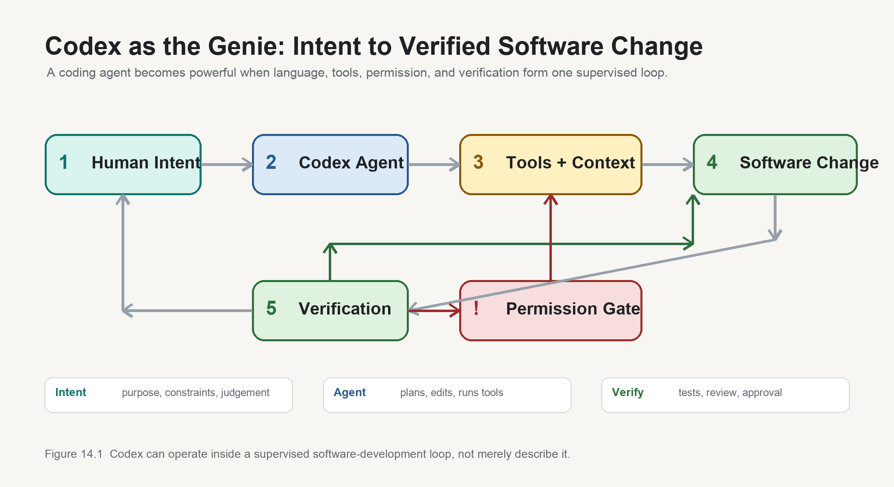

# Agents, Tools, and Integrated Systems

So far, we have mostly discussed AI as a system that responds to prompts.

A user asks for help. The model generates an answer. The human evaluates it.

But software is moving toward something more active. AI systems increasingly use tools, inspect files, call APIs, run tests, search documents, modify code, and take multi-step actions. These systems are often called agents.

The word "agent" is used loosely, so it needs caution. Not every chatbot is an agent. Not every workflow with an AI call is an agent. For this book, the important idea is that agentic systems combine models, context, tools, memory, goals, feedback, and repeated inference to act across software.

[[AI Agents Tool Use and Reliability]] now tracks research support for this chapter. Current agent frameworks from OpenAI, Google, Microsoft, Anthropic, and LangChain all point in the same direction: agents are not merely better prompts. They are engineered systems involving tool loops, state, handoffs, guardrails, tracing, permissions, evaluation, deployment, and integration.

That makes them powerful.

It also makes them risky.

## From Answers to Actions

A basic AI assistant answers a question.

An AI workflow may perform a defined task, such as extracting fields from an invoice or classifying customer messages.

An AI agent goes further. It may pursue a goal through multiple steps:

```text
Goal
↓
Inspect context
↓
Choose action
↓
Use tool
↓
Observe result
↓
Plan next step
↓
Continue or stop
```

In software development, this might mean reading a bug report, searching a codebase, opening relevant files, proposing a fix, editing code, running tests, interpreting failures, revising the change, and summarising the result.

This begins to resemble work.

## The Agentic AI Moment

This shift is no longer only theoretical. Analyst firms and AI companies are now treating agentic AI as a distinct category.

Gartner's 2026 agentic-AI research places agentic AI at the peak of inflated expectations, while also reporting that only a minority of organisations have deployed agents so far. That contrast is important. It suggests that agentic AI is both overhyped and strategically serious. Enterprises are interested, but the infrastructure for safe deployment is still immature.

The same pattern is visible in software development. Gartner has described the enterprise AI coding-agent market as entering a new phase of expansion and competitive realignment. Forrester describes agentic software development as a shift from development assistants to semi-autonomous agents that can plan, generate, modify, test, and explain software artifacts across the development lifecycle.

The product market is moving in the same direction. Cursor, Claude Code, Codex, GitHub Copilot, and similar tools are no longer competing only on who can autocomplete code best. They are competing to become the place where developers assign work to agents, supervise progress, review changes, and decide what is safe to merge.

This is why coding agents matter so much to this book. They are one of the first serious markets where AI stops being merely a conversational assistant and begins to behave like a supervised worker.

## Tools Change the Meaning of AI

A model without tools can generate text.

A model with tools can affect systems.

It can query a database, run a compiler, call an API, send an email, modify a file, create a ticket, update a record, or trigger a workflow. Tool use turns language into action.

Anthropic's tool-use documentation makes this boundary clear: the model selects a structured tool call, and the surrounding application or server-side environment executes it. OpenAI's Agents SDK similarly treats repeated tool calls, branching, handoffs, tracing, guardrails, and approval pauses as parts of agent engineering. The Model Context Protocol pushes the same idea into system integration by standardising how AI applications connect to external data sources, tools, and workflows. See [[AI Agents Tool Use and Reliability]].

This is where [[System Integration]] becomes central. An AI agent is valuable only if it connects to real systems. But every connection creates risk. What data can it access? What actions can it take? Which permissions apply? What happens if it misunderstands? How are actions logged? Can a human review before execution? Can the system roll back mistakes?

The more capable the agent, the more important the boundaries.

## Context and Memory

Agents depend on context.

They need to know the goal, the available tools, the current state, previous steps, constraints, user preferences, relevant documents, and system rules. The [[Context Windows|context window]] becomes working memory.

For simple tasks, context may be small. For complex engineering work, context may include many files, test results, design notes, issue history, logs, and previous decisions. If the agent lacks context, it may act confidently on incomplete information. If it has too much context, it may focus on the wrong details.

Longer context helps, but it does not solve everything. Agents also need retrieval, summarisation, state tracking, and explicit task structure.

## Verification in Agentic Systems

Agentic errors can compound.

A wrong answer is one mistake. A wrong action can create new state. A wrong action followed by another wrong action can create a chain of failure.

Therefore agents require stronger verification than simple chat systems.

Useful safeguards include:

- Tool permissions.
- Read-only modes.
- Human approval before irreversible actions.
- Sandboxed execution.
- Test suites.
- Action logs.
- Rate limits.
- Rollback mechanisms.
- Confidence thresholds.
- Validation after each step.

These safeguards are not theoretical. OWASP identifies prompt injection, insecure output handling, and excessive agency as major LLM-application risks, and its agentic-application work names agent-specific risks such as tool misuse, identity and privilege abuse, memory and context poisoning, cascading failures, and rogue agents. The Cloud Security Alliance's MAESTRO framework similarly treats agentic AI as requiring layered threat modelling across the agent lifecycle. See [[AI Agents Tool Use and Reliability]].

The principle from the previous chapter still applies:

> AI suggests; deterministic software decides.

For agents, we might extend it:

> AI plans and proposes; tools execute within controlled boundaries.

## Agents in Software Development

Software development is a natural environment for agents because the work is already tool-heavy.

Developers inspect files, run commands, search code, execute tests, use version control, read documentation, update tickets, and deploy systems. An AI agent can assist because many steps are digital and observable.

A coding agent may:

- Read a task description.
- Search the repository.
- Identify relevant files.
- Make a small change.
- Run tests.
- Interpret failures.
- Revise the change.
- Produce a summary.

This can reduce developer effort, especially for well-bounded tasks. But it also raises new questions. Did the agent understand the architecture? Did it modify unrelated behaviour? Did it overfit to tests? Did it ignore security? Did it break a workflow not covered by tests? Did it create code the team can maintain?

Agents make verification and review more important, not less.

## Screenshot To Diagnosis

Multimodal agents add another important capability: the user can show the problem instead of describing it perfectly.

Imagine adding a screenshot of an Xcode error message to Codex.

The screenshot does not enter the system as meaning. It enters as visual information:

```text
pixels
↓
visual patches
↓
numerical representations
↓
detected text, layout, colours, and UI clues
```

The model may identify the visible error text, the highlighted line, the surrounding interface, and the development tool. It may infer that the screenshot shows a compiler error, test failure, missing dependency, runtime crash, or configuration issue.

But the screenshot alone is rarely enough. Codex becomes useful because it can combine the image with software context:

```text
screenshot
+ user explanation
+ repository files
+ build logs
+ project structure
+ previous edits
↓
diagnosis
```

For example, a screenshot may show:

```text
Cannot find 'CharacterStore' in scope
```

The repository may show that `CharacterStore.swift` exists, but belongs to another target or module.

The likely diagnosis is not "the code does not exist." It may be:

```text
The file exists, but this part of the project cannot see it.
```

That leads to a different class of fix: target membership, imports, module boundaries, file location, or build configuration.

This is why multimodal AI matters for software development. Real debugging information is often scattered across screenshots, logs, code, project settings, terminal output, documentation, and memory. A coding agent becomes more useful when it can connect these forms of evidence.

The final step remains human verification. Screenshots can be cropped, outdated, or misleading. The model can misread visible text or infer the wrong cause. Multimodal input improves context; it does not remove the need for tests, review, and judgement.

## Codex: When The Agent Controls The Development Environment

Codex is useful as a concrete example because it shows the next step beyond code generation.



An ordinary chatbot can suggest code.

Codex can work inside a development environment.

It can read files, search a repository, edit code, run terminal commands, inspect errors, run tests, and summarise what changed. In some configurations it can also use connected tools, browser diagnostics, plugins, MCP servers, or other authorised sources of context.

That changes the workflow.

The old pattern was:

```text
Human intent
↓
Human programmer
↓
Editor, terminal, browser, build tools
↓
Software
```

The emerging pattern is:

```text
Human intent
↓
Codex
↓
Files, terminal, browser, tests, tools, approvals
↓
Software change
↓
Human review
```

This is why Codex feels different from a normal AI answer. It is not only producing text about software. It can participate in the workflow that changes software.

### The Tool Loop

A typical Codex debugging loop looks like this:

```text
read the user's request
↓
inspect relevant files
↓
form a hypothesis
↓
edit code
↓
run a build or test
↓
read the failure
↓
revise the hypothesis
↓
edit again
↓
verify
```

That loop matters because software development has always depended on feedback. Human programmers rarely write perfect code on the first attempt. They compile, test, inspect errors, search documentation, and revise.

Codex can participate in the same feedback cycle.

The difference is that the user increasingly describes the outcome rather than every command.

### Why Authorization Matters

The more an AI can act, the more permission matters.

Official Codex guidance describes two basic controls:

- sandbox mode: what Codex can technically read, write, or access
- approval policy: when Codex must stop and ask before acting

That is not just product plumbing. It is the engineering answer to agency.

If Codex wants to edit a file inside the current project, that may be allowed.

If it wants to write outside the workspace, use the network, install a dependency, access an external connector, or perform a risky action, approval may be required depending on the configuration.

The principle is:

```text
More agency
↓
more permissions
↓
more audit
↓
more verification
```

This is why agentic AI is not simply "AI gets smarter." It is a new relationship between intelligence and authority.

### Example: Installing A Dependency

Suppose an application fails with:

```text
ModuleNotFoundError: No module named 'pandas'
```

A human developer might inspect the import, check `requirements.txt`, add the dependency, install it, rerun tests, and commit the change.

Codex can follow a similar path:

```text
read error
↓
inspect project files
↓
identify missing dependency
↓
edit dependency file
↓
request approval if network install is needed
↓
run tests
↓
report result
```

The important detail is the approval point. Installing packages usually requires network access and changes the development environment. A safe agent should not silently reach out to the internet or change dependencies without appropriate permission.

This is the new shape of programming: not merely writing code, but supervising an agent that can act on the project.

### Example: Logging Into A Website

Consider a task that requires testing a web workflow after login, such as checking how a feature behaves inside Facebook or another authenticated website.

The safe pattern is not:

```text
Give the AI your password.
```

The safe pattern is:

```text
Codex opens or navigates the site
↓
the human handles login, OAuth, two-factor authentication, or approval
↓
Codex observes the authorised session only if permitted
↓
Codex tests the workflow
↓
Codex reports what it found
```

This distinction is essential.

Agents do not remove authorization. They make authorization more important.

If a browser, plugin, connector, or computer-control feature gives Codex access to a logged-in environment, the question is no longer "Can AI answer?" The question is "What is AI allowed to do?"

That is the same question enterprises will ask about GitHub, Slack, Google Drive, deployment tools, payment systems, customer databases, and internal applications.

### Browser Debugging

For web applications, a coding agent may also use browser diagnostics when enabled and approved.

It may inspect:

- page state
- console errors
- network requests
- runtime exceptions
- screenshots
- visible UI behaviour

The loop becomes:

```text
open app
↓
perform workflow
↓
observe error
↓
inspect console or network
↓
edit code
↓
rebuild
↓
retest
```

This is closer to how a human developer debugs a web application. The agent is no longer merely producing code in isolation. It is using the running system as evidence.

### Radix Field Note: Why Codex Was Different From ChatGPT

My experience building Radix made this difference clear.

ChatGPT could explain ideas, suggest code, and help me think through problems. But it usually depended on me to carry the whole technical situation into the conversation. I had to describe the file structure, paste the relevant code, copy the error message, run the command myself, and then bring the result back.

Codex changed the relationship because it could work inside the project.

It could inspect the Radix files, search the repository, edit Swift or Python, run terminal commands, read build failures, revise its own changes, and report what had been checked. That made the interaction feel less like asking for advice and more like supervising a software worker inside the development environment.

This mattered when Radix problems crossed several boundaries at once: screenshots, OCR capture, web pages, AI prompt templates, database storage, Xcode errors, and user-interface behaviour. A normal chatbot could discuss each piece separately. Codex could help connect them inside one working loop.

Consider a Facebook-like web-capture or scraping problem. The technical issue is not simply "how do I scrape a page?" It may involve whether the user is authorised to access the page, whether the content is visible in the current session, whether it appears as text or image, whether OCR is needed, whether the page structure has changed, whether platform rules allow automated extraction, and whether the captured result flows correctly into the application.

The safe pattern is:

```text
human defines the legitimate task
↓
human handles login or grants approved access
↓
Codex observes only the authorised page, screenshot, file, or output
↓
Codex diagnoses the technical problem
↓
Codex edits local code or extraction logic
↓
Codex reruns permitted checks
↓
human verifies the result
```

That is the important distinction.

ChatGPT can tell me what might be wrong.

Codex can help discover what is wrong by examining the actual working system.

This does not make the human less important. It makes the human's role different. I still decide what Radix should do, whether a capture workflow is legitimate, whether the behaviour is acceptable, and whether a change should be kept. Codex reduces the cost of moving from problem to tested change, but judgement and accountability remain human.

### Learning The Language Of Agents Through Radix

The vocabulary of artificial intelligence can make a fairly understandable activity sound remote. Terms such as _agentic loop_, _grounding_, _tool use_, _state_, _guardrails_, and _human in the loop_ are useful, but only after the reader can connect them to something that happened.

Radix provides that connection. The examples below are not demonstrations invented after the fact. They come from the development record of the application. They show what I asked the Genie to do, what it actually did, and the name the wider AI world gives to that behaviour.

#### Agentic behaviour: when the keyboard covered the work

At one point, the iPhone keyboard covered the Etymology field in Radix. My report was written as a user, not as a programmer: when I touched the field, I could no longer work with it properly.

The Genie found the interface code, saw that the lower fields had nowhere to scroll, changed the layout, and added controls for dismissing the keyboard and saving the result. The first attempted change did not compile. The Genie read the compiler's objection, recognised a SwiftUI view-building problem, adjusted the implementation, and built Radix again. The second build succeeded.

In ordinary language, it tried to repair the problem, examined what happened, corrected itself, and checked again. In AI terminology, this was **agentic behaviour**. The repeated sequence is an **agentic loop**:

```text
understand the objective
↓
inspect the environment
↓
take an action
↓
observe the result
↓
revise the action
↓
verify the outcome
```

Researchers and developers sometimes call the alternation between reasoning and action **ReAct**. The name is less important than the mechanism. The Genie did not produce a single answer and stop. It used feedback from the real system to decide what to do next.

#### Tool use: when a request became a ZIP export

I asked for an option in Radix that would collect its essential JSON, database, and text files into a ZIP archive. I did not identify the Swift files that needed to change or describe how a ZIP file should be constructed.

The Genie inspected the existing My Data screen, found the export service, identified the relevant application resources, and extended the existing design. It added a manifest explaining what the archive contained, changed three source files, ran an Xcode build, and checked that it had not mixed its work with unrelated changes already present in the project.

The language model supplied interpretation and judgement. Codex supplied access to files, search, editing, terminal commands, and the compiler. In AI terminology, these are **tools**. A model can discuss a ZIP export. An agent with tools can participate in building one.

This distinction is central to the economics of agents. Intelligence becomes more valuable when it can be connected to action. It also becomes more dangerous. A system that can change files needs permissions, boundaries, records, and verification in a way that a system producing only prose may not.

#### Grounding: when the visible problem was not the real problem

I asked the Genie to highlight the position of a previewed character in Radix's Browse grid. After examining the code, it discovered that the highlight already existed. The real problem was that the grid did not move to the page on which the character appeared. The Genie changed the page-selection behaviour rather than building a second highlighting mechanism.

This is **grounding**: forming a conclusion from the actual project rather than from a plausible guess. The Genie retrieved the relevant files and placed their contents into its working context before deciding what to change.

This resembles the principle behind **retrieval-augmented generation**, usually shortened to **RAG**. A general model is supplemented with information relevant to the current question. But the terms should not be blurred. Searching source files is not by itself proof that Codex is implemented as a particular RAG architecture. The durable idea is that the answer became specific because the Genie could retrieve and inspect Radix itself.

#### Human in the loop: when AI proposed and the user decided

The Phrase Discovery Import feature provides an example inside Radix, not only in the way Radix was developed.

Radix preserves a passage of Chinese text captured through OCR. It identifies phrases already known to the application and prepares the full passage for an AI model, together with instructions to suggest useful new phrases. The returned candidates are parsed and checked again. Duplicates and invalid entries are removed. The user reviews the remaining phrases, edits them if necessary, and chooses which ones to save. Approved phrases go into an overlay database; the core database remains protected.

In everyday language, AI proposes, software filters, and the human decides. The wider term is **human in the loop**. Human judgement has not disappeared. It has moved from producing every candidate to deciding which candidates deserve acceptance.

The surrounding restrictions are **guardrails**. The AI-assisted process may propose phrases, but it may not silently rewrite the protected database, invent missing information, or bypass the user's approval. The distinction between what a system is capable of doing and what it is authorised to do is one of the defining problems of agentic AI.

#### Observability and verification: when nineteen became eighteen

After source files were accidentally deleted, the Genie searched recovery folders and archives. It compared duplicate files byte for byte and ran a build. A signing failure initially obscured the source problem, so the Genie performed a compile-oriented check with signing disabled. That exposed nineteen missing Swift files.

One archive contained none of them. Another contained 253 Swift files but only one of the missing files. The Genie extracted that one file, compared its checksum with the archived copy, and ran the check again. The number of missing files fell from nineteen to eighteen.

This was not complete success, and that is precisely why it is a useful example. The Genie kept a visible record of what it had examined and what each test established. In AI engineering, the ability to reconstruct an agent's actions and results is called **observability**. Checking whether the result is correct is **verification**.

The episode also shows the boundary of agency. The Genie could search every source it was given. It could not recover information that was absent from all of them. Agentic AI expands the range of work a model can attempt; it does not abolish the limits imposed by missing evidence.

#### External memory: moving the Genie between machines

When I prepared to continue Radix on another computer, the Genie produced a handoff that recorded what had already changed, which files had been separated, what should not be repeated, which build command should be used, and what work remained. I also kept a handoff document in the project so a later Codex session could reconstruct the situation.

This is **external memory**. The model did not acquire permanent human recollection of the project. Important state was written outside the model and retrieved when needed. The chat history, the source tree, the project notes, and the handoff file each preserved a different part of the working context.

The distinction matters because the word _memory_ is often used too casually in AI. Remembering a preference, retaining the current conversation, retrieving a project document, and changing a model through training are not the same process. My handoff file was closer to a carefully prepared briefing for the next worker than to a memory inside a brain.

### Where The Radix Evidence Ends

Not every term in the agentic-AI vocabulary has already appeared in the development of Radix. This book should not pretend otherwise. Where the development record is direct, I describe what happened. Where the connection is only an analogy, I say so. Where I describe a possible future, it is speculation rather than history.

A future **multi-agent system**, for example, might assign one Genie to inspect Radix's interface, another to examine its databases, and a third to test the proposed change. A coordinating agent would divide the work and combine the results. That coordination is called **orchestration**. If the agents exchanged tasks and results directly, the wider industry might describe it as **agent-to-agent**, or **A2A**, communication.

The same idea could apply to this book. One agent might retrieve sources, another challenge the argument, another check technical language, and another edit for clarity. I would remain responsible for the thesis, the meaning, and the decision to accept or reject their work. The speculative economic question is not merely whether AI can imitate one worker. It is whether one person may increasingly be able to direct something resembling a small artificial organisation.

Radix also offers a natural possible use for **GraphRAG**. Its characters, components, variants, pronunciations, meanings, and phrases form a network of relationships. Ordinary retrieval might find a passage containing a character. Graph-based retrieval could follow relationships to find characters sharing a phonetic component or phrases connected through their constituent characters. Radix does not need to be described as using GraphRAG today for the example to make the concept visible.

**Reinforcement learning** provides another case where precision matters. If Radix records which proposed phrases a user accepts, it has stored feedback. It has not necessarily learned. It becomes reinforcement learning only if that feedback is used to alter a policy governing future choices. **PPO**, or Proximal Policy Optimization, is one mathematical method for making such adjustments without allowing each new lesson to change the system too violently. The mechanism belongs in the wider explanation; Radix is the imagined application, not evidence that the method is already present.

A future Radix might also combine flexible model judgement with exact rules: the model judges whether a phrase is natural, while conventional software enforces its permitted length, rejects duplicates, and protects the core database. The broad research term for combining learned neural judgement with explicit symbols or rules is **neuro-symbolic AI**. Whether a particular implementation deserves that label would depend on its architecture, but the Radix example explains why the combination is attractive: probabilistic intelligence and deterministic software compensate for each other's weaknesses.

These possibilities belong in the book because they connect my experience to the wider AI world. They must remain visibly labelled as possibilities. The Genie metaphor should make unfamiliar ideas understandable, not make speculation look like accomplished fact.

## Field Note: The Genie's Uneven Magic

While preparing this book for publication, I noticed that several diagrams contained boxes whose labels escaped across their borders. The same kind of problem had appeared in Radix. Codex could implement the logic of a feature, yet squeeze a button until its words wrapped awkwardly or arrange controls correctly in principle but badly in the available space. Microsoft Word templates created another version of the problem: the content was present, but fixed fields, pagination, anchors, and font metrics refused to behave as expected.

These were small failures beside the amount of work the Genie could accomplish. They were also revealing. The model could understand the relationship among the parts without reliably judging the finished whole. It knew that a label belonged inside a button. It did not always anticipate the exact space the rendered words would occupy.

The problem is broader than visual layout. The Genie's powers are uneven in four recurring ways:

| The Genie is strong at | Where it remains less dependable |
|---|---|
| Generating a plausible result | Establishing that the result is correct |
| Following the stated instruction | Inferring the intention and missing context behind it |
| Constructing individual components | Anticipating interactions across the whole system |
| Producing an artefact | Judging whether it is useful, safe, polished, and finished |

The unevenness helps explain several otherwise puzzling experiences with AI. A model can produce hundreds of lines of coherent code and overlook an unusual permission case. It can rewrite a chapter fluently and introduce a contradiction with an earlier chapter. It can obey “make the button smaller” even when the real intention was to make the interface feel less crowded. It can generate a finished-looking document without noticing that a heading has been stranded at the bottom of a page.

### An old problem exposed by faster generation

The Radix experience should not be read as evidence that AI created the difficulty of user-interface work. Programmers struggled with graphical interfaces long before generative models appeared. A Microsoft Research paper published in 1992 began from the observation that high-quality GUIs were difficult to build and described toolkits, standard widgets, and interactive layout editors as ways to make that work more manageable. The specific technology is old; the engineering response is still recognisable. [The study drew on extensive observation of more than 120 users.](https://www.microsoft.com/en-us/research/?p=154648)

Modern frameworks contain entire systems for negotiating space because the underlying problem never vanished. Apple's SwiftUI documentation explains that text placed in a constrained area may wrap, tighten, shrink, or truncate. Developers are given line limits, minimum scale factors, truncation modes, flexible frames, grids, stacks, and custom layout containers because no single arrangement works for every word, device, language, and accessibility setting. Apple's Dynamic Type guidance explicitly tells developers to preview multiple text sizes and look for words clipped by fixed containers. [These are normal properties of rendered interfaces, not unusual defects unique to Radix.](https://developer.apple.com/videos/play/wwdc2024/10074/)

AI enters this old problem unevenly. It can produce interface code quickly, but functional correctness and visual fidelity are different tests. The [VISTA benchmark](https://arxiv.org/abs/2605.26144) found that the two were only partially coupled in generated web applications: an application could behave correctly without closely matching the intended visual structure. Earlier [Design2Code research](https://salt-nlp.github.io/Design2Code/) reached a similar conclusion while testing hundreds of real webpages. Meanwhile, the 2025 Stack Overflow Developer Survey found that 66 per cent of respondents who answered its AI-frustration question complained about solutions that were almost right, while 45 per cent cited time spent debugging AI-generated code. Those figures cover AI-assisted development generally rather than UI alone, but they describe the same costly category of near-success. [Stack Overflow reports the survey population and question results on its AI results page.](https://survey.stackoverflow.co/2025/ai)

This leads to a more precise conclusion than “AI is bad at UI.” Interface engineering was already difficult. AI makes the first implementation cheaper, exposes the unresolved visual work sooner, and can increase the volume of screens that need review. Current models can help with that work, but they do not make the older disciplines obsolete.

Research also supports the possibility of improvement without claiming the problem has disappeared. A 2026 experiment called [*Coding with Eyes*](https://arxiv.org/abs/2604.19750) gave a coding system visual feedback and direct interaction with rendered GUI applications. Its task success and visual scores improved, but overall success remained far from complete. Another 2026 study used a fully automated visual critic to render webpages, inspect them, revise the code, and repeat; three refinement cycles improved performance by as much as 17.8 per cent. [The result supports automated self-correction while also showing why one-shot generation is insufficient.](https://arxiv.org/abs/2604.05839)

The practical answer is therefore cumulative:

~~~text
learned design knowledge
+ established UI framework
+ reusable design system
+ responsive layout rules
+ automated functional and visual tests
+ AI render–inspect–correct loop
+ human judgement for purpose and experience
~~~

AI does not replace the framework. It becomes more dependable when working through one. It does not replace visual testing. It can help run and interpret the tests. It does not eliminate design judgement. It can remove more of the mechanical correction so that human attention is reserved for questions the framework cannot answer.

### Three failures the reader can see

The first example came from Radix on an iPhone:


The screen worked, but the row beneath the character strip did not read like a deliberate interface. “Memory” and “Phrases” were forced into two lines, with hyphens appearing where the words broke. “Components” became “Compon...”. The help text and navigation competed with the character grid for the same small screen.

The first attempted correction also taught a second lesson. Codex changed the labels for a vertical or sidebar layout, but the screenshot showed the iPhone's horizontal header path. The code change was reasonable inside the component it had found; it simply did not affect the version of the interface that the user was looking at. Once the screenshot was supplied, Codex traced the actual rendered path and changed the visible labels to shorter forms such as “Mem”, “Phrase”, and “Root”.

The next two examples came from this book. In the first version of the English-to-software diagram, the words “Mathematical representation” extended beyond the green box. The sentence at the bottom crossed both sides of its container:


In the AI-model figure, the small sentence beneath the main diagram was wider than the box drawn to contain it:


Other figures failed differently. One contained a blank oval where “Procedure” should have appeared. Another left “Probabilistic AI” out of the main node. The human-expertise figure contained words that were clipped at the bottom of their boxes. Each file existed. Each image opened. Each page could be published. A production check concerned only with file generation would have declared success.

A reader can see the failures immediately because people perceive the rendered whole. The source process had checked whether an image was produced, not whether every label remained legible inside the composition. After the screenshots were returned to Codex, the diagrams were rebuilt with measured boxes, deliberate line breaks, and visual inspection of the rendered PNGs.

These examples clarify the limitation. The Genie was capable of recognizing and correcting the spatial defect. What failed was the workflow around it: creation was automatic, while looking at the creation was left to the human.

### Why the Genie misses what people see

Code logic is often expressed in symbols with outcomes that can be checked. If a payment succeeds, does the order change state? If an imported phrase already exists, is it duplicated? A test can supply an input and compare the observed result with the expected one.

Visual quality depends on geometry and perception. The width of a label changes with the typeface, font size, operating system, language, browser, screen size, accessibility settings, padding, and the words themselves. A layout that works on a laptop can fail on a telephone. A Word paragraph moving by one line may push a table onto the next page.

Current models can interpret images, but they do not continuously experience the screen as a person does while they generate code. Unless the workflow renders the result and returns it for inspection, the model may treat valid source code as a completed interface. Even when shown the screen, it can identify the obvious overflow while missing balance, hierarchy, or the accumulated irritation of using a cramped workflow repeatedly.

Other limitations have the same structure. Missing context prevents the model from seeing the whole project. Probabilistic generation produces convincing errors. Long tasks allow terminology and design decisions to drift. Novel situations provide fewer established patterns to draw upon. Most importantly, the model does not live with the consequences of a bad release, a misleading claim, or a damaging decision.

### The older machinery still matters

The answer is not to ask another model whether the first model did a good job. Software engineering already has a large collection of deterministic tools designed to catch particular classes of failure.

Compilers and type checkers reject inconsistent program structures. Linters detect suspicious patterns. Unit, integration, and end-to-end tests compare behaviour with expected outcomes. Schemas constrain data exchanged between systems. Security scanners look for known vulnerabilities. Version control exposes exactly what changed and allows a change to be reversed. Permissions and sandboxes limit the damage a tool can cause.

Visual work also has automated safeguards. Browser tests can render the same interface at several screen sizes and measure whether text extends beyond its container. [Playwright's visual comparisons](https://playwright.dev/docs/test-snapshots) can compare a new screenshot with an approved reference image. [axe-core](https://github.com/dequelabs/axe-core) can automatically identify many accessibility defects in rendered web interfaces, while deliberately reporting some cases for human review. Design systems provide tested components with minimum sizes, spacing rules, and predictable responsive behaviour.

Documents have partial safeguards rather than a complete solution. Templates, paragraph styles, table rules, preflight checks, and PDF rendering can reduce errors. Microsoft's Open XML tools can [validate the structure of a Word document](https://learn.microsoft.com/en-us/office/open-xml/word/how-to-validate-a-word-processing-document), but Microsoft also states that the SDK does not reproduce Word's layout behaviour. A structurally valid file can therefore remain visually poor. The dependable workflow is still to render the final pages and inspect them.

These tools are narrower than AI, and that is their advantage. A schema does not understand the purpose of Radix, but it can say with precision that required data is missing. A screenshot comparison has no taste, but it can prove that pixels changed. A test suite does not know whether a feature is worth building, but it can establish whether previously agreed behaviour survived.

The strongest system combines the Genie's breadth with the older machinery's narrow certainty:

```text
human intention
↓
AI generation
↓
deterministic checks
↓
rendered inspection
↓
human judgement and approval
```

### This can be engineered away

There is no fundamental reason a person must be the first to notice that a label has crossed a border. If the Genie can create an interface and interpret a screenshot, the surrounding agent can close the loop automatically:

~~~text
generate the interface
↓
render the real screen
↓
capture it at several sizes and states
↓
measure overflow and compare screenshots
↓
inspect the image
↓
revise and repeat
~~~

When I uploaded screenshots of the defective book figures, Codex could see the problem and correct it. The missing capability was not visual recognition. The earlier production process had stopped after generating the image. It had not required the Genie to look at its own finished work.

Better training should improve the first attempt. Models can learn recurring design practices: adequate button padding, minimum target sizes, responsive grids, readable line lengths, accessible contrast, and deliberate text wrapping. Training provides patterns that usually work. It cannot prove that a particular label, font, device, language, or data value works in the screen being built. The relationship is the same as code: learning good programming patterns improves generated code, while compilation and testing establish whether this program works here.

Frameworks can reduce the problem further by restricting what the model is allowed to invent. Radix could define approved buttons, cards, text styles, spacing, and navigation structures. Instead of choosing arbitrary widths for every feature, Codex would assemble tested Radix components whose rules already cover padding, accessibility, and different screen sizes. A diagram system could measure each label, wrap it deliberately, reject collisions, and fail the build if text leaves its container.

The preferred division of labour is therefore:

~~~text
frameworks prevent predictable mistakes
automated tests detect measurable mistakes
AI inspects and corrects visible mistakes
humans judge purpose, experience, and unusual cases
~~~

Human review does not disappear, but it should move upward. People should spend their attention deciding whether a learning screen is clear and worthwhile, not repeatedly discovering that a machine made a button too narrow.

### Temporary weakness or lasting boundary?

Some of the problem is likely to be temporary. Multimodal models are improving at reading screens. Coding agents can open browsers, capture screenshots, inspect the document structure, test multiple viewport sizes, and revise their own work. Overflow detection, automated test generation, retrieval of project decisions, and comparison across files should all become more reliable.

A deeper boundary will remain even if the obvious defects disappear. Detecting that text crossed a border is measurable. Deciding whether a learning screen feels calm, whether an explanation is humane, whether a workflow deserves the user's trust, or whether a feature should exist requires judgement about people and purposes. Better models may become strong advisers on these questions, but the questions do not collapse into geometry.

The short-term weakness is incomplete perception and verification. The longer-term boundary is responsibility for what “good” should mean.

### Where the human time moves

This has a direct economic consequence. AI may make a functional feature dramatically faster to produce without reducing the final mile of product work by the same amount. Someone still has to use the feature, notice that the button is cramped, test the smaller screen, rewrite the label, check accessibility, and decide whether the interaction feels coherent.

During the present transition, a large amount of human time can therefore move into user-interface refinement. Looking back on the development of Radix, I would estimate that UI work consumed about 80 per cent of my time. That is a retrospective personal estimate, not a measurement from time-tracking software, but the scale is important. Much of the effort went into arranging screens, fitting controls onto different devices, shortening labels, clarifying what could be tapped, exposing the right information at the right moment, and checking whether a change actually appeared in the layout the user saw.

The UI had not necessarily become more expensive in absolute terms. It had become a much larger share of the remaining work because the Genie accelerated the underlying implementation more than it accelerated visual refinement. The same shift can appear in editing, testing, integration, governance, and review.

This is a current cost, not an unavoidable destination. Better component frameworks, automated checks, and agentic self-inspection should progressively remove much of the mechanical rework. The 80 per cent figure describes my experience of building Radix with the available tools; it should not be treated as a prediction that future AI-assisted projects must spend the same proportion.

This is another form of the scarcity shift developed later in the book. When production becomes abundant, inspection, taste, and responsibility become more valuable.

The practical rule is simple: never declare visual or document work complete because the file was generated. Render it at the size in which a person will encounter it. Measure what can be measured. Use deterministic checks wherever they exist. Then let a person judge the experience.

The Genie can help with every step. It should not be allowed to skip them.

### Claude Code, Cursor, And The Coding-Agent Race

Codex is not alone.

Claude Code, Cursor, GitHub Copilot, and other tools are competing for the same emerging role: the place where software work is assigned, supervised, reviewed, and merged.

The important question is not which product wins.

The important question is what category is being created.

The category is:

```text
AI as supervised software worker
```

That worker may live in the terminal, the editor, the desktop app, the browser, the cloud, or some combination of all of them. It may read code, run tests, inspect logs, open pages, create pull requests, update tickets, and coordinate with other agents.

This is why the coding-agent market matters so much. It is the first serious attempt to make intent-to-code less painful by putting AI inside the actual development workflow.

### The Future: Painless Intent To Code

The future possibility is not just better autocomplete.

It is a smoother path from human intent to verified software change:

```text
user explains goal by voice, screenshot, sketch, or text
↓
Codex asks clarifying questions
↓
Codex creates a plan
↓
Codex inspects the codebase
↓
Codex edits files
↓
Codex runs tests
↓
Codex opens the app and checks behaviour
↓
Codex reviews the diff
↓
Codex prepares a pull request
↓
human approves
```

In more advanced workflows, Codex-like systems may coordinate multiple specialised agents:

```text
one agent explores the code
one agent writes tests
one agent checks security
one agent updates documentation
one agent validates the user interface
```

The main agent then summarises the work and presents the decision to the human.

This is the direction that points toward [[Macrohard Speculation Packet|Macrohard]]. If a single agent can perform bounded development work, the next question is whether many agents can coordinate larger parts of a software organisation.

But the lesson should be kept grounded.

The future is not "AI does everything without oversight."

The more serious future is:

```text
AI does more of the mechanical work
humans define intent
humans set boundaries
humans verify outcomes
humans remain accountable
```

That is how intent becomes software without pretending that trust, security, and judgement disappear.

## Agents and Legacy Systems

Agents may also matter for legacy modernisation.

Imagine an AI system that can inspect old code, search documentation, map dependencies, generate tests, propose wrappers, compare outputs between old and new systems, and maintain migration notes. This would not replace engineers, but it could reduce the cost of understanding complex systems.

The same risks apply. Legacy systems often support critical operations. An agent must not make uncontrolled changes. It should operate inside strict permissions, with human review, audit logs, and test environments.

The economic value is large because legacy understanding is expensive.

## Agents as Economic Multipliers

A model answers one question at a time. An agent can coordinate many model calls, tools, and checks toward a goal.

That makes agents potential economic multipliers. They can reduce the cost of workflows, not just individual tasks.

But the cost also multiplies. Agents consume repeated inference. They require tool integration. They need monitoring. They create security and permission challenges. They may fail in complex ways. They require evaluation not only of outputs, but of sequences of actions.

The economic question is:

> Does the agent reduce enough human effort, delay, and error to justify the cost and risk of giving AI more agency?

For some tasks, yes. For others, a simple assistant or deterministic workflow will be safer and cheaper.

## Five Years

In a five-year scenario, agents become common in bounded software workflows.

They help with code search, test generation, bug fixing, documentation, migration scripts, data cleanup, support triage, and internal operations. The most successful agents are likely to be constrained: clear goals, limited tools, strong permissions, test environments, and human approval for risky actions.

## Ten Years

In a ten-year scenario, agents may coordinate larger workflows across enterprise systems.

They may monitor processes, propose improvements, maintain documentation, detect anomalies, assist migrations, and orchestrate specialised tools. They may become a layer above existing software, translating human goals into sequences of controlled actions.

This depends on major progress in reliability, context management, security, evaluation, and organisational trust.

## The Engineering Lesson

Agents make AI feel more like a worker than a tool.

That feeling can be misleading. An agent is still a system. It needs architecture, constraints, permissions, tests, monitoring, and accountability.

The more agency we give AI, the more engineering discipline we need around it.

This completes the movement of Part IV. AI changes software engineering by making communication more important, precision more difficult, legacy understanding more valuable, and integration more central.

The final part of the book can now ask what happens if these changes continue.

What becomes scarce when software becomes cheaper?

What happens to programmers?

What might the next five and ten years look like?
