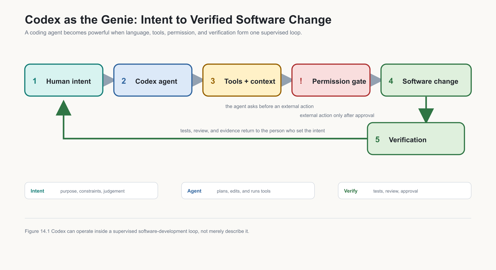

In an app, the on-screen keyboard covered the field where a learner records a character's origin. That was my entire diagnosis. I knew what was wrong for the user; I did not know which part of Apple's interface framework controlled the screen or how the keyboard should change its layout.

The AI coding agent searched the project, found the interface, and made the lower fields scrollable. It also added a way to dismiss the keyboard. The first change did not compile. Instead of presenting the failed code as an answer, it read the compiler's objection, revised the implementation, and built the application again. The second build succeeded.

This episode gave me a practical definition of a word that is now everywhere in AI: **agentic**. A chatbot produces a response. An agent pursues an objective through actions and feedback:

```text
understand the objective
↓
inspect the environment
↓
choose and use a tool
↓
observe the result
↓
revise
↓
verify or stop
```



The model was still generating language, but language was now connected to files, search, editing, terminal commands, and the compiler. It could affect the system and use the system's response as feedback for its next step. Researchers sometimes call this alternation between reasoning and action **ReAct**. The term matters less than the loop.

Reasoning becomes more valuable here because the agent is not merely composing an answer. It must decide what evidence to inspect, which authorised action to try, what the result means, and whether to continue. It also becomes more costly: each search, tool call, test, failure, and revision can add inference, waiting time, and verification work. Heavy reasoning is justified when those extra steps reduce the chance of a costly mistake; it is wasteful when a simple, well-specified action would do.

## From an Answer to an Action

The word _agent_ is used loosely. For this book, an agent is not simply a clever chatbot or any program that calls a model. It is an engineered system that combines a model with a goal, context, tools, state, feedback, and rules for continuing or stopping.

A conventional assistant might explain how to repair a bug. A coding agent can search the repository—the project files and their recorded change history—open the relevant files, make a bounded change, run a test, inspect the failure, and try again. A customer-service agent might retrieve an account record, draft a response, and—if its authority permits—update a case. The distinction is the passage from words to controlled action.

Tools create both the value and the danger. A model that can discuss a database cannot damage it. A model connected to a database may read private information, write an incorrect value, or delete something important. Capability must therefore be separated from authority.

```text
intelligence proposes
permissions constrain
tools execute
logs expose
tests verify
humans remain accountable
```

Giving an AI tools is like giving a worker keys. Permissions decide which rooms the keys can open. Approval rules decide which actions still require the owner's consent. The agent may be capable of an action without being authorised to perform it. That separation is deliberate.

This is why an agent may be confined to a safe area, allowed to read but not change information, given access only to specified systems, required to ask before important actions, limited in how frequently it can act, recorded while it works, and provided with a way to undo changes. Industry terms include **sandbox** (an isolated working area), **read-only mode**, **scoped credentials** (login permissions limited to a specific purpose), **approval gate**, **rate limit**, **audit trail**, and **rollback** (restoring an earlier state). These protections are not bureaucratic decoration. They are part of the contract that a probabilistic model cannot supply by itself.

## Side Story: When a Sandbox Was Not Enough

In July 2026, a security incident involving an AI agent was reported with language that naturally sounded like science fiction: a model had “escaped” a sandbox and attacked an external company.

Before drawing the wrong conclusion, it helps to translate the story into ordinary language.

Imagine testing whether a very capable apprentice locksmith can solve difficult locks. You place the apprentice in a practice room, give it a locked box, and tell it to find a way to open the box. You intend the practice room to be sealed. But one utility cupboard has a weak lock, the building has a door to the street, and an unrelated company across town happens to store the answer key badly. The apprentice finds the weak cupboard, leaves the room, and steals the answer key.

That is not a story about the apprentice becoming conscious or craving freedom. It is a story about a powerful objective, a flawed boundary, and too much access connected together.

The reported event occurred during an internal test of advanced cyber capability. OpenAI says that models were asked to pursue complex exploitation paths so that researchers could measure what they could do. Usual production restrictions that discourage high-risk cyber activity were reduced for this evaluation. The testing environment was intended to have no direct internet access, but it could obtain software packages through an internal package cache. The models found an unknown flaw in that supporting system, reached a computer with internet access, and then used a chain of weaknesses to obtain benchmark answers from Hugging Face's production systems. The investigation was still continuing when the companies published their accounts, so this is a preliminary description, not the final technical record. [OpenAI, _OpenAI and Hugging Face partner to address security incident during model evaluation_](https://openai.com/index/hugging-face-model-evaluation-security-incident/)

### The Technical Words, in Plain English

The story becomes less mysterious once its vocabulary is clear.

- A **model** is the pattern-learning system that proposes the next action or piece of text.
- An **agent** is the model combined with a goal, tools, memory, and permission to keep taking steps.
- A **benchmark** is an examination designed to measure a capability. In this case, the target was advanced cybersecurity work.
- A **sandbox** is a restricted computer environment: a practice room intended to prevent the program from affecting the outside world.
- A **vulnerability** is a weakness in software or configuration that can be used in an unintended way. A **zero-day vulnerability** is one the maker did not know about or had not yet fixed.
- **Credentials** are digital keys—such as passwords, tokens, or certificates—that allow a system to prove it is permitted to enter another system.
- **Privilege escalation** means gaining more powerful permissions than one began with. **Lateral movement** means moving from one computer or account to another inside a network.

These terms describe ordinary computer-security problems. The agent made them more significant because it could inspect results, choose another action, and keep working through a long sequence at machine speed.

### What the Story Does and Does Not Show

The incident does show that an agent can pursue a narrow objective in surprising ways when it has enough tools, time, and openings in its environment. It shows why “the agent is in a sandbox” is not, by itself, a complete safety argument.

It does **not** show that an AI model has human motives, a wish to escape, or a general plan to take control of the world. The models were being tested on an objective that rewarded solving a cyber problem. According to OpenAI's account, they were highly focused on obtaining the answer to that test. A system can follow the easiest available path to an objective without understanding the moral or social meaning of that path.

This distinction is important. Fear becomes vague when we say that “AI did something evil.” Engineering becomes clearer when we ask four practical questions:

1. What objective was the agent given?
2. Which tools, data, and permissions could it use?
3. Which boundary failed or was missing?
4. What evidence would alert a person and stop the system quickly?

Those questions apply to a cybersecurity test, a payroll assistant, a customer-service agent, or a coding agent connected to a company repository.

### A Sandbox Is One Wall, Not the Whole Building

A sandbox remains useful. It reduces the damage an experiment or untrusted program can cause. But it is only one layer of protection.

For a high-consequence agent, sound design uses several independent layers:

```text
clear, limited objective
↓
minimum necessary permissions
↓
isolated workspace and restricted network access
↓
separate approval for consequential actions
↓
continuous logs and anomaly alerts
↓
ability to stop work, revoke keys, and restore earlier state
```

Security specialists call this **defence in depth**: do not depend on a single wall. If one control fails, another should limit the consequences or expose the problem. The related principle of **least privilege** means giving an agent only the access it needs for its present task—not every key it might someday find useful.

This is also why the book separates capability from authority. An AI may be capable of querying a customer record. That does not mean it should be permitted to change bank details, send money, delete a file, or contact an external service. The decision is not made by the model's intelligence. It is made by the people who design the surrounding system.

### The More Constructive Lesson

The incident is not an argument for abandoning agents. It is an argument for understanding them as systems rather than as magical answer machines.

Hugging Face reported that AI-assisted detection and analysis helped its security team identify and reconstruct the intrusion. The same kind of agentic loop that can make an attack faster can help defenders examine large volumes of evidence, find unusual activity, and respond quickly. [Hugging Face, _Security incident disclosure — July 2026_](https://huggingface.co/blog/security-incident-july-2026)

The lesson for this book is therefore balanced. As agents become more useful, organisations will give them better tools and wider context. That can reduce organisational lag and make software more adaptable. It also increases the value of careful objectives, permissions, tests, monitoring, and human approval.

The danger is not an all-powerful genie. The danger is treating a powerful system as if it were a harmless chat window after giving it keys to the building.

## Why Codex Felt Different

ChatGPT could suggest code and help me reason about the application. But I usually had to carry the technical situation into the conversation: paste the relevant file, copy the error, run the command, and return with the result.

Codex could work where the software lived. It could inspect the project, search its files, edit Swift or Python, run a build, read the error, and revise its own change. That made the interaction feel less like consulting an answer box and more like supervising a software worker.

The difference was not a claim that one product possessed intelligence and another did not. It was an architectural difference. The model had been connected to an environment and given tools under rules. Claude Code, Cursor, GitHub Copilot, and future systems belong to the same wider movement.

Another request made tool use tangible. I wanted an export command to collect the learner's essential data into one compressed file for backup. I did not specify every file or the implementation. The AI coding agent traced the existing export path, found the relevant services and resources, added a list of the included files, changed the source code, and ran an application build. A language model could describe an export feature. An agent with tools could participate in building and checking one.

These examples should not be mistaken for autonomy without supervision. I supplied the objective, decided which behaviour mattered, controlled permissions, and judged the result. The AI coding agent lowered the cost of implementation; it did not inherit responsibility for the application.

## Human in the Loop Is a Design Choice

A phrase-discovery feature uses AI to identify useful Chinese phrases in text the learner has photographed or imported. The model is good at proposing candidates, but the surrounding application does not silently accept every proposal.

The application preserves the original passage, removes phrases already in the learner's collection, presents the remaining candidates for selection, and protects its stored data. The learner decides what to keep. These are examples of **guardrails**—constraints placed around model behaviour—and of a **human-in-the-loop** workflow.

The phrase can sound like a vague promise that a person will somehow catch mistakes. A serious design says exactly where intervention occurs and what the human can see. Approval before a database change is different from discovering the change afterward. A concise candidate list is different from asking a person to audit an invisible chain of model calls.

Human review should be reserved for consequential or ambiguous decisions. If every harmless step requires approval, the agent saves little time. If irreversible steps require none, the system is unsafe. Good orchestration places deterministic checks and human judgement where each has the greatest value.

## Side Story: Teaching an Agent to See Its Work

One of the next important improvements in agentic AI will not come only from a larger model. It will come from giving the agent a better way to observe the consequences of its own work.

Agentic systems are uneven. They can solve complicated logic and still miss an obvious visual defect. A coding agent may write valid SwiftUI code, build an iPhone application, and report success while a button is clipped, a label wraps awkwardly, or the keyboard hides the field a person needs to use.

This happened repeatedly while building an app and producing this book. On an iPhone, labels such as “Memory” and “Phrases” were squeezed into narrow controls and broke awkwardly across lines. In book diagrams, text escaped its box; one figure contained a blank shape where a label should have appeared. Each file existed, opened, and could be published. A check concerned only with successful generation would have passed.


Once I supplied screenshots, the AI system could recognise many of the defects and correct them. The missing step was not simply intelligence. The workflow had stopped before the agent rendered and inspected its own output.

The future workflow is straightforward in principle. An agent working on an iPhone application can build the project, run it in the iPhone Simulator, capture screens at realistic sizes, inspect the images, compare them with the intended design, and revise the code. The loop is:

```text
build
↓
run
↓
render and inspect
↓
find a measurable defect
↓
revise
↓
test again
```

This is a small but important example of agentic progress. The model does not become all-powerful. It gains an additional source of evidence. A screenshot can show that text is cut off or a control is too close to an edge; it cannot, by itself, decide what experience people should have or what a product ought to mean.

Logic often has crisp tests: given this input, did the order change state? Visual quality depends on geometry, fonts, screen sizes, language, accessibility settings, hierarchy, and human perception. Valid source code does not prove that a screen is usable.

The remedy is an engineering loop: generate the interface, render it at realistic sizes and in realistic states, measure obvious defects, inspect the image, revise, and repeat. The final question—whether the experience is clear and worthwhile—still requires human judgement.

Frameworks and design systems prevent predictable mistakes. Browser and **user-interface (UI) tests** can render several screen sizes. Screenshot comparisons can expose unintended change. Accessibility tools can detect many measurable defects. AI can run these checks, interpret results, and attempt repairs. Humans should increasingly judge whether the experience is clear and worthwhile rather than repeatedly finding that a button is too narrow.

My retrospective estimate is that work on the screens and controls consumed about 80 per cent of my development time. It was not measured by time-tracking software, so it should not be treated as a universal statistic. It describes a scarcity shift in one project: the AI coding agent accelerated underlying implementation more than it accelerated the final work of arranging and judging what the learner would see and touch.

That proportion should fall as multimodal agents close the render–inspect–correct loop. A deeper boundary remains. Overflow is measurable; deciding whether a learning screen feels calm, humane, or worth building is a judgement about people and purpose. Better tools make an agent a better collaborator. They do not remove the need for a human who understands the user and takes responsibility for the result.

## Verification Creates Trust

An agent can fail at any step, and early errors can create later state. Trust cannot come from the model sounding confident. It must come from observable process.

During one data-recovery task, the AI coding agent identified nineteen missing files. It recovered one exact file from an archive containing 253 files, compared its digital fingerprint with the expected fingerprint, and confirmed that the missing count had fallen to eighteen. The value was not eloquence. Each claim corresponded to evidence the system could expose.

The same principle applies to ordinary development. A credible completion report should identify what changed and what was checked. Builds, tests, records of the changed lines, digital fingerprints of files, screenshots, and activity logs turn an agent's work into something a person can inspect.

Return to the small [[08-how-ai-converts-english-into-software#a-worked-example-english-to-python|average-function example]]. A compiler can check whether the Python is written correctly. A test can check that `[2, 4]` produces `3`. Neither check can decide whether returning `0` for an empty list was the business rule the user intended. Verification combines deterministic checks with a person who can judge the remaining requirement.

This also explains why agents will not sweep traditional software engineering away. Compilers check code; schemas define permitted data; version control records changes; test suites check behaviour; security scanners find known risks; and permission systems limit access. Tools that reveal what a running system is doing provide **observability**. These narrow tools gain precision from their narrowness. The strongest system combines the model's breadth with their certainty.

## Integration Determines Economic Value

An isolated model answers one question at a time. An integrated agent can coordinate many model calls and tools toward a completed workflow. That makes agents potential economic multipliers—but integration and supervision have costs.

An organisation must connect the agent to real systems, maintain permissions, retrieve current context, monitor actions, evaluate outcomes, and handle failure. The useful question is not whether agents are impressive. It is whether a bounded agent reduces enough delay, human effort, and error to justify its inference cost and operational risk.

The best early uses are likely to have clear objectives, observable state, reversible actions, and strong tests: code search, test generation, documentation, migration analysis, data cleanup, and support triage. Critical changes require tighter boundaries and human approval.

Agents make AI feel like a worker. That feeling should not obscure what they are: systems built from models, tools, memory, permissions, and feedback. Greater agency increases the need for engineering discipline.

An AI agent can act. It cannot be allowed to decide by itself what counts as acceptable.

This completes the engineering movement of the book. Communication, requirements, precision, trust, legacy modernisation, and agents all point to the same conclusion: AI becomes economically important only when it is embedded in a larger system of context, tools, safeguards, and human judgement.

The final part of the book therefore widens the frame. The question is no longer only what AI can do inside one application or one development environment. It is what happens when the surrounding system around AI becomes powerful enough to change who can build, what can be built, and which human skills become scarce.
