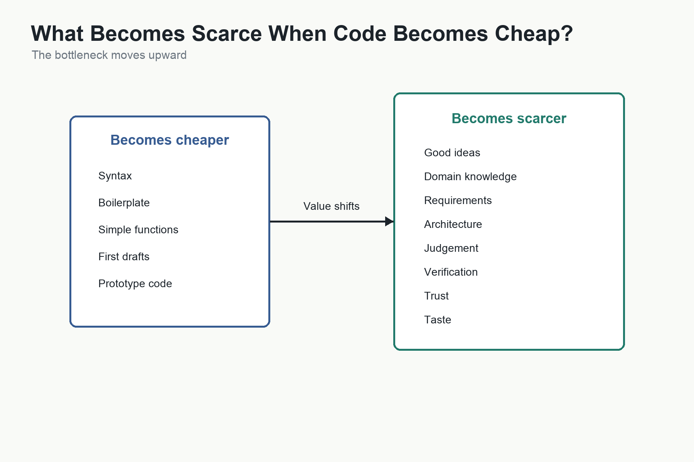

# What Becomes Scarce When Code Becomes Cheap?

The first chapter asked a question that now deserves a fuller answer:

If software becomes much cheaper to create, what becomes scarce?

The answer is not code.

Code still matters. It must run, integrate, perform, and be maintained. But if AI makes code easier to generate, then code is no longer the main constraint in every situation. The bottleneck moves.

This is what happens when an important cost falls. People do not merely produce the same thing more cheaply. They produce more of it, produce new kinds of it, and discover that other constraints become more important.

Software has always been limited by the cost of translating ideas into reliable machine behaviour. If AI reduces that translation cost, the scarce resources shift upward.

## Ideas Become More Important

When implementation is expensive, many ideas die early.

They are not rejected because they are bad. They are rejected because the cost of building them exceeds the expected benefit. A tool for one classroom, one family, one clinic, one research project, one small business, or one temporary workflow may be useful, but not useful enough to justify a conventional software project.

If implementation cost falls, more ideas cross the threshold of viability.

But this does not make all ideas valuable. In fact, abundance makes selection harder. When more things can be built, the question becomes what should be built.

Good ideas become scarce because they require contact with real problems. They come from domain experience, frustration, curiosity, observation, and judgement. AI can suggest ideas, but the most valuable ideas often come from people who live inside a problem long enough to see what outsiders miss.

## Domain Knowledge Becomes More Important

Generic software is easier to imagine than useful software.

A teacher understands classroom routines. A doctor understands clinical workflow. A lawyer understands procedural risk. A factory manager understands exceptions on the production floor. A language learner understands where existing apps fail. A small-business owner understands the irritating manual process no commercial product quite fits.

AI can help transform domain knowledge into software, but it cannot fully replace domain knowledge. It can infer, generalise, and suggest. It can ask questions. It can provide examples from patterns it has seen. But the person closest to the problem often knows which details matter.

As the cost of implementation falls, domain expertise becomes a more valuable input into software creation.

## Requirements Become Scarce

Cheap generation does not solve unclear requirements.

It exposes them faster.

If AI can build a prototype quickly, vague intent becomes working ambiguity. A system may appear functional while embodying wrong assumptions. It may handle the normal case and miss the exceptions. It may implement what the user said rather than what the user needed.

This makes requirements more important. The scarce skill is not merely asking AI to build something. It is knowing what behaviour should exist, what should not happen, what edge cases matter, what trade-offs are acceptable, and how success will be measured.

In the AI era, requirements are not a bureaucratic prelude to programming. They are programming at a higher level of abstraction.

## Architecture Becomes Scarce

AI can generate code quickly. It cannot guarantee that the resulting system has a coherent architecture.

Architecture is the discipline of making decisions that allow software to grow, change, integrate, and remain understandable. It includes boundaries, data models, interfaces, dependencies, permissions, deployment, observability, and failure handling.

When software is small, architecture can seem unnecessary. When software grows, architecture becomes the difference between speed and chaos.

AI may generate a working feature, but someone must decide where it belongs, how it interacts with existing systems, how it should be tested, how it will be maintained, and what future changes it should allow.

As code becomes more abundant, architecture becomes more valuable.

## Judgement Becomes Scarce

AI produces plausible output.

Plausibility is not correctness.

Judgement is the ability to decide whether an answer is useful, safe, elegant, excessive, incomplete, risky, or wrong. It requires experience, taste, domain knowledge, ethical awareness, and an understanding of consequences.

AI can help evaluate its own work, but it cannot be the final authority for every decision. Someone must decide when the output is good enough, when the risk is acceptable, when to ask for more evidence, when to stop, and when not to build the thing at all.

In a world of cheap generation, judgement becomes a central human contribution.

## Trust and Verification Become Scarce

The more software we generate, the more we need to know what can be trusted.

This is the lesson from [[Software Verification]] and [[Precision]]. AI can produce code, explanations, tests, summaries, and decisions quickly. But speed does not prove correctness.

Trust requires evidence. Tests, reviews, monitoring, structured outputs, validations, audits, and human oversight become more important when output becomes abundant.

This is especially true in high-stakes domains. A hobby app and a medical system do not require the same verification burden. The economics of AI will vary by risk.

Cheap code does not make reliability cheap.

Early productivity evidence supports this caution. [[AI-Assisted Developer Productivity]] shows that AI can accelerate bounded programming tasks and increase individual productivity in some settings, but system-level outcomes are more complex. DORA's 2024 research found individual benefits from AI adoption while also reporting negative effects on software delivery stability and throughput. Stack Overflow's 2025 survey shows high AI adoption but also frustration with answers that are almost right and the time required to debug AI-generated code.

In other words, cheap generation moves the bottleneck. It does not remove it.

## Taste Becomes Scarce

Taste is easy to dismiss because it sounds subjective. But in software, taste matters.

Taste decides what to leave out. It decides whether an interface feels simple or cluttered, whether a workflow respects the user's attention, whether a feature belongs in the product, whether an automation is helpful or intrusive, whether a system is coherent or merely capable.

AI can generate many alternatives. That increases the need to choose.

When production becomes easy, curation becomes valuable.

## The New Software Economy

If software becomes cheaper, the economy of software creation changes.

We should expect more niche software, more internal tools, more personal applications, more temporary systems, more prototypes, and more software created by people whose primary expertise is not programming.

But this does not mean effort disappears. It means effort moves.

The scarce work shifts toward:

- Knowing the problem.
- Defining the desired behaviour.
- Designing coherent systems.
- Evaluating output.
- Integrating with reality.
- Building trust.
- Maintaining quality.

This is the real transformation. AI does not make human skill irrelevant. It changes which human skills matter most.

## What We Know

When production cost falls, demand often increases and new uses become viable.

AI may reduce the cost of translating intent into software.

Cheap generation increases the importance of requirements, judgement, architecture, trust, verification, and taste.

Software that was previously too niche, temporary, personal, or small may become economically viable.

## What We Infer

The future software economy will not be defined simply by more code. It will be defined by a shift in scarcity.

People with strong domain knowledge and clear communication may gain new creative power.

Professional engineering skills will remain important because reliability, architecture, integration, and verification become more visible bottlenecks.

## What We Do Not Yet Know

We do not yet know how far software creation costs will fall across different domains.

We do not yet know which categories of personal, niche, or temporary software will become common.

We do not yet know whether organisations will adapt their processes quickly enough to benefit from cheaper generation.
