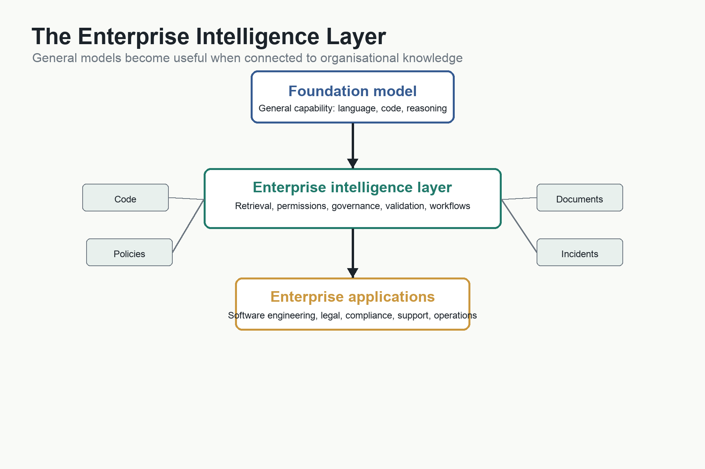

# The Enterprise Intelligence Layer



## Purpose

Explain why the next major enterprise software platform may not be another application, but a layer that connects AI models to organisational knowledge, workflows, permissions, and verification.

## Central Question

If companies can rent general intelligence from frontier AI providers, what must they still own?

## Core Ideas

For most organisations, the strategic question is not whether they should build their own GPT, Claude, Gemini, or Grok.

The better question is:

What knowledge must the enterprise organise so that any sufficiently capable model can become useful inside the business?

That distinction is easy to miss because public attention focuses on frontier models. Model releases are visible. Benchmarks are visible. Context-window announcements are visible. Data centres, GPUs, and model races make dramatic headlines.

But inside a bank, hospital, airline, manufacturer, government agency, or insurance company, the most valuable knowledge is not general world knowledge. It is private organisational knowledge: source code, business rules, policies, customer histories, product definitions, operational procedures, regulations, contracts, production incidents, architecture decisions, and decades of accumulated experience.

A frontier model may understand Python, English, accounting principles, REST APIs, and general software architecture. It will not automatically understand the exact way a particular bank calculates risk, how a hospital routes clinical workflows, why an airline reservation system behaves strangely during edge cases, or which undocumented rule in a legacy system exists because of a regulatory change twenty years ago.

That knowledge lives inside the enterprise.

The economic question is whether the organisation can make that knowledge usable by AI.

## The Model Is Not the Enterprise

A foundation model contains broad learned patterns from enormous amounts of data. It knows general language, common programming techniques, public frameworks, familiar business concepts, and many widely discussed technical patterns.

That is valuable.

But it is not the same as knowing the enterprise.

A bank does not need to train a new frontier model merely so that AI understands SQL, Python, accounting, English grammar, or basic software design. Those capabilities can usually be rented from specialised AI companies. The cost of training frontier models is so high that the economics favour providers who can spread the cost across millions of users and thousands of customers.

For most enterprises, the more realistic architecture is:

```text
Foundation Model
        |
        v
Enterprise Intelligence Layer
        |
        v
Enterprise Applications and Workflows
```

The foundation model supplies general capability.

The enterprise intelligence layer supplies relevance.

The applications and workflows turn that relevance into business action.

## What the Enterprise Must Own

The enterprise must own its representation of itself.

That includes:

- Source code.
- Documents.
- Business rules.
- Policies.
- Contracts.
- Customer knowledge.
- Product knowledge.
- System architecture.
- Operational history.
- Meeting notes.
- Incident reports.
- Regulatory obligations.
- Security permissions.
- Approval workflows.
- Audit trails.

This is not merely data. It is institutional memory.

When an experienced employee retires, changes job, or forgets why a decision was made, some of that memory disappears. When a system has been modified for decades without complete documentation, the business knowledge becomes trapped inside code. When teams work in separate tools, the organisation knows more than any one person can access.

Enterprise AI changes the value of that memory.

Knowledge that was once scattered, buried, or informal becomes economically valuable if it can be retrieved, permissioned, interpreted, and used by AI systems.

## Context Window Versus Enterprise Knowledge

This is where the word "context" can become confusing.

A model's context window is the information it can consider during one reasoning session.

Enterprise knowledge is the much larger universe of information held by the organisation.

The relationship looks like this:

```text
Enterprise Knowledge
        |
        v
Knowledge Organisation
        |
        v
Retrieval
        |
        v
Relevant Context
        |
        v
AI Context Window
        |
        v
Answer or Action
```

The context window is working memory.

Enterprise knowledge is long-term organisational memory.

The economic challenge is not simply to buy a model with a larger context window. Larger context helps, but only if the right information is placed inside it. A model that can read millions of tokens may still fail if it receives irrelevant, outdated, contradictory, or unauthorised material. A model with a smaller context window may perform better if the enterprise retrieves exactly the right information at the right time.

This creates an important distinction:

```text
Raw context = how much information the model can hold.

Effective context = how much relevant information the system can actually use.
```

The future competition may not be won by the organisation with the largest context window. It may be won by the organisation with the best enterprise knowledge architecture.

## Enterprise Knowledge Architecture

An enterprise intelligence layer requires four foundations.

First, the organisation needs knowledge.

This includes code, documents, decisions, policies, logs, contracts, diagrams, process descriptions, tickets, emails, chats, meeting transcripts, and structured data.

Second, it needs organisation.

Knowledge must be cleaned, indexed, tagged, permissioned, updated, deduplicated, summarised, and connected. Otherwise AI systems will reason from noise.

Third, it needs retrieval.

The system must decide which knowledge is relevant to each task. The AI should not receive everything. It should receive what matters.

Fourth, it needs governance.

The organisation must control who can ask what, which systems may be touched, which answers require verification, what must be logged, and where human approval is required.

The architecture is therefore not just:

```text
AI model + documents
```

It is closer to:

```text
Knowledge
+ Organisation
+ Retrieval
+ Permissions
+ Verification
+ Workflow
+ Auditability
= Enterprise Intelligence Layer
```

## ERP Digitised Transactions. AI Digitises Knowledge.

Enterprise software history provides a useful comparison.

ERP systems digitised transactions. They standardised finance, procurement, inventory, manufacturing, sales, and reporting. Their value came from making business processes more visible, consistent, and measurable.

Enterprise AI is different.

It does not merely digitise transactions.

It digitises knowledge.

Transactions are relatively structured. Knowledge is messier. It lives in code, documents, meetings, decisions, exceptions, comments, diagrams, and people's memories. That makes Enterprise AI harder to implement than simply connecting a model to a document repository.

It also makes the potential payoff broader.

If an organisation can make its knowledge usable by AI, the same layer can support software engineering, customer support, legal review, compliance, finance, product management, operations, training, and executive decision-making.

The business case is not one application.

It is the reuse of organisational knowledge across many workflows.

## How It Will Be Funded

Most large enterprises will not begin by approving a vast Enterprise Intelligence Layer because the concept sounds impressive.

CFOs do not buy visions. They buy business cases.

The more likely path is incremental:

```text
Software engineering assistant
        |
Customer support assistant
        |
Legal document assistant
        |
Compliance assistant
        |
Internal search assistant
        |
Shared retrieval, permissions, governance, and workflow
        |
Enterprise Intelligence Layer
```

Each project begins with its own return on investment. A coding assistant saves engineering time. A support assistant handles common enquiries. A legal assistant accelerates contract review. A compliance assistant helps prepare evidence and reports.

Over time, the organisation discovers that all these systems need similar infrastructure: document retrieval, permissions, identity management, logging, audit trails, evaluation, monitoring, integration, and governance.

The shared layer emerges because repeated local investments create a need for common infrastructure.

This is how many major enterprise technologies spread. Cloud computing did not always begin as a single company-wide strategy. Often one application moved first, then another, then another. Eventually the platform became obvious.

Enterprise AI may follow the same pattern.

## The ROI Portfolio

Enterprise AI should not be justified by vague claims that everyone will become more productive.

A more serious method is to treat it as a portfolio of use cases.

This is also how the current evidence should be read. McKinsey estimated in 2023 that generative AI could add US$2.6 trillion to US$4.4 trillion annually across 63 use cases, with much of the value concentrated in customer operations, marketing and sales, software engineering, and research and development. That is not proof of realised enterprise-wide ROI. It is evidence that the most credible business cases are likely to begin with specific workflows that have measurable outcomes.

For each workflow, the organisation can ask:

- What is the current cost base?
- What share of the work is addressable by AI?
- What productivity improvement has been measured?
- What adoption rate is realistic?
- What share of the improvement becomes financial value?
- What are the costs of subscriptions, inference, integration, governance, security, training, and change management?
- How confident is the evidence?

The basic logic is:

```text
Annual Gross Benefit
= Addressable Cost Base
× Adoption Rate
× Productivity Improvement
× Capture Rate
```

Then the organisation subtracts the cost of running and governing the system.

This prevents the book from making an unsupported claim that enterprise-wide AI ROI is already proven. The evidence is stronger for focused workflows than for complete enterprise transformation.

The broader hypothesis is that enough focused returns may eventually compound into a platform-level return.

## Enterprise Throughput

The most important metric may not be productivity alone.

It may be enterprise throughput: the rate at which an organisation converts knowledge into business value.

For a bank, this might mean loans processed, risks analysed, regulations interpreted, software released, fraud cases investigated, customer requests resolved, and products launched.

For a software company, it might mean features designed, code reviewed, bugs fixed, tests written, incidents resolved, documentation updated, and customers supported.

For a hospital, it might mean records summarised, protocols followed, staffing decisions improved, compliance evidence gathered, and patient communication made clearer.

AI may reduce labour cost, but that is not always the largest value.

The larger value may be capacity expansion.

If the same organisation can make better decisions, ship more software, serve more customers, clear more backlogs, and respond faster to change, the return may exceed simple headcount savings.

## The New Strategic Asset

Historically, companies accumulated capital, factories, machinery, patents, software, brands, customer relationships, and skilled employees.

In the AI era, they may also compete by accumulating high-quality machine-readable organisational knowledge.

The strategic asset is not merely documents.

It is knowledge that is accurate, current, permissioned, retrievable, interpretable, auditable, and usable by AI.

That leads to the Enterprise Context Hypothesis:

> In the AI era, the competitive advantage of an enterprise may depend less on the number of software engineers it employs and more on the completeness, quality, governance, and accessibility of the organisational context available to its AI systems.

This does not mean people stop mattering.

It means people increasingly work through systems that can remember, retrieve, interpret, and apply what the organisation knows.

## Why This Matters for Software Development

Software development is one of the clearest early examples because software is already made of information.

An enterprise AI system that understands code without understanding the business is useful but limited.

An enterprise AI system that understands the code, the architecture, the requirements, the incidents, the customers, the regulations, and the business rules becomes much more powerful.

That is why the future of AI in software may not be only about better code generation.

It may be about giving AI enough organisational context to understand why the software exists, what it must preserve, what it may change, and how success should be judged.

The frontier model is the engine.

The enterprise intelligence layer is the vehicle.

Without the engine, the vehicle does not move.

Without the vehicle, the engine has nowhere useful to go.

## Reader Takeaways

- Most enterprises will probably rent general AI capability rather than train frontier models from scratch.
- The enterprise's durable advantage may lie in its proprietary knowledge, context, workflows, and governance.
- A context window is working memory; enterprise knowledge is organisational memory.
- The key problem is effective context, not just larger raw context.
- Enterprise AI ROI will likely emerge from a portfolio of focused use cases before becoming a shared platform.
- ERP digitised transactions; Enterprise AI may digitise organisational knowledge.
- The strategic asset of the AI era may be machine-readable organisational knowledge.

## Bridge to Next Chapter

If enterprises can turn organisational knowledge into an AI-usable asset, the final question becomes larger than software. What happens when human intent, institutional memory, and machine intelligence become part of the same creative system?

## Related Notes

- [[19-enterprise-intelligence-layer|Enterprise Intelligence Layer]]
- Enterprise Knowledge Architecture
- Enterprise AI ROI
- Emergent Enterprise Intelligence Layer
- Enterprise Throughput
- Three Meanings of Context
- The Economics of Context
- [[10-context-what-the-model-knows-right-now|Context Windows]]
- [[15-legacy-problem|Legacy Systems]]
- [[15-legacy-problem|System Integration]]
- [[14-economics-of-trust|The Economics of Trust]]

## Future Work

- Add sourced examples of focused enterprise AI ROI.
- Add a figure comparing context window, effective context, enterprise knowledge, and enterprise intelligence layer.
- Add a figure comparing ERP and Enterprise AI.
- Decide whether this chapter belongs before or after `What Becomes Scarce When Code Becomes Cheap`.
