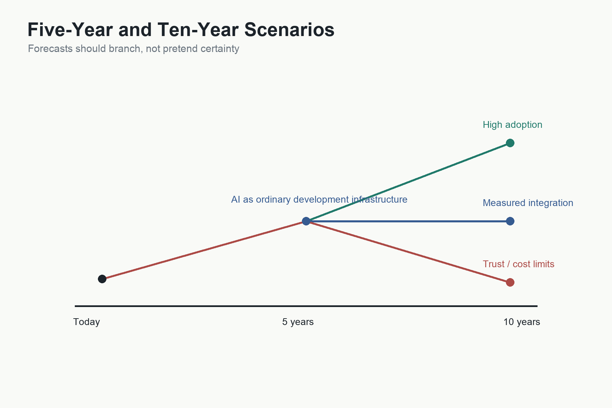

# Five-Year and Ten-Year Scenarios

The future should be approached with humility.

AI is changing quickly. Model capabilities, costs, tools, regulations, business models, and social expectations are all unstable. Any confident prediction about a specific product, company, or model version is likely to age badly.

But careful scenarios can still be useful.

A scenario is not a prophecy. It is a structured way to ask what might happen if certain economic and technical trends continue. The purpose is not to predict exactly. It is to identify the forces that matter.

The forces this book has followed are:

- The cost of producing software.
- The level of abstraction available to humans.
- The cost of training and inference.
- The reliability of AI systems.
- The quality of integration with real software.
- The skills that remain scarce.

## The Current Position

At the current stage, AI can already assist with many software tasks: explanation, code generation, debugging, refactoring, tests, documentation, requirements clarification, and prototyping.

It is not equally reliable across all tasks. It works best when the task is well specified, the context is available, the risk is manageable, and the output can be checked.

The strongest near-term value is not full autonomy. It is acceleration. AI helps people move faster through understanding, drafting, exploring, and iterating.

The main constraints are verification, context, integration, cost, trust, and organisational adoption.

The labour-market signal is still mixed. Labour-Market Effects on Programmers suggests that the near-term impact may appear first in skills, role expectations, and hiring patterns rather than in a simple collapse of programmer employment. Official projections can still show growth while the content of the job changes substantially.

## Five-Year Scenario: AI as Ordinary Development Infrastructure

In a plausible five-year scenario, AI becomes ordinary infrastructure for software development.

Developers use AI assistants as routinely as they use search engines, compilers, documentation, package managers, and version control. AI helps read code, write tests, explain errors, generate migrations, update documentation, and suggest designs.

Non-programmers build more prototypes and internal tools. Some become serious AI-assisted builders. Organisations create policies for model use, data sharing, prompt templates, evaluation, and security.

AI features appear inside more applications, but production systems increasingly use hybrid designs: probabilistic AI for interpretation and deterministic software for validation, permissions, calculations, and execution.

Legacy modernisation becomes a major use case. AI helps document old systems, generate tests, map dependencies, and create integration layers.

Agents become useful in bounded workflows, especially where tools, permissions, and test environments are clear.

The main assumption behind this scenario is that model capability continues improving while inference becomes affordable enough for everyday development workflows.

## Five-Year Risks

The five-year scenario could disappoint if verification costs remain too high, organisations fail to integrate AI safely, model behaviour remains unstable, data-security concerns restrict usage, or productivity gains prove uneven.

There may also be a wave of poor-quality AI-generated software. If generation becomes cheap but engineering discipline does not improve, many organisations may create fragile systems faster than they can maintain them.

The limiting factor may not be AI capability. It may be human and organisational discipline.

## Ten-Year Scenario: Intent-Driven Software Creation

In a plausible ten-year scenario, software creation becomes far more intent-driven.

Humans describe goals, workflows, constraints, data, examples, and desired outcomes. AI systems propose architectures, generate implementations, run tests, integrate tools, monitor behaviour, and explain trade-offs.

Programming languages still exist, but many humans interact with them less directly. Code becomes an intermediate representation that AI can generate, inspect, and revise. Humans focus more on intent, design, verification, domain knowledge, and accountability.

Personal, niche, temporary, and organisation-specific software becomes more common. A teacher creates a classroom tool. A doctor prototypes a workflow aid. A researcher builds a specialised analysis interface. A family creates a private coordination app. A small business builds internal systems that previously would have been uneconomic.

Enterprise AI systems may reason across larger portions of organisations: finance, inventory, compliance, operations, customer service, and software infrastructure. Agents may coordinate workflows across tools, but serious systems still require permissions, logs, human review, testing, and governance.

Enterprise Context sharpens this scenario. The competitive advantage of future enterprises may depend less on the raw number of software engineers they employ and more on the quality, completeness, and accessibility of the organisational context available to their AI systems. Companies may compete by turning source code, documentation, architecture decisions, incidents, customer complaints, regulations, and business policies into machine-readable institutional memory.

The main assumption behind this scenario is that AI reliability, context management, tool use, and integration improve enough for organisations to trust AI with larger workflows.

## Ten-Year Risks

The ten-year scenario could fail or fragment.

AI may remain excellent at prototypes but unreliable at long-lived systems. Verification may dominate cost in high-stakes domains. Regulation may slow adoption. Security risks may limit tool use. Model providers may become infrastructure bottlenecks. Organisations may accumulate unmaintainable AI-generated systems. Human expertise may erode in dangerous ways if people rely on AI without understanding enough to evaluate it.

There may also be inequality in capability. People and organisations with strong domain knowledge, good data, engineering discipline, and access to powerful tools may benefit greatly. Others may use the same tools poorly and receive disappointing results.

## What Should We Watch?

The future depends on several signals.

First, cost per useful task. Not cost per token, model size, or benchmark score alone, but the cost of completing valuable work reliably.

Second, verification methods. If AI systems become easier to test, monitor, constrain, and audit, adoption in serious software will accelerate.

Third, context and memory. If models can reliably use larger, more relevant context, they can work on larger software systems.

Fourth, tool integration. The more safely AI can use tools, the more it can move from answering to acting.

Fifth, model stability. If behaviour changes unpredictably across versions, production use becomes harder.

Sixth, education. If people learn to specify, verify, and collaborate with AI, the benefits spread. If they treat AI as magic, failures multiply.

Seventh, labour-market composition. Watch whether employers reduce routine coding roles, increase demand for AI-literate developers, create more evaluation and governance roles, compress junior career ladders, or broaden software creation to product managers and domain experts.

Eighth, enterprise context. Watch whether organisations invest in code indexing, knowledge graphs, retrieval systems, documentation quality, meeting and decision capture, data governance, and AI-access policies as seriously as they once invested in cloud infrastructure.

## The Industrialisation of Intelligence

The broader frame for this book may be the industrialisation of intelligence.

The Industrial Revolution mechanised physical work. AI begins to mechanise certain kinds of cognitive work: translation, drafting, summarisation, coding, classification, explanation, and planning.

Software development is the clearest case study because it is both knowledge work and machine work. It requires human intent, symbolic representation, formal execution, and economic value. If AI changes software creation, it shows how machine intelligence can alter the production of useful cognitive artefacts.

But the lesson is larger than software.

When intelligence becomes cheaper to access, the scarce resource shifts. The future belongs not merely to those who can produce output, but to those who know what output is worth producing, how to judge it, and how to connect it safely to the real world.

## The Final Question

The genie in the bottle is not simply that AI writes code.

The deeper mystery is that human intent can increasingly be transformed into working systems through conversation, examples, feedback, and machine-learned representation.

That transformation is technical, but its consequences are economic.

It changes who can build software, what can be built, how quickly ideas become systems, and where human judgement creates value.

The future is not a world without programmers. It is a world in which programming moves upward, closer to intent, and software creation becomes available to more kinds of people.

The question is not whether AI will change software development.

It already has.

The question is whether we will understand the change deeply enough to use it well.

## What We Know

AI already assists with software explanation, generation, debugging, testing, documentation, and prototyping.

AI is most useful where output can be checked and context is available.

Future impact depends on cost, reliability, integration, verification, governance, and human skill.

Software development is an early case study in the broader industrialisation of intelligence.

## What We Infer

In five years, AI is likely to become ordinary development infrastructure in many software workflows.

In ten years, software creation may become substantially more intent-driven, with humans interacting less directly with code in many contexts.

The scarce resources will be domain knowledge, judgement, requirements, architecture, verification, trust, and taste.

## What We Do Not Yet Know

We do not know the pace of capability improvement or cost reduction.

We do not know how regulation, security, intellectual property, labour markets, and education will adapt.

We do not know whether AI-generated software will improve maintainability or create new forms of technical debt.
