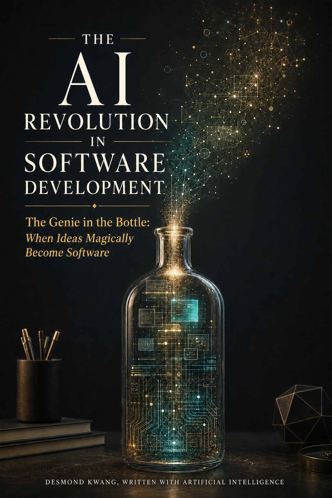

# The AI Revolution in Software Development

## The Genie in the Bottle: When Ideas Magically Become Software

**Desmond Kwang, written with artificial intelligence**

This is a free public reading draft of a book about why artificial intelligence is transforming software development. The argument is not that AI is magic, or that programmers disappear. The argument is that AI changes the economics of turning human intent into working software.

[[00-author-and-ai-note|Start reading]]

## Table of Contents

### Front Matter

- [[00-author-and-ai-note|Author and AI Note]]

- [[01-introduction|Introduction]]

### Part I - The Economics of Software

- [[02-economics-of-software-development|Chapter 1: The Economics of Software Development]]

### Part II - The History of Abstraction

- [[03-hidden-engine-of-computing|Chapter 2: The Hidden Engine of Computing]]

- [[04-programming-as-representation|Chapter 3: Programming as Representation]]

### Part III - The Economics of Intelligence

- [[05-what-is-information|Chapter 4: What Is Information?]]

- [[06-what-is-an-ai-model|Chapter 5: What Is an AI Model?]]

- [[07-how-neural-networks-learn-relationships|Chapter 6: How Neural Networks Learn Relationships]]

- [[08-how-ai-converts-english-into-software|Chapter 7: How AI Converts English Into Software]]

- [[09-economics-of-models|Chapter 8: The Economics of Models]]

- [[10-context-what-the-model-knows-right-now|Chapter 9: Context: What the Model Knows Right Now]]

### Part IV - Engineering with AI

- [[11-communication-becomes-the-interface|Chapter 10: Communication Becomes the Interface]]

- [[12-requirements-engineering|Chapter 11: Requirements Engineering]]

- [[13-precision-and-probabilistic-ai|Chapter 12: Precision and Probabilistic AI]]

- [[14-economics-of-trust|Chapter 13: The Economics of Trust]]

- [[15-legacy-problem|Chapter 14: The Legacy Problem]]

- [[16-agents-tools-and-integrated-systems|Chapter 15: Agents, Tools, and Integrated Systems]]

### Part V - The Future

- [[17-what-becomes-scarce-when-code-becomes-cheap|Chapter 16: What Becomes Scarce When Code Becomes Cheap?]]

- [[18-future-of-programmers|Chapter 17: The Future of Programmers]]

- [[19-enterprise-intelligence-layer|Chapter 18: The Enterprise Intelligence Layer]]

- [[20-five-year-and-ten-year-scenarios|Chapter 19: Five-Year and Ten-Year Scenarios]]

- [[21-conclusion-when-intent-becomes-software|Conclusion: When Intent Becomes Software]]

### Reference

- [[98-glossary|Glossary]]

- [[99-bibliography-and-evidence-notes|Bibliography and Evidence Notes]]
