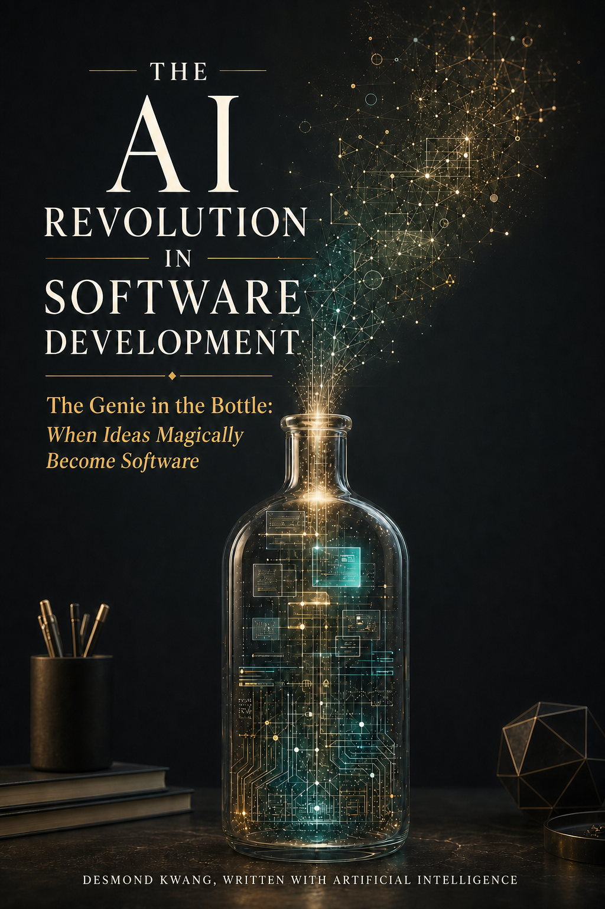

## The Genie in the Bottle: When Ideas Magically Become Software

**Desmond Kwang, written with artificial intelligence**

**Version 1.0.0 · Build 78**

This is the public reading edition of a book about why artificial intelligence is transforming software development. The argument is not that AI is magic, or that programmers disappear. The argument is that AI changes the economics of turning human intent into working software.

The genie is the analogy. Codex is the AI coding agent I used. The book is about what that experience reveals.

This public edition is the working book. I am not maintaining a separate draft version; useful changes go directly into the published reading edition.

[[00-author-and-ai-note|Start reading]]

If you are preparing for an executive course on agentic AI or organisational transformation, use the [[22-preparing-to-lead-agentic-ai|Executive Pre-Course Guide]] after reading the main argument. It maps the book into eight learning modules with worked answers, a complete organisational example, and reusable planning templates.

## Table of Contents

### Front Matter

- [[00-author-and-ai-note|Author and AI Note]]
- [[00-preface|Preface: Why This Book Matters]]
- [[01-introduction|Introduction]]

### Part I · The Economics of Software

- [[02-economics-of-software-development|Chapter 1: The Economics of Software Development]]

### Part II · The History of Abstraction

- [[03-hidden-engine-of-computing|Chapter 2: The Hidden Engine of Computing]]
- [[04-programming-as-representation|Chapter 3: Programming as Representation]]

### Part III · The Economics of Intelligence

- [[05-what-is-information|Chapter 4: What Is Information?]]
- [[06-what-is-an-ai-model|Chapter 5: What Is an AI Model?]]
- [[side-story-cnn-vs-transformer-intuition|Side Story: CNNs and Transformers, Intuition]]
- [[side-story-cnn-vs-transformer-engineering|Side Story: CNNs and Transformers, Engineering]]
- [[side-story-transformers|Side Story: Understanding Transformers]]
- [[side-story-reasoning-in-transformers|Side Story: Where Does Reasoning Actually Happen in a Transformer?]]
- [[side-story-fossil-record-of-thought|Side Story: The Fossil Record of Thought]]
- [[side-story-the-jagged-frontier|Side Story: The Jagged Frontier]]
- [[side-chapter-the-genie-is-not-all-powerful|The Genie Is Not All-Powerful]]
- [[side-chapter-from-dna-to-a-machine-native-ai|Exploratory Side Chapter: From DNA to a Machine-Native AI]]
- [[08-how-ai-converts-english-into-software|Chapter 6: How AI Converts English Into Software]]
- [[09-economics-of-models|Chapter 7: The Economics of Models]]
- [[10-context-what-the-model-knows-right-now|Chapter 8: Context: What the Model Knows Right Now]]

### Part IV · Engineering with AI

- [[11-communication-becomes-the-interface|Chapter 9: Communication Becomes the Interface]]
- [[12-requirements-engineering|Chapter 10: Requirements Engineering]]
- [[side-chapter-building-radix-with-codex|Case Study: Radix Began with One Search Box]]
- [[13-precision-and-probabilistic-ai|Chapter 11: Precision and Probabilistic AI]]
- [[14-economics-of-trust|Chapter 12: The Economics of Trust]]
- [[15-legacy-problem|Chapter 13: The Legacy Problem]]
- [[16-agents-tools-and-integrated-systems|Chapter 14: Agents, Tools, and Integrated Systems]]
- [[side-chapter-personal-librarian|Side Chapter: The Personal Librarian]]

### Interlude

- [[interlude-a-machine-from-2026-arrives-in-1981|A Machine From 2026 Arrives in 1981]]

### Part V · The Future

- [[17-what-becomes-scarce-when-code-becomes-cheap|Chapter 15: What Becomes Scarce When Code Becomes Cheap?]]
- [[18-future-of-programmers|Chapter 16: The Future of Programmers]]
- [[19-enterprise-intelligence-layer|Chapter 17: The Enterprise Intelligence Layer]]
- [[side-story-intelligence-that-does-not-need-to-be-fast|Side Story: The Intelligence That Does Not Need to Be Fast]]
- [[side-chapter-from-demonstration-to-daily-work|Side Chapter: From Demonstration to Daily Work]]
- [[20-five-year-and-ten-year-scenarios|Chapter 18: Five-Year and Ten-Year Scenarios]]
- [[side-story-when-intelligence-acquires-agency|Side Story: When Intelligence Acquires Agency]]
- [[side-story-what-would-it-take-rethinking-agi|Side Story: What Would It Take? Rethinking Artificial General Intelligence from First Principles]]
- [[21-conclusion-when-intent-becomes-software|Conclusion: When Intent Becomes Software]]

### Course Preparation

- [[22-preparing-to-lead-agentic-ai|Preparing to Lead Agentic AI: An Executive Pre-Course Guide]]

### Addendum: Articles in Development

- [[side-story-addendum-dna-to-machine-native-ai|From DNA to a Machine-Native AI]]
- [[side-story-addendum-decade-ahead|The Decade Ahead: AI and the Remaking of Civilization]]
- [[side-story-addendum-ai-discovers-biology|AI Discovers Biology Beyond Human Intuition]]
- [[side-story-addendum-cio-field-guide-agentic-ai|A CIO's Field Guide to Agentic AI]]

### Reference

- [[98-glossary|Glossary]]
- [[99-bibliography-and-evidence-notes|Bibliography and Evidence Notes]]
