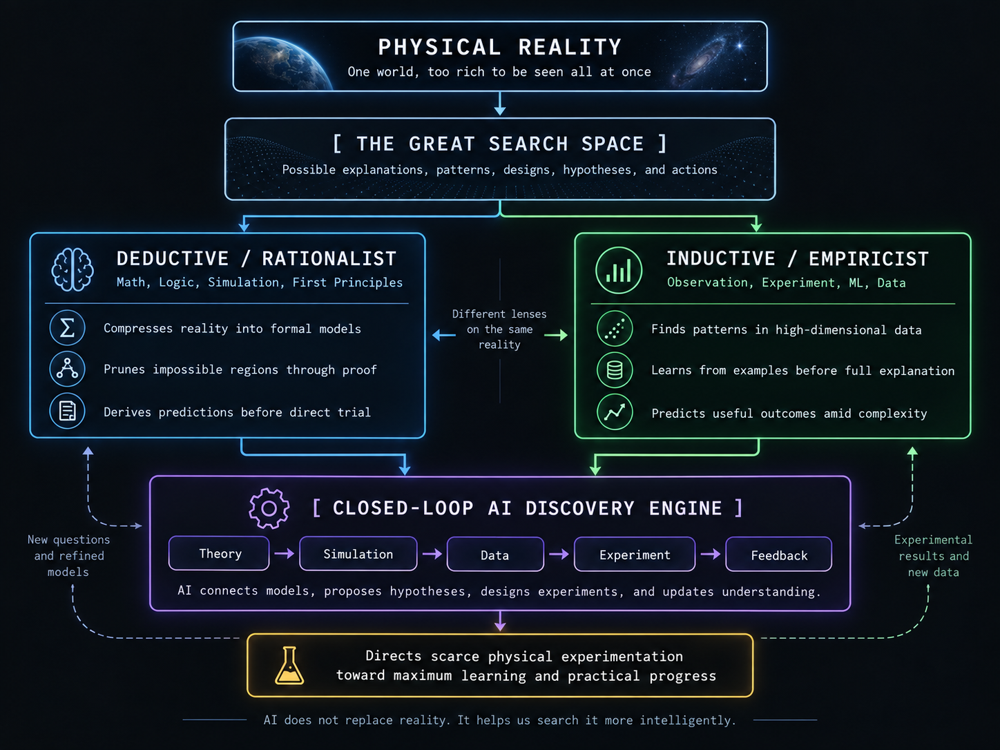

# AI, Mathematics and the Search for Reality

## Why AI Progress in Mathematics Matters

Recent advances in AI mathematics are easy to misunderstand. At first glance, an AI system solving an old mathematical problem looks like something mainly of interest to mathematicians — an impressive parlor trick in a field most people never think about. The deeper significance is much broader than that.

On May 20, 2026, OpenAI announced that a general-purpose reasoning model — not a system built or trained specifically for mathematics — had disproved the Erdős unit distance conjecture, a problem in discrete geometry that had stood since 1946 and that Noga Alon, a leading combinatorialist, described as "one of Erdős' favorite problems." The question sounds almost recreational: scatter some number of points on a flat plane, and ask how many pairs of them can sit exactly one unit apart. Erdős conjectured a ceiling on that count, and for eighty years the field's best minds believed he was right. The model constructed an infinite family of point arrangements that broke the conjectured ceiling, using tools imported from an entirely different corner of mathematics — algebraic number theory, including machinery called class field towers, originally built for purposes that had nothing to do with points on a plane. OpenAI didn't ask anyone to take the claim on faith: the same day, nine independent mathematicians, including Fields Medalist Tim Gowers, published a companion paper verifying the argument and translating it into standard mathematical language. Gowers called it "a milestone in AI mathematics." University of Toronto's Daniel Litt went further, calling it the first AI-produced result he found "exciting in itself, as opposed to as a leading indicator."

That last phrase is worth sitting with, because it points at the real question this chapter is about. It's no longer especially interesting to ask whether AI can perform mathematics humans already know how to do. The interesting question is whether AI can discover mathematical relationships and abstractions that humans have simply failed to find — and mathematics matters enough to civilization that the answer, if it turns out to be yes at scale, would matter well beyond mathematics departments. Mathematics is one of humanity's principal tools for representing reality: it lets us describe systems, predict their behavior, simulate alternatives, and rule out impossible or unproductive approaches before ever spending money building anything in the physical world. If AI becomes substantially better at constructing this kind of representation, the consequence isn't "AI is good at puzzles." It's that AI may become better at building the models through which science and engineering understand reality in the first place.

And when mathematics alone isn't enough — because reality is simply too complicated to reduce to clean equations — AI has a second route available: empiricism. Machine-learning systems can find useful patterns directly in enormous quantities of observations without first requiring a complete mathematical explanation of why the pattern holds. AI can therefore attack reality from two directions at once, and the two directions map onto one of the oldest divides in the theory of knowledge. The rationalist path works top-down, from first principles toward deduction — mathematics, reasoning from axioms to necessary conclusions. The empiricist path works bottom-up, from high-dimensional observation toward statistical regularity — machine learning, inferring pattern from accumulated data rather than deriving it from principle. Science has alternated between these two modes for centuries without fully reconciling them: Kepler found his laws of planetary motion by patiently mining Tycho Brahe's observational data for regularities, an almost purely empiricist achievement, while Newton later derived those same laws deductively from a small set of general mechanical principles, a rationalist achievement built on Kepler's empirical foundation. AI's genuinely new move isn't simply getting faster at either path in isolation. It's closing the loop between them — letting empirical patterns discovered by machine learning prompt symbolic, mathematical theories, which then generate deductive predictions for empirical testing in turn. That synthesis is what the rest of this chapter is really about, and it's worth naming plainly: not naive data-positivism, and not rigid logicism either, but the two working on each other.

## Mathematics Lets Us Avoid Brute-Forcing Reality

Why does mathematics matter in the first place? Not simply because equations are elegant. Mathematics gives us a formal language for building models of reality — and a model, by design, throws away almost all of reality's detail and keeps only the relationships relevant to the question being asked. A bridge contains an unimaginable number of atoms, and no engineer calculates the behavior of every one of them. Instead, engineers represent forces, loads, material strength, geometry, vibration, and temperature, and reason about those instead. A spacecraft is enormously complicated in its full physical detail, but orbital mechanics lets engineers predict its trajectory without repeatedly launching spacecraft just to see what happens.

The model is not reality. It's a useful representation of selected aspects of reality, and its enormous economic value comes from letting cheap reasoning substitute for expensive physical trial and error. Instead of building a thousand bridges to find out which ones collapse, engineers reject most bad designs mathematically, before a single support beam is poured. Mathematics, in this sense, lets civilization search reality without physically trying every possibility.

## Simulation Turns Mathematics Into Large-Scale Search

Once a physical system has a mathematical representation, a computer can solve those relationships repeatedly under different conditions — which is simulation, and it's really mathematics scaled up into a search process. Suppose engineers are considering a million conceivable reactor configurations. Building a million reactors is obviously impossible. But if the underlying physics is represented accurately enough, a computer can explore an enormous number of candidate configurations on its own, progressively narrowing a million possible designs down to perhaps ten thousand plausible simulated ones, then a hundred strong candidates, then ten actual physical experiments, and eventually one commercially viable system. Simulation converts an expensive physical search into a much cheaper computational one.

This is also why improvements in mathematics translate directly into improvements in engineering. If a new mathematical representation makes an important simulation a hundred times faster, engineers can explore vastly more of the design space within the same budget and the same amount of time. Better mathematics doesn't just produce prettier equations. It changes what's actually economically searchable.

## Mathematics Can Eliminate Search Altogether

Simulation still explores possibilities one at a time, even if it does so quickly. Mathematics can sometimes do something stronger: prove that an entire class of possibilities simply cannot work, without ever simulating a single one of them. If a theorem establishes that every design of a certain type must have efficiency below some threshold, there's no reason to simulate another million variations within that type if the efficiency you actually need exceeds that threshold. A proof, in effect, produces the instruction: don't bother searching here.

Negative knowledge like this can be extraordinarily valuable, and it becomes particularly interesting applied to AI development itself. If mathematics can demonstrate that an entire family of neural network architectures has some fundamental structural limitation, that could redirect billions of dollars of experimental computation before anyone wastes it training enormous models built on a dead end. Mathematics, in other words, doesn't only help by finding solutions. It also tells us which parts of the search space almost certainly don't contain any solutions worth looking for.

There's a pragmatist reading of this worth making explicit, in the tradition of C. S. Peirce and William James: a proof's value here isn't chiefly that it reveals some eternal, mind-independent truth for its own sake, but that it changes what's rational to do next — it's an instrument for economizing action under uncertainty, not just a certificate of logical correctness. A theorem that tells an engineer where not to search is doing exactly the same kind of work a successful experiment does, just cheaper: both cash out, in the end, as a change in what it makes sense to try.

## The Limitation May Be Human Mathematics Itself

There's a deeper issue worth raising here. Human beings were never handed a complete mathematical language capable of representing everything. We built our mathematical abstractions gradually and unevenly — numbers, geometry, algebra, calculus, complex numbers, matrices, probability, groups, tensors — and each new one opened up ways of thinking about problems that had previously been difficult or flatly impossible to even express. A problem can look extraordinarily hard not because the underlying reality is incomprehensible, but simply because our current representation of it is a poor fit. The history of mathematics is full of exactly this pattern: a difficult problem, followed by a better abstraction, followed by a problem that suddenly looks much simpler than it did before.

This raises one of the more consequential possibilities AI creates. What if the mathematics humans have built represents only a small fraction of all the useful mathematical representations that could exist? There's a genuinely Kantian question sitting underneath that possibility, worth stating plainly rather than leaving implicit: human mathematics is path-dependent, shaped not by reality alone but by the cognitive architecture doing the perceiving — working memory, visual intuition, a linear symbolic syntax we read left to right, one step at a time. Kant argued that the mind doesn't passively receive reality but actively structures experience through categories built into cognition itself; whether or not one accepts that framework in full, it's hard to deny a narrower version of the same point about mathematics specifically — the abstractions we reached for first were, in part, the ones a human-shaped mind found reachable, not necessarily the ones best suited to the structure of the problem itself. AI mathematics could start out simply outperforming humans while still working entirely inside the frameworks humans already invented — using our tools, just faster and more thoroughly. But the more important transition, if it happens, is the shift from AI solving problems with human mathematics to AI actually expanding the mathematics available to us in the first place — building genuinely non-human abstractions, unconstrained by whatever a human brain happens to find intuitive. That would be a qualitatively different achievement than performing existing mathematics more quickly, and it's the possibility the rest of this chapter is really about.

## Why the Recent Mathematical Results Matter

This is what makes the Erdős result, and the string of results that followed it, worth taking seriously as more than a curiosity. These weren't confined to school-level mathematics or artificial benchmark exercises designed to make a model look impressive. OpenAI went on to report additional results across coding theory, arithmetic circuit complexity, quantum complexity, and lattice problems connected to post-quantum cryptography, with the resulting arguments formalized into Lean certificates — machine-checkable versions of the proofs that don't require a human to simply trust the model's word. Separately, in an unrelated project, an AI system formalized the entire proof of Fermat's Last Theorem into a computer-checked proof spanning millions of lines; Nature reported the formalization took eleven days, where some researchers had previously expected a human-led effort to take years.

None of this proves AI is about to reinvent the whole of mathematics from scratch. But it's real evidence that mathematical work which used to require extremely scarce, highly specialized human expertise is becoming increasingly accessible to machines. The question that actually matters going forward isn't simply how many theorems AI can rack up. It's whether AI starts discovering genuinely new representations — the kind that make previously intractable scientific problems tractable for the first time, the way calculus once did for physics.

There's a real philosophical tension worth naming directly here, though, rather than letting the Lean certificates stand in as an unqualified triumph. Philosophy of science has long distinguished between prediction and explanation — between a result that's merely verified and one that's actually understood. A formal certificate proves a statement is logically sound; it doesn't automatically hand anyone insight into why. Nine mathematicians could translate the Erdős proof back into standard mathematical language specifically because it was still short enough, and human enough in its structure, for that translation to be possible at all. A proof spanning millions of lines, or one built from abstractions that never map cleanly back onto human intuition or natural language, may not offer that same option. That raises a question worth sitting with rather than resolving too quickly: are we willing to accept a science in which reality is modeled with real accuracy, but the models themselves are epistemically inaccessible to the minds using them — verified, but not, in any ordinary sense, understood? Verifiability and comprehensibility have quietly come apart before in the history of mathematics, in smaller ways; AI mathematics may be about to pull them apart much further and much faster.

## Better Mathematics Could Transform Engineering

Imagine engineers currently modeling some physical process using hundreds of interacting quantities, where one accurate simulation takes ten hours to run. Now suppose an AI mathematician discovers a different representation of the same underlying dynamics — one that's just as accurate, but expresses the important relationships far more efficiently, so that same simulation now takes ten seconds instead of ten hours. The immediate benefit is obviously cheaper computation. The deeper benefit is a vastly larger search: a team that could previously examine a hundred candidate designs within its budget can now examine hundreds of thousands, and a better representation, cascading through cheaper simulation and a much larger search, tends to produce better designs and faster technological progress overall. This kind of gain could plausibly matter across fusion energy, materials science, aerospace, semiconductor design, energy storage, climate modeling, and AI architecture itself. The mathematics doesn't manufacture the machine. It reduces how much of physical reality actually has to be brute-forced before the machine gets built.

## Fusion Provides a Concrete Example

Fusion energy demonstrates this idea with unusual clarity, precisely because it isn't one problem — it's plasma physics, electromagnetism, control theory, materials science, heat transfer, and conventional engineering, all bound together at once. Google DeepMind and Commonwealth Fusion Systems are already applying AI to the SPARC tokamak; DeepMind's TORAX plasma simulator is meant to let researchers run millions of virtual experiments before the physical machine ever operates, while separate reinforcement-learning systems explore operating strategies and real-time plasma control. DeepMind had previously demonstrated a reinforcement-learning controller managing the magnetic coils on a real tokamak, with a single learned controller able to handle several different plasma configurations.

This is exactly the process this chapter has been describing: a model feeds a simulation, the simulation guides an AI search, and the search results get tested against a physical experiment. Better mathematics could improve the model sitting at the front of that chain. Better AI could search the simulation space more effectively. But reality remains the final judge regardless of how good either of those get. No mathematical model can prove that every component of a reactor will actually survive years of real neutron bombardment. Eventually, somebody still has to build it and find out.

## Some Reality Is Too Complex for First-Principles Modeling

Mathematics works especially well when a system can be reduced to a manageable set of relationships. Celestial mechanics is the classic example: given sufficiently accurate physical laws and initial conditions, planetary motion can be predicted with extraordinary precision, which is exactly why Einstein's theories could generate quantitative predictions that astronomers could go out and actually test.

Biology is a very different kind of problem. A single living cell involves genes, proteins, signaling pathways, metabolism, environmental effects, developmental history, molecular noise, and feedback loops, all interacting simultaneously. Every one of those ultimately obeys ordinary physical law. But calculating an organism's behavior upward from fundamental physics is practically hopeless — not because biology secretly violates mathematics, but because the sheer number of interacting variables and scales overwhelms any first-principles approach. This is exactly the point where a different scientific tradition becomes essential: empiricism.

It's worth being careful here not to slide into a kind of mathematical realism, or Pythagoreanism, that treats every remaining difficulty as merely a temporary shortfall in abstraction — as though reality will always yield smoothly once the right representation is finally found, the map simply not yet fine enough for the territory. The map-and-territory distinction cuts deeper than that in at least some corners of physical reality. In chaotic systems, the bottleneck often isn't a missing abstraction at all; it's sensitive dependence on initial conditions, where two starting points closer together than any measurement could ever distinguish diverge into wildly different futures regardless of how good the underlying equations are. In quantum measurement, the bottleneck may be a limit built into nature itself rather than into human ingenuity. Some aspects of reality may simply be irreducible to any sufficiently compressed representation, whether that representation is invented by a human mathematician or discovered by a machine — and a chapter arguing that AI can expand our representational reach owes itself at least this much epistemological humility: expansion is not the same guarantee as completion.

## Empiricism: Discovering What Happens Before Knowing Why

Empiricism starts from observation rather than principle. Instead of reasoning "these equations imply that this must happen," it starts from "whenever we observe circumstances like these, something like that tends to happen" — moving from observation, to a noticed regularity, to a hypothesis, rather than the other way around. Humanity has repeatedly gained real, useful empirical knowledge well before having any satisfying theoretical explanation for it. Selective breeding preceded genetics by thousands of years. Metallurgy preceded modern atomic theory. Some medicines were shown to work well before anyone understood their molecular mechanism. Astronomers recorded detailed patterns in planetary motion long before Newtonian mechanics explained why those patterns existed. Empiricism, in other words, lets us say something genuinely useful even when we don't yet know why it's true: we may not understand the mechanism, but observation shows the effect is real. AI dramatically scales up exactly this kind of discovery.

## Machine Learning as Industrialized Empiricism

Traditional empiricism depends heavily on a human being noticing a pattern in the first place. Machine learning can search for statistical structure across datasets far too large and far too high-dimensional for any human scientist to inspect directly — which makes it useful to think of machine learning as industrialized empirical pattern discovery: reality generates data, data gets turned into a learned representation, and the representation generates a prediction. That learned representation doesn't need to correspond to an elegant, human-legible equation to be scientifically useful.

AlphaFold is the clearest demonstration of this. Determining a protein's three-dimensional structure experimentally can take enormous time and effort. AlphaFold showed that a learned system could predict protein structure from sequence alone with high accuracy, without solving every atomic interaction from first principles — the model learned structure directly from a vast body of existing biological evidence instead. AlphaFold 3 later extended the same underlying approach to complexes involving proteins, nucleic acids, small molecules, ions, and other biomolecular components together. This is exactly the situation where empirical AI becomes genuinely powerful: a problem too complex for a clean first-principles model, but tractable once a system can learn directly from enough real examples.

## Protein Space Shows Why Guided Search Matters

The sheer scale of the protein problem makes clear why this kind of guided search matters so much. A protein built from the twenty common amino acids, with only a hundred positions, has roughly 1.27 times ten to the 130th power possible sequences — a number so large that brute-force physical experimentation across that space is impossible, and brute-force computation is impossible too. But the space isn't uniformly useful. Physics constrains how a chain can actually fold. Chemistry constrains what's stable. Living cells constrain what's biologically compatible at all. Evolution has already explored and selected specific regions of this enormous space over billions of years, and a learned model can infer something real about the shape of that landscape — concentrating its attention on the regions actually likely to contain viable or useful molecules, rather than searching blindly across all 10^130 possibilities. AI reduces brute-force search here too, but through empirical pattern learning rather than explicit analytical mathematics — the second of the two directions this chapter opened with.

## Reality Is Not Simply Deterministic or Random

It's tempting to sort the world into two neat bins — physics is deterministic, biology is random — but reality is more complicated than that split allows. There's a real spectrum of predictability running through it. Planetary motion is highly predictable. Weather may obey fully deterministic equations while still being chaotic, in the technical sense that tiny uncertainty in the starting conditions grows into large uncertainty later on, which is why forecasts get less reliable the further out they reach. Quantum physics introduces genuine probability at a more fundamental level in our current theories. Biological evolution combines hard physical constraints with mutation, selection, and historical accident all at once. Scientific modeling has to match the actual structure of the system in front of it — for some systems the useful question really is "what exactly will happen," and for others the honest and more useful question is "what outcomes are probable under these conditions." Machine learning turns out to be especially well suited to a large share of problems in that second category.

## Evolution as Search Inside a Constraining Harness

Evolution isn't unrestricted randomness — it operates inside a powerful harness of constraints. Physics determines which structures are even possible. Chemistry limits which molecular interactions can happen. Genetics governs what actually gets inherited. Development restricts which organisms can be viable at all. Natural selection eliminates the large majority of unsuccessful variations before they get anywhere. Within all of those constraints together, an enormous range of outcomes remains genuinely possible: constraints plus random variation plus selection plus a long specific history produce evolution as we actually observe it. If biological history somehow restarted from billions of years ago, the physical laws would stay exactly the same — but there's no particular reason to think humans, elephants, orchids, and whales would appear again in anything like their current form. Reality, in other words, can be tightly constrained without being uniquely predetermined, and that combination — real structure, genuine openness — is exactly the kind of situation empirical, pattern-based AI is well suited to.

## Cancer as Evolution Inside the Body

Cancer illustrates the same principle at a much smaller scale. A multicellular organism imposes serious constraints on its own individual cells — controls over division, DNA repair, programmed cell death, tissue boundaries, immune surveillance, and resource access. Mutations happen constantly. Most are irrelevant or actively harmful to the cell carrying them. Occasionally, though, a mutation gives one cell lineage a real reproductive advantage over its neighbors, that lineage becomes more common as a result, and further advantageous changes can accumulate on top of the first one. The whole process is a kind of clonal evolution: random mutation supplies the raw variation, and non-random selection determines which variants actually expand. Treatment itself becomes part of the selection environment the moment it's applied — which is exactly why cancer is usefully understood as evolution happening inside the body, and why the genuinely useful scientific question about it is so often probabilistic rather than perfectly deterministic.

## AI Can Attack Reality From Both Directions

This brings the argument back to AI directly. There are two fundamental routes into understanding reality. The theory-driven route runs from principles, through mathematics, to a model, to a prediction. The empirical route runs from observations, through data, to a pattern, to a prediction. AI is increasingly capable on both routes at once: AI mathematics can search for proofs, relationships, and potentially entirely new mathematical abstractions; AI empiricism can search enormous observational datasets for predictive structure no human would ever spot by hand.

The real power shows up once these two start talking to each other. A learned empirical model discovers an unexplained relationship in the data. An AI scientist asks why the relationship holds. A mathematical AI proposes an explanatory model. That model generates new, testable predictions. An experiment tests those predictions. The results feed back into the system, refining both the empirical pattern and the underlying theory together — pattern leading to theory, theory leading to prediction, prediction leading to experiment, and experiment producing a sharper new pattern to start the cycle again.

## Autonomous Laboratories Begin to Close the Loop

This isn't purely hypothetical anymore. In materials science, researchers have already built an autonomous laboratory — known as the A-Lab — that combines computational predictions, the existing scientific literature, machine learning, active learning, and robotic experimentation into one working system. Over seventeen days, it ran 353 experiments and successfully synthesized 36 of the 57 inorganic materials it had been targeting, feeding every failed experiment back into the system so its synthesis strategy could adjust for the next attempt. Today this operates only within a narrow scientific domain. But the architecture of the process itself is the important part: AI is no longer only analyzing results after a human scientist runs an experiment. It's increasingly participating in the earlier, more consequential decision of which experiment should actually happen next.

## AI Improving AI: The Transformer as a Concrete Example

Perhaps the most interesting near-term example of this whole cycle is AI research turning its own tools on itself. The Transformer architecture, introduced in 2017, became the foundation underneath most leading language models; its central attention mechanism is extraordinarily powerful, but it also carries real computational costs and appears to have genuine structural limitations. Researchers are already using mathematics to pin those limitations down precisely — a 2024 theoretical analysis connected to Google DeepMind used tools from communication complexity to prove that a single Transformer layer cannot perform certain kinds of function composition once the relevant domains get large enough, and tied that limitation to specific mathematical tasks Transformers are known to struggle with in practice.

At the same time, researchers have been exploring architectures that remove or modify attention altogether. One influential example is Mamba, which uses selective state-space models instead of conventional attention; its original designers reported linear scaling with sequence length and language performance competitive with Transformers, while avoiding the standard architecture's quadratic attention cost. Follow-up theoretical work uncovered a surprisingly close mathematical relationship between attention mechanisms and state-space models, and used that connection to design Mamba-2, whose core computational layer ran substantially faster while staying competitive with Transformers in the authors' own experiments. It's important not to overread this, though — a 2026 ACM survey still identifies real, fundamental trade-offs and limitations in Mamba-style systems, including problems that stem directly from their compact state representation. Mamba hasn't replaced the Transformer, and that's actually the point worth taking from this example: the real research question was never "which fashionable architecture wins." It's whether mathematics can help explain *why* different architectures succeed and fail, and whether that explanation can then guide an intelligent search for something genuinely better, rather than a search driven purely by trial and error.

It's worth imagining what a future AI research system running the complete version of this cycle might actually look like: analyze a Transformer mathematically, prove a specific limitation, derive an alternative architecture from that proof, write the implementation, train experimental models on it, measure where they fail, and revise the underlying mathematical theory in light of those failures — then repeat. Every individual ingredient of that cycle already exists somewhere separately, and we already have direct evidence that AI can discover computational improvements human experts missed entirely. DeepMind's AlphaTensor discovered previously unknown algorithms for matrix multiplication, a problem mathematicians had studied intensively for decades. AlphaDev later discovered faster low-level sorting algorithms, and several of those algorithms were subsequently incorporated into the LLVM C++ standard library — meaning machine-discovered algorithms are now running inside real, widely used software, not just sitting in a research paper. Neither AlphaTensor nor AlphaDev discovered anything resembling a successor to the Transformer. But together they demonstrate something that matters more than either individual result: AI can search computational design spaces and find genuinely new solutions that human experts, working the same problem for years, had missed.

Combine that demonstrated search capability with increasingly powerful AI mathematics, and the eventual trajectory could run from one AI system, to a mathematical understanding of that system's own limitations, to a better architecture built on that understanding, to a successor system — and then repeat the whole cycle again from the new starting point. This doesn't guarantee runaway recursive self-improvement is coming. But AI architecture research has one genuinely unusual advantage over fusion, biology, or materials science: its experimental world is almost entirely digital. An AI system can generate an architectural hypothesis, write the code, train a small model, measure the result, and start the next experiment, all without waiting on a factory, a laboratory animal, or a fusion reactor to become available. That makes AI research one of the very few domains where the full cycle of theory, experiment, and learning can potentially run at its fastest possible speed — and it raises a genuinely interesting possibility: the eventual successor to the Transformer might not come from a single human researcher's brilliant insight at all. It might emerge from a machine research process that proves why certain approaches fail, invents alternatives, tests thousands of them experimentally, and feeds the results straight back into its own evolving mathematical understanding.

This same closed quality, though, is exactly what should make anyone pause before calling it clean science. When a single system generates the hypothesis, runs the trial, and defines the metric by which the trial counts as a success, the loop is epistemically reflexive in a way that ordinary experimental science, with its independent replication and its arm's-length peer review, was specifically built to avoid. A cycle like this risks a kind of automated confirmation bias: converging smoothly and confidently toward architectures that are optimized for whatever a digital simulator happens to reward, rather than architectures that are actually good by any standard reality itself would apply. A model can get very good at winning a game it invented for itself.

## The Physical World Eventually Becomes the Bottleneck

AI research itself can increasingly happen at machine speed. The physical world cannot. A newly designed protein still has to be synthesized before anyone actually knows whether it behaves the way the model predicted. A new material still has to be manufactured. A fusion reactor component still has to survive real heat and real neutron bombardment over real time. A drug still has to interact with actual, messy human biology. An aircraft still, eventually, has to fly.

This changes where the real bottleneck sits. Historically, the major scarce resource driving the pace of science and engineering was expert human thought — there simply weren't enough trained people to generate and test every promising idea. If AI makes hypothesis generation, mathematical analysis, coding, simulation, and design increasingly abundant, the scarcity doesn't disappear. It just relocates — to experimental capacity, energy, raw materials, manufacturing capability, and time itself. The fusion example makes this unusually visible: only a relatively small number of facilities worldwide can run leading fusion experiments at all, which makes physical experimental access itself the genuinely scarce resource, and is exactly why AI surrogate models and simulators matter so much here — they let researchers extract far more value out of each expensive physical experiment they're actually able to run. It's entirely possible for AI to start generating good hypotheses considerably faster than civilization can physically test them.

This is worth connecting directly back to the reflexivity worry raised above. Physical contact with reality is exactly the friction that a purely self-referential AI research loop lacks, and it's not an obstacle to be engineered away so much as the actual discipline the whole enterprise needs. A model that has drifted toward optimizing for its own simulator's quirks rather than the world's real structure eventually has to submit a design to an actual reactor, an actual protein assay, an actual manufactured chip — and reality either confirms the model's self-generated confidence or it doesn't, with no room for the loop to negotiate. The bottleneck this section describes is, in that sense, a genuine safeguard as much as a limitation: the slowness of atoms may be the only thing keeping a fast-moving, closed digital loop honest.

## The Deeper Meaning of AI Mathematics

Put all of this together, and the recent mathematical progress starts to matter well beyond mathematics itself. The important development isn't "AI can solve difficult equations," and it isn't even "AI can prove difficult theorems." The deeper possibility is that AI may expand the entire set of representations through which civilization understands and manipulates reality. AI mathematics expands the theoretical side of that effort — principles leading to new abstractions leading to new models. Machine learning expands the empirical side — observations leading to new patterns leading to new hypotheses. And simulation and real-world experimentation connect the two together, letting AI theory and AI empiricism check each other against actual reality rather than drifting apart on their own. That's a considerably larger transformation than simply automating calculation. It's potentially an expansion of the methods by which science itself discovers things in the first place.

## Science as Search

There's a single idea running underneath mathematics, simulation, empiricism, and machine learning alike: all of them are ways of searching without physically trying everything. Mathematics searches logical relationships. Simulation searches possible configurations. Empiricism searches observations for regularities. Machine learning searches enormous statistical spaces no human could scan by hand. Evolution searches biological possibilities across immense stretches of time. Engineering searches possible designs against real-world constraints. AI can increasingly participate in every one of these searches at once — more mathematical structures, more hypotheses, more simulations, more algorithms, more candidate molecules, more materials, more architectures, more empirical relationships — and, just as importantly, it may become increasingly capable of identifying where *not* to search at all, closing off unproductive regions before anyone wastes real resources exploring them. The scientific value of intelligence, seen this way, was never simply about knowing the correct answer. It's about reducing how much search is actually required to reach it.

## Conclusion: AI Expands the Search Space Available to Civilization

Human scientific progress has always been bounded by human cognition in ways that are easy to forget precisely because we've never known anything different. We could only invent the mathematical representations we were capable of imagining in the first place. We could only notice the empirical patterns our minds and our instruments allowed us to detect. We could seriously investigate only a limited number of hypotheses at a time, and design and evaluate only a tiny fraction of all the possible machines, molecules, and materials that could, in principle, exist.

AI is beginning to loosen every one of those constraints at once. The Erdős result and the string of formal results that followed it suggest AI is moving past routine calculation and into genuine mathematical research. AlphaFold shows how a learned representation can extract real structure out of biological complexity too tangled for a first-principles model to handle. The A-Lab shows an early, working, closed loop connecting computation, machine learning, and physical experimentation in one system. Fusion research shows how AI simulation and control can multiply the value extracted from experiments that are inherently scarce and expensive to run. AlphaTensor and AlphaDev show that AI search can find computational algorithms that trained human experts had missed entirely, with at least one of those discoveries now running inside software the world actually uses. And the ongoing work on Transformers, state-space models, and their alternatives shows mathematics and experimentation increasingly being turned back on AI itself.

Together, these examples trace a progression from human scientific search, to AI-assisted scientific search, to something that looks increasingly like autonomous scientific search in its own right. The profound implication isn't that AI will simply come to know more facts than any human does. It's that AI may enlarge the entire space of mathematical representations, empirical patterns, hypotheses, experiments, and designs that civilization is actually capable of exploring at all. If that continues, the central constraint on scientific progress may eventually stop being *can we think of a sufficiently good solution* — intelligence itself may stop being the scarce ingredient — and start being a very different question: can physical reality be tested quickly enough to keep pace with the solutions intelligence is now generating. That shift, from AI as a tool that assists science to AI as an active engine of discovery in its own right, is where the real transformation this chapter has been describing may ultimately take place.
