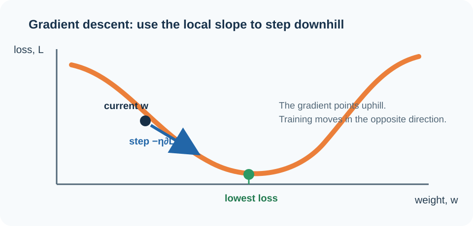
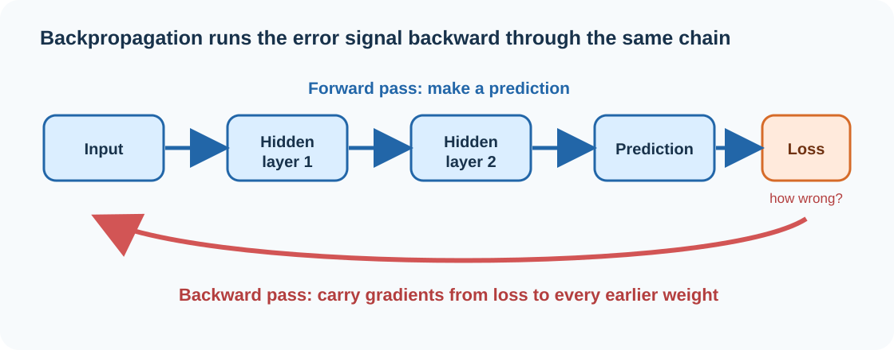
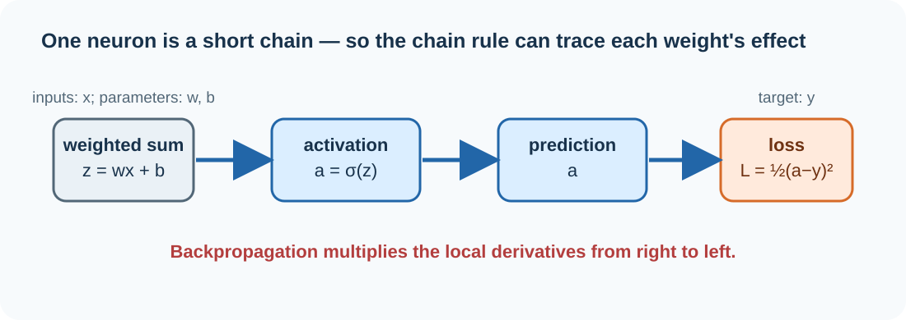

## Imagine hiking down a mountain in thick fog

You're standing somewhere on a mountainside, and your goal is simple: get to the lowest point in the valley. There's just one problem — a heavy fog has rolled in, and you can't see more than a few feet in any direction.

What do you do? You can't see the valley floor. But you *can* feel the ground under your feet. So you feel around: which direction slopes downward the most steeply from where you're standing right now? You take a step that way. Then you feel around again, and take another step. Step by step, feeling your way downhill, you eventually reach the bottom — without ever once seeing where you were headed.

This is, almost exactly, how an AI model learns. It can't "see" the perfect set of settings that would make it flawless. But at every moment, it can feel which direction — out of millions of possible directions — would make its mistakes a little smaller. It takes a step. It feels around again. It takes another step. Millions of tiny steps later, it has learned.

The mathematical tool that lets a machine "feel the slope of the ground" is **calculus** — specifically, a set of ideas built around something called the **derivative**. And the clever technique that lets this happen efficiently across a machine with billions of adjustable settings is called **backpropagation**. This essay walks through both, building up from ordinary intuition to the actual equations that run inside every neural network in use today.

---

## 1. Calculus is just the mathematics of "how fast is this changing?"

Calculus has a reputation for being intimidating, but the core idea is something you already understand from everyday life.

Picture a car driving down a road. Its position keeps changing as time passes. If you want to know how *fast* it's going at any given instant, you're asking a calculus question — you're asking for the **rate of change** of its position. This branch is called **differential calculus**, and it's all about answering: *right now, how quickly is this changing, and in which direction?*

There's a mirror-image branch, too. If you know the car's speed at every single moment, and you want to know the *total distance* it traveled, you'd need to add up an enormous number of tiny movements — one instant at a time. That's **integral calculus**: accumulating small changes into a total.

For training AI, it's the first kind — differential calculus, the mathematics of slope and direction — that does almost all of the work. A neural network doesn't need to know a grand total. It needs to answer one question, over and over, for every one of its settings:

> **If I nudge this number slightly, does my error get better or worse — and by how much?**

That is a question about slope. And slope is exactly what calculus was built to measure.

---

## 2. The derivative: a name for "which way is downhill, and how steep"

Picture a simple graph. Along the bottom, you have one particular setting inside the AI — engineers call these settings **weights**. Going up the side, you have the model's **error**: how wrong its predictions currently are.

If you plotted this out, you'd get a curve — some hills, some valleys. Stand at any point on that curve, and the **derivative** simply tells you the steepness and direction of the ground right where you're standing:

- If the slope tilts upward as the weight increases, increasing the weight will make the error *worse*.
- If the slope tilts downward as the weight increases, increasing the weight will make the error *better*.
- If the ground is nearly flat, changing that particular weight right now won't do much of anything.

In the language of calculus, if $w$ is one weight and $L$ is the error (formally called the **loss**), the question "how does the loss respond to a small nudge in this one weight?" is written:

$$
\frac{\partial L}{\partial w}
$$

Read it as: *"how much does L change, for a tiny change in w?"* The curly symbol $\partial$ (instead of a plain $d$) is a small but important detail: a real neural network has *many* weights at once, and this notation is a reminder that we're isolating the effect of just one of them while momentarily treating all the others as if they were frozen in place. This kind of derivative — one variable at a time, out of many — is called a **partial derivative**.

---

## 3. From one dial to millions of them

A real neural network isn't adjusting one weight. It's adjusting millions, sometimes billions, all at once — like a mixing board with an almost unimaginable number of dials, all needing to be tuned together to make the music come out right.

Call these weights $w_1, w_2, w_3, \dots, w_n$. For *every single one*, we can ask the same question: if I nudge this one dial, what happens to the error?

$$
\frac{\partial L}{\partial w_1},\quad \frac{\partial L}{\partial w_2},\quad \frac{\partial L}{\partial w_3},\quad \ldots
$$

Bundle all of those answers together into a single list, and you get something called the **gradient**:

$$
\nabla L = \left[\frac{\partial L}{\partial w_1}, \frac{\partial L}{\partial w_2}, \ldots, \frac{\partial L}{\partial w_n}\right]
$$

Think of the gradient as a compass — except instead of pointing north, it points in the single direction, across *all* the dials at once, that would make the error grow the fastest. Once you know that direction, the strategy for improving the model is obvious: **go the opposite way.**

That's the whole idea behind what comes next.

---

## 4. Gradient descent: taking the downhill step

Return to the foggy mountainside. The "landscape" here is the error the network makes, spread out across every possible combination of its weights. A particular configuration of weights is a particular *spot* on that landscape. Training the network is the act of hiking toward a low point in that landscape — a set of weights where the error is small.

The gradient is what tells you which way is *uphill*. So you step in the *opposite* direction. This is captured in one compact formula, which is really just "take a step downhill" written in math:

$$
w_{\text{new}} = w_{\text{old}} - \eta \frac{\partial L}{\partial w}
$$

Here, $\eta$ (the Greek letter "eta") is called the **learning rate** — it's simply how big a step you take. Take steps that are too large, and you might stride right over the valley floor and end up bouncing between two hillsides, never settling down. Take steps that are too small, and you'll get there eventually, but painfully slowly. Choosing a good step size is one of the small but crucial judgment calls in training any model.

The important takeaway: the network isn't guessing which way to adjust its weights. **Calculus tells it, precisely, which direction to move and how much.**

---

## 5. The catch: a neural network is a long chain, not a single equation

If a neural network only had one weight feeding directly into one error, the story would already be finished. But real networks are built from many layers stacked on top of each other, like an assembly line. Each layer receives something from the layer before it, transforms it, and passes the result along:

$$
\text{Input} \rightarrow \text{Layer 1} \rightarrow \text{Layer 2} \rightarrow \text{Layer 3} \rightarrow \cdots \rightarrow \text{Prediction} \rightarrow \text{Loss}
$$

Now think about a weight sitting near the very *front* of this assembly line. Nudge it, and the first layer's output shifts slightly. That shift changes what the second layer receives, which changes what *it* produces, which changes the third layer's input — and the ripple keeps traveling, layer after layer, until it finally reaches the very end and shows up as a change in the final error.

So the real question becomes much harder than before:

> **How much does a change way back at the start of the assembly line end up affecting the error way out at the end, after rippling through every step in between?**

This is exactly the kind of problem calculus solved centuries ago, long before anyone had heard of a neural network — with an idea called the **chain rule**.

---

## 6. The chain rule: multiplying ripples together

The chain rule handles situations where one thing affects a second thing, which in turn affects a third. Suppose $y$ depends on $g$, and $g$ depends on $x$:

$$
y = f(g(x))
$$

The chain rule says you can find how $x$ ultimately affects $y$ by multiplying two smaller effects together:

$$
\frac{dy}{dx} = \frac{dy}{dg} \cdot \frac{dg}{dx}
$$

In plain language: *figure out how x affects the middle step, figure out how the middle step affects the final result, and multiply those two effects together.*

That's exactly the tool needed for a neural network, which is really just a long chain of these middle steps stacked one after another:

$$
x \rightarrow z_1 \rightarrow a_1 \rightarrow z_2 \rightarrow a_2 \rightarrow L
$$

The effect of an early weight on the final loss can be broken down into a chain of small, manageable multiplications:

$$
\frac{\partial L}{\partial w_1} = \frac{\partial L}{\partial a_2} \cdot \frac{\partial a_2}{\partial z_2} \cdot \frac{\partial z_2}{\partial a_1} \cdot \frac{\partial a_1}{\partial z_1} \cdot \frac{\partial z_1}{\partial w_1}
$$

Instead of one impossibly complicated calculation, you get a sequence of small, ordinary ones, each answering a simple local question — and then you just multiply them all together. That sequence of small, chained calculations is the mathematical heart of **backpropagation**.

---

## 7. Why it's called "backpropagation"

A network's prediction happens in one direction — data flows from the input, through the hidden layers, out to the final answer:

$$
\text{Input} \rightarrow \text{Hidden Layers} \rightarrow \text{Output}
$$

This is called the **forward pass**, and it's how the model produces a guess in the first place.

But to *improve*, the network needs to send information the other way: starting from how wrong the final answer was, and working backward to figure out how much *each individual weight*, all the way back to the very first layer, contributed to that mistake:

$$
\text{Loss} \rightarrow \text{Output Layer} \rightarrow \text{Hidden Layers} \rightarrow \text{Earlier Layers}
$$

Because the error information travels *backward* through the network, layer by layer, the process is called **backpropagation** — literally, the backward propagation of error. And the chain rule is the mathematical machinery that makes this backward journey possible.

---

## 8. Seeing it happen: the simplest neural network there is

Diagrams and formulas are one thing — actually watching the numbers move is where the idea clicks. So let's shrink everything down to the smallest possible neural network: a single artificial neuron.

This one neuron takes an input $x$, multiplies it by a weight $w$, and adds a small offset called a bias, $b$:

$$
z = wx + b
$$

It then passes that result through an **activation function** — a small mathematical "squashing" step that keeps outputs in a controlled range. We'll use one of the classics, the **sigmoid function**, which squeezes any number into a value between 0 and 1:

$$
a = \sigma(z) = \frac{1}{1 + e^{-z}}
$$

Finally, we compare the network's output $a$ to the answer it *should* have produced, $y$, using a simple measure of error:

$$
L = \frac{1}{2}(a - y)^2
$$

Put together, the whole tiny network is one short chain:

$$
w \rightarrow z \rightarrow a \rightarrow L
$$

And our goal is the same question as always: **if we nudge $w$, how does $L$ change?** We'll answer it by walking backward through the chain, one link at a time — exactly the way backpropagation does inside a network a billion times this size.

---

## 9. Step one: how sensitive is the error to the prediction?

We start at the very end of the chain and work backward. The loss is:

$$
L = \frac{1}{2}(a - y)^2
$$

Taking the derivative with respect to the prediction $a$ gives a wonderfully simple result:

$$
\frac{\partial L}{\partial a} = a - y
$$

In words: the error is most sensitive to the prediction in exact proportion to how far off that prediction is. Guess too high, and this number is positive — a signal to bring the prediction down. Guess too low, and it's negative — a signal to bring it up.

---

## 10. Step two: how sensitive is the prediction to the neuron's internal signal?

The prediction $a$ came from squashing $z$ through the sigmoid function. Sigmoid has a famously tidy derivative:

$$
\sigma'(z) = \sigma(z)\big(1 - \sigma(z)\big)
$$

which means:

$$
\frac{\partial a}{\partial z} = a(1 - a)
$$

This tells us how much the neuron's output shifts for a small shift in its internal signal $z$ — the second link in our backward chain.

---

## 11. Step three: how sensitive is the internal signal to the weight?

Recall that $z = wx + b$. Taking the derivative with respect to $w$:

$$
\frac{\partial z}{\partial w} = x
$$

This one makes intuitive sense without any math at all: if the input $x$ is large, a small nudge to the weight has a big effect on $z$. If the input happens to be zero, changing the weight makes no difference at all for that particular example — there was nothing there for the weight to act on.

---

## 12. Chaining it all together

We now have three separate, simple pieces:

$$
\frac{\partial L}{\partial a} = a - y, \qquad
\frac{\partial a}{\partial z} = a(1-a), \qquad
\frac{\partial z}{\partial w} = x
$$

The chain rule says: multiply them.

$$
\boxed{\ \frac{\partial L}{\partial w} = (a - y)\, a(1-a)\, x\ }
$$

That's it. That single expression is the derivative of the entire network's error with respect to its one weight — calculated not in one impossible leap, but by walking backward through the chain and multiplying small, understandable pieces together.

---

## 13. Watching real numbers move through the machine

Let's plug in actual values and watch this play out.

Suppose $x = 2$, the starting weight is $w = 0.5$, the bias is $b = 0$, and the correct answer is $y = 1$.

**Forward pass — make a prediction:**

$$
z = wx + b = (0.5)(2) + 0 = 1
$$

$$
a = \frac{1}{1 + e^{-1}} \approx 0.731
$$

The network guesses about $0.731$, when the true answer is $1$. Not bad, but not right either. The loss:

$$
L = \frac{1}{2}(0.731 - 1)^2 \approx 0.036
$$

**Backward pass — figure out what to blame:**

$$
a - y = 0.731 - 1 = -0.269 \qquad a(1-a) = 0.731(0.269) \approx 0.197 \qquad x = 2
$$

Multiply the three together:

$$
\frac{\partial L}{\partial w} \approx (-0.269)(0.197)(2) \approx -0.106
$$

The gradient came out negative — meaning that, right now, *increasing* the weight would *decrease* the error. With a learning rate of $\eta = 0.1$:

$$
w_{\text{new}} = 0.5 - (0.1)(-0.106) \approx 0.511
$$

The weight nudges up, very slightly, to $0.511$. Nothing here was a hunch or a guess. The network didn't decide $0.511$ "felt better." **Calculus calculated, exactly, the direction and size of the correction.**

---

## 14. Scaling this up to a real AI model

The toy example above had exactly one weight. A modern AI model may have billions. For every single one of those billions of dials, the same basic question gets asked: *if I nudge this dial, what happens to the error?* And every one of those questions gets answered by walking backward through the same kind of chain, using the same chain rule.

$$
\nabla L = \left[\frac{\partial L}{\partial w_1}, \frac{\partial L}{\partial w_2}, \ldots, \frac{\partial L}{\partial w_n}\right]
\qquad\Longrightarrow\qquad
\mathbf{w}_{\text{new}} = \mathbf{w}_{\text{old}} - \eta \nabla L
$$

The genuinely remarkable part isn't just that this works — it's that it works *efficiently*. Backpropagation doesn't recalculate everything from scratch for each of those billions of weights. It reuses intermediate results as it walks backward through the network, the same way you wouldn't re-measure the whole hiking trail from your starting point every single step — you just feel the ground immediately beneath your current position and adjust from there. Without that efficiency trick, training today's largest AI models would be computationally out of reach.

---

## 15. So what is the AI actually "learning"?

It's tempting to say an AI "learns from its mistakes," and at a high level that's true. But it's worth being precise about what that actually means mechanically, because there's no understanding involved in the human sense — no moment of realization. Instead, the same six-step loop runs over and over, millions or billions of times:

1. **Make a prediction** — the current weights produce an output.
2. **Measure the error** — the loss function compares that output to the correct answer.
3. **Differentiate the loss** — calculus works out how sensitive the error is to every single weight.
4. **Propagate the derivatives backward** — the chain rule efficiently spreads that sensitivity information through every layer.
5. **Update the weights** — an optimization step nudges each weight a little, using the gradient as its guide.
6. **Repeat** — across an enormous number of examples, again and again.

Over enough repetitions, the weights drift toward a configuration that makes fewer mistakes. That drift, powered entirely by calculus, is what we call "training."

---

## 16. The deeper idea hiding underneath it all

Step back, and there's something genuinely elegant here. A model might have billions of interconnected numbers inside it. Yet the question being asked of every single one is embarrassingly simple:

> **If I changed this one number slightly, what would happen to the final error?**

Calculus answers that question at every scale of the problem. The **derivative** measures the local effect of a small nudge. The **partial derivative** isolates one setting out of millions. The **gradient** gathers all of those answers into a single map. The **chain rule** lets that map be built even when the effect has to travel through dozens or hundreds of layers to get there. And **gradient descent** turns that map into an actual plan of action — a series of small steps that reliably head downhill.

Together, these ideas turn what could have been an impossibly large guessing game into something orderly and mathematical: a systematic search for the settings that make the fewest mistakes.

---

## 17. From a single neuron to modern AI

The example walked through here was as small as a neural network gets — one neuron, one weight. A modern large language model might contain hundreds of billions of parameters, arranged into far more elaborate structures involving attention mechanisms, embeddings, and dozens of other techniques that didn't exist when calculus was first invented.

But strip away the complexity, and the training loop underneath is unchanged:

$$
\boxed{
\text{Forward computation} \rightarrow \text{Loss} \rightarrow \text{Backward differentiation} \rightarrow \text{Gradient} \rightarrow \text{Parameter update}
}
$$

Every one of those billions of parameters is still being asked the exact same question calculus has been answering since the seventeenth century — a question originally developed to describe the motion of planets and falling objects:

> **If something changes by a tiny amount, what happens to everything connected to it?**

Calculus turns that question into precise mathematics. The chain rule makes it possible to answer even when the effect has to travel through hundreds of intermediate steps. Backpropagation turns that mathematics into a practical, efficient algorithm. And gradient descent turns the algorithm into an actual training process — the hiker, in the fog, finally reaching the valley floor.

---

## A simple way to hold it all in your head

If none of the equations stick, this much will:

- **Derivative** — how much does one thing change, when something else changes a little?
- **Partial derivative** — the same question, asked about just one setting among many.
- **Gradient** — all of those answers, collected into a single map of "which way is uphill."
- **Chain rule** — the trick for tracing an effect through a long sequence of connected steps.
- **Gradient descent** — using that map to take a step in the opposite direction, downhill, toward fewer mistakes.
- **Backpropagation** — the efficient, organized way of doing all of this backward through an entire network at once.

Or, in a single sentence:

> **A neural network learns by using calculus to work out exactly how much each of its settings contributed to its mistake, then nudging every one of those settings in the direction that tends to make future mistakes smaller.**

That, stripped of all the machinery, is the mathematical heart of how a machine learns.
